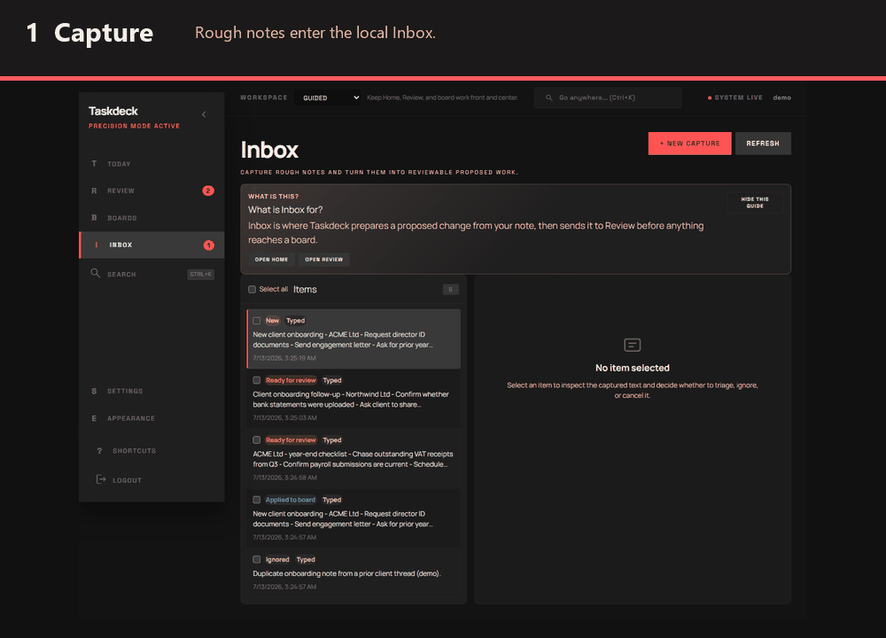

# Taskdeck

**The local-first, review-first action-item engine.**

Paste notes, emails, checklists, or transcript text into Inbox and Taskdeck turns them into source-linked proposals. You decide what is correct; only then does Taskdeck apply approved board changes. Your entire workspace lives in a single SQLite file you own - back it up together with its local configuration keys (see [UPGRADING.md](UPGRADING.md)). When a live provider is configured, transcript-source captures get LLM-backed extraction with evidence spans that deep-link back to the transcript (deterministic fallback otherwise); ordinary short-form capture triage is always deterministic and offline.

[](https://github.com/Chris0Jeky/Taskdeck/actions/workflows/ci-required.yml)
[](https://github.com/Chris0Jeky/Taskdeck/releases)
[](LICENSE)



> **Beta software:** Taskdeck is in the v0.x free open beta. Expect breaking changes while the public run paths, onboarding, and transcript workflow are hardened. The current open-source core is GPL-3.0-only; the transition and treatment of earlier MIT releases are documented in [LICENSING.md](LICENSING.md) and [ADR-0050](docs/decisions/ADR-0050-gplv3-copyleft-core.md). Automated DCO enforcement is paused; [#2019](https://github.com/Chris0Jeky/Taskdeck/issues/2019) is the future restoration tracker. The required branch-protection gate covers the secret/dependency/SAST scans (ADR-0035).

## The loop

1. **Capture** - paste a note, email, checklist, or transcript text into Inbox.
2. **Proposal** - Taskdeck prepares structured, source-linked board changes instead of mutating the board directly.
3. **Review** - inspect the diff, side effects, provenance, and risk; approve or reject it.
4. **Apply** - approved changes land on the board with an audit trail.

Taskdeck ships this capture -> proposal -> review -> apply loop today, including transcript-source LLM triage with evidence spans when a live provider is configured - the default Mock provider falls back to deterministic triage without evidence links (transcript-source triage has a separately gated extraction leg, and Automation Chat uses the configured provider when one is enabled - both may send bounded content to it; ordinary short-form capture triage stays deterministic and offline, and the default provider is the offline Mock). The active roadmap lives in [docs/REVIVAL_PLAN.md](docs/REVIVAL_PLAN.md) under the direction in [docs/strategy/PRODUCT_DIRECTION.md](docs/strategy/PRODUCT_DIRECTION.md).

## Why Taskdeck

- **Local-first ownership.** The default runtime uses SQLite, so backup and portability start with a file you control.
- **Review-first trust.** Automation stops at a proposal. Approval and execution are explicit human actions.
- **Useful provenance.** Capture-linked proposals preserve where suggested work came from.
- **Agent-safe writes.** The MCP server lets AI clients read Taskdeck and propose changes without granting them the ability to approve their own work.
- **Calm product surface.** The Paper workspace keeps Inbox, Review, and Boards focused on the decisions that matter.

Taskdeck is single-instance and self-hosted in the current beta. A managed hosted service is a future commercial possibility, not a shipped feature or a requirement for using the open-source core.

## Quick start

Choose the path that matches how you want to evaluate Taskdeck.

### 1. Desktop release

The self-contained desktop executable is the quickest path for v0.1.x. **Windows 10/11 x64 is the
only supported 0.1.x desktop platform.** Download the Windows ZIP and checksum from the
[latest public release](https://github.com/Chris0Jeky/Taskdeck/releases/latest), then follow the
[Windows quick start](docs/releases/WINDOWS_QUICK_START.md) for verification, extraction, launch,
registration, shutdown, backup, and optional OpenAI setup. **Known v0.1.1 limitation:** on a machine
that previously configured the retired Gemini provider through user-scoped environment variables, the
app can exit before listening with a misleading port/data-folder error — the workaround is in
[UPGRADING.md](UPGRADING.md#version-notes); the fix shipped in v0.1.2. The non-Windows archives
attached to v0.1.0 remain available as historical artifacts; they are not a continuing support promise.

### 2. Docker

Build and run the production image locally:

```bash
docker build -f deploy/Dockerfile.production -t taskdeck:local .
if [ ! -f deploy/.env.docker-run ]; then
  umask 077
  printf 'Jwt__SecretKey=%s\nConnectors__EncryptionKey=%s\n' \
    "$(openssl rand -base64 48)" \
    "$(openssl rand -base64 32)" \
    > deploy/.env.docker-run
fi
docker run --rm -p 5000:5000 \
  --env-file deploy/.env.docker-run \
  -v taskdeck-data:/app/data \
  taskdeck:local
```

Keep `deploy/.env.docker-run` with the `taskdeck-data` volume and reuse it for every restart. Back up both together: replacing `Jwt__SecretKey` signs everyone out, while losing or replacing `Connectors__EncryptionKey` makes connector credentials already stored in SQLite undecryptable. The env file is ignored by Git; never commit it.

Or use the Compose baseline:

```bash
cp deploy/.env.example deploy/.env
# Set TASKDECK_JWT_SECRET and TASKDECK_CONNECTORS_ENCRYPTION_KEY in deploy/.env.
docker compose -f deploy/docker-compose.yml --env-file deploy/.env --profile baseline up -d --build
```

Open `http://localhost:5000` after the direct `docker run` command. The Compose baseline publishes its reverse proxy at `http://localhost:8080`. See [DEPLOYMENT_CONTAINERS.md](docs/ops/DEPLOYMENT_CONTAINERS.md) for secret generation, volumes, health checks, and shutdown.

### 3. From source

Prerequisites: .NET 8 SDK and Node.js 24.x (minimum 24.13.1 LTS).

```powershell
git clone https://github.com/Chris0Jeky/Taskdeck.git
Set-Location Taskdeck
.\scripts\dev-up.ps1 -Seed
```

```bash
git clone https://github.com/Chris0Jeky/Taskdeck.git
cd Taskdeck
scripts/dev-up.sh --seed
```

The seeded account is `demo` / `demo123`. These source-only credentials are not present in the
Windows release. The source launcher intentionally leaves the API and frontend running as background
processes, prints their PIDs, API URL, and expected frontend entry point, and records them for the
matching stop command. Open `http://localhost:5173`; if Vite selects a fallback port, use the `Local:`
URL in the frontend dev-server output. Stop the whole stack with
`.\scripts\dev-up.ps1 -Stop` or `scripts/dev-up.sh --stop`; closing the launching shell is not the
documented stop path. See the [source startup troubleshooting](docs/product/DEMO_PLAYBOOK.md#source-startup-troubleshooting)
if readiness, ports, or a stale PID file blocks startup.

For the first guided run, see [START_HERE.md](docs/START_HERE.md).

## MCP: write access with a human gate

Taskdeck includes an MCP server for AI clients such as Claude Code and Cursor. Read tools expose boards, cards, captures, and proposal status. Board-mutating tools stop at proposals, and MCP intentionally exposes no approve or apply tool, so an agent cannot approve its own suggested board changes. Bounded workflow actions such as creating a capture or dismissing a proposal are direct writes.

Taskdeck supports local stdio plus API-key-authenticated Streamable HTTP at `/mcp`. The
[MCP server quickstart](docs/MCP_SERVER.md) covers the packaged desktop release, released Docker
image, source checkout, and setup for Claude Code, Claude Desktop, and Cursor:

| Mode | Command / endpoint | Intended use |
|---|---|---|
| Packaged Windows stdio | `C:\absolute\path\to\Taskdeck.Api.exe --mcp` | Released desktop ZIP; zero network listener |
| Released Docker stdio | `docker run --rm -i --no-healthcheck --user 1001:1001 ... IMAGE dotnet Taskdeck.Api.dll --mcp` | Released image sharing the normal web volume |
| Source stdio | `dotnet run --project backend/src/Taskdeck.Api/Taskdeck.Api.csproj -- --mcp` | Source checkout; zero network listener |
| Standalone HTTP | `dotnet run --project backend/src/Taskdeck.Api/Taskdeck.Api.csproj -- --mcp --transport http` → `http://127.0.0.1:5001/mcp` | Local HTTP client or same-host sidecar |
| Co-hosted HTTP | `<your Taskdeck API base>/mcp` | Reuse the normal API process and database |

Every Taskdeck process that should share a workspace must use the same `ConnectionStrings__DefaultConnection`. `dev-up` prints the database path, but its environment override belongs only to the API process it launches; a later MCP process does not inherit it. The launchers use these stable paths:

- Windows: `Data Source=$env:LOCALAPPDATA\Taskdeck\taskdeck-dev.db` (PowerShell expands `$env:LOCALAPPDATA` when you assign the value).
- macOS/Linux: `Data Source=${XDG_DATA_HOME:-$HOME/.local/share}/taskdeck/taskdeck-dev.db` (the shell expands the data directory when you export the value).

Before using stdio, run the corresponding web app once and create an active local user. Use
[mcp.example.json](mcp.example.json) for the packaged Windows executable or
[mcp-docker.example.json](mcp-docker.example.json) for the released image; each file defines exactly
one active server. The stdio server uses `McpServer__DefaultUserId` only when it names an existing
active user. When that setting is absent, stdio starts only if the database has exactly one active
user; zero or multiple active users fail with setup guidance. A present empty, zero, malformed,
missing, or inactive ID fails closed and never falls back to another account. See the
[quickstart](docs/MCP_SERVER.md#from-source) for source-checkout configuration and database paths.

For HTTP, create a key in **Settings → API Keys** and start the standalone command with the same `ConnectionStrings__DefaultConnection` as the web app. Claude Code can use [mcp-claude-code-http.example.json](mcp-claude-code-http.example.json), whose `${VAR}` / `${VAR:-default}` expansion is Claude Code-specific. In Cursor or another client, configure the same URL and `Authorization` header through that client's native secret/environment support rather than committing a raw key. The real route requires `Authorization: Bearer tdsk_...`; missing, invalid, expired, or revoked keys receive `401`, and `/` is not an MCP endpoint. Authentication attempts are bounded by client IP before key lookup, and valid requests are rate-limited independently by the key's opaque ID.

The standalone server binds only to `127.0.0.1` by default and replaces blank or ASP.NET any-host `AllowedHosts` values (`*`, `0.0.0.0`, `[::]`, including mixed lists) with the loopback allowlist. Keep bearer keys on loopback. If you deliberately use `--host` for a container, tunnel, or deployment, terminate TLS before the request reaches an untrusted network and set `AllowedHosts` to the exact public host names; `--host` does not relax host-header validation. Cross-origin browser MCP is not enabled. Scoped-key and runtime tool-hash hardening remain planned for [REVIVAL-13](https://github.com/Chris0Jeky/Taskdeck/issues/1309).

## Current scope

Shipped now:

- capture, triage, proposal review, explicit approval, and audited apply;
- boards, cards, labels, Inbox, Review, search, notifications, and local operations surfaces;
- SQLite persistence, JSON/board exports, authentication, and self-hosted container support;
- MCP resources, review-gated board changes, and bounded workflow actions;
- mock, OpenAI, and config-gated compatible/local provider integrations.

Shipped releases and the active roadmap:

- **v0.1.0 "First Light" (2026-08-19), v0.1.1 (2026-08-21), and v0.1.2 (2026-08-25):** shipped; the latest release is the Honest Windows Beta with the Windows startup correction and its bounded trust-fix tranche;
- **v0.2 Coherent Context-to-Action Loop:** final target 2026-09-01; bounded capture, board-context, contrast, core-loop, and release-closure work;
- **v0.3 Open Beta + Accountable Agents:** RC target 2026-09-04; final target 2026-09-08 or 2026-09-09; packaged MCP, feedback, accountable-agent, and trusted-collaboration proof.

Direction lives in [docs/strategy/PRODUCT_DIRECTION.md](docs/strategy/PRODUCT_DIRECTION.md); the execution plan is [docs/REVIVAL_PLAN.md](docs/REVIVAL_PLAN.md). Taskdeck is not claiming a hosted service or a stable v1 API today.

## Technology

| Layer | Technology |
|---|---|
| Backend | .NET 8, ASP.NET Core, EF Core, SQLite |
| Frontend | Vue 3, TypeScript, Pinia, Vite, Tailwind CSS |
| Realtime | SignalR |
| Testing | xUnit, Vitest, Playwright |
| LLM | Mock by default; OpenAI and compatible/local providers are config-gated |

```text
backend/          .NET solution and layered application
frontend/         Vue application and browser tests
docs/             Product, architecture, operations, and contributor guidance
deploy/           Container and deployment configuration
scripts/          Development, demo, verification, and operations helpers
```

## Verification

```bash
# Backend
dotnet test backend/Taskdeck.sln -c Release -m:1

# Frontend (run from frontend/taskdeck-web)
npm run typecheck
npm run build
npx vitest --run
npx playwright test --reporter=line
```

See [TESTING_GUIDE.md](docs/TESTING_GUIDE.md) for suite ownership and CI parity.

## Contributing

External code contributions are currently paused while the project's long-term licensing — including a possible commercial/proprietary future — is evaluated; see the notice at the top of [CONTRIBUTING.md](CONTRIBUTING.md) and [issue #2012](https://github.com/Chris0Jeky/Taskdeck/issues/2012). Issues and bug reports are welcome. `Signed-off-by:` trailers are currently optional and are not checked for merge eligibility; see the [paused Developer Certificate of Origin guidance](CONTRIBUTING.md#developer-certificate-of-origin-enforcement-paused). The required branch-protection gate covers the secret, dependency, and SAST scans (ADR-0035).

Repository rules for automated contributors live in [AGENTS.md](AGENTS.md).

## License and security

Taskdeck's current open-source core is released under the [GNU General Public License version 3 only](LICENSE). Earlier copies released under MIT keep their existing grants; the transition, permanent free-core boundary, and posture for any future additive commercial module are documented in [LICENSING.md](LICENSING.md) and [ADR-0050](docs/decisions/ADR-0050-gplv3-copyleft-core.md).

Found a vulnerability? Follow the private reporting process in [SECURITY.md](SECURITY.md). Do not open a public issue for a suspected security problem.

---

[First 15 minutes](docs/START_HERE.md) | [Upgrading and backups](UPGRADING.md) | [Documentation index](docs/INDEX.md) | [Issue tracker](https://github.com/Chris0Jeky/Taskdeck/issues)
