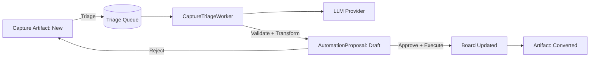

# Capture Pipeline Specification (Inbox-first)
Date: 2026-02-21
Status: Draft (analysis pack; non-authoritative)

## Objective
Deliver the core promise:
**Capture messy input → triage → proposal → apply**  
while preserving Taskdeck’s existing proposal-first automation and clean architecture boundaries.

## High-level workflow
1. User creates a **Capture Artifact** (typed note, transcript paste, etc).
2. Artifact appears in **Inbox** with status `New`.
3. User triggers “Triage” (or batch triage).
4. Backend enqueues triage job.
5. Worker processes job:
   - calls LLM provider (or deterministic mock)
   - validates strict JSON output
   - transforms output into `AutomationProposal` diff
6. User reviews and applies proposal.
7. Artifact transitions to `Converted` (or remains `Triaged` until apply).

### Mermaid diagram

## Domain model

### CaptureSource (enum)
- `Typed`
- `Paste`
- `TranscriptPaste`
- `Import`
- `Voice` (future)
- `MeetingIntegration` (future)

### CaptureStatus (enum)
- `New`
- `Triaging`
- `Triaged` (triage output exists)
- `ProposalCreated`
- `Converted` (proposal applied successfully)
- `Ignored`
- `Failed` (triage failed)

### Entity: CaptureArtifact
Minimum fields:
- `Id : Guid`
- `OwnerUserId : Guid`
- `CreatedAtUtc : DateTime`
- `Source : CaptureSource`
- `Status : CaptureStatus`
- `RawText : string`  *(store full text; enforce max length)*
- `TitleHint : string?` *(optional; user-supplied)*
- `BoardIdHint : Guid?` *(optional)*
- `MetadataJson : string?` *(optional; meeting title, timestamps, etc)*
- `LastTriageRunId : Guid?`

Invariants:
- `OwnerUserId` always derived from claims (never from client)
- `RawText` length <= configured max (ex: 20k chars initially)
- status transitions are controlled (no skipping from `New` → `Converted`)

### Entity: CaptureTriageRun
- `Id : Guid`
- `ArtifactId : Guid`
- `CreatedAtUtc : DateTime`
- `Status : Succeeded|Failed`
- `Provider : string`
- `Model : string`
- `PromptVersion : string`
- `OutputJson : string?`
- `FailureCode : string?`
- `FailureMessage : string?`
- `ProposalId : Guid?`

### Relationship to existing automation
- A triage run creates an `AutomationProposal` (existing entity/service).
- The proposal should store:
  - `SourceType = "CaptureTriage"`
  - `SourceRefId = triageRunId`
  - this enables audit and UI linking.

## Persistence (SQLite / EF Core)
Tables:
- `CaptureArtifacts`
- `CaptureTriageRuns`

Indexes (recommended):
- `IX_CaptureArtifacts_OwnerUserId_CreatedAtUtc`
- `IX_CaptureArtifacts_OwnerUserId_Status`
- `IX_CaptureTriageRuns_ArtifactId_CreatedAtUtc`

Retention:
- Default retain artifacts indefinitely (local-first), but allow purge later.
- Consider a future setting to auto-purge `RawText` after conversion (privacy).

## Application services (suggested)
- `CaptureArtifactService`
  - `CreateArtifactAsync(...)`
  - `ListArtifactsAsync(ownerId, status, paging, search)`
  - `MarkIgnoredAsync(ownerId, artifactId)`
- `CaptureTriageService`
  - `EnqueueTriageAsync(ownerId, artifactId, idempotencyKey)`
  - `GetTriageStatusAsync(ownerId, artifactId)`
- Worker: `CaptureTriageWorker`
  - pops queue item
  - loads artifact (owner-scoped)
  - calls provider
  - validates output schema
  - creates proposal via existing `AutomationProposalService`
  - persists run record
  - updates artifact status

## Idempotency and concurrency
- Triage enqueue should require `Idempotency-Key` (optional but recommended).
- Multiple triage requests for same artifact:
  - if `Triaging` → return 409 or return current triage run status
  - if `Triaged/ProposalCreated` → allow “re-triage” only via explicit action; record new run

## Error handling (contract)
Use existing `ApiErrorResponse { errorCode, message }`.
Suggested error codes:
- `capture.invalid_text` (validation)
- `capture.not_found`
- `capture.forbidden`
- `capture.already_triaging`
- `capture.triage_failed`
- `capture.llm_output_invalid`

## Logging
- Do NOT log `RawText` or full provider prompts by default.
- Log correlation id + artifact id + triage run id.
- If debug logging is enabled, allow safe-length excerpt logging with redaction later (future).

## Frontend requirements (linked)
See `UX_SPEC.md` for UI flows.
