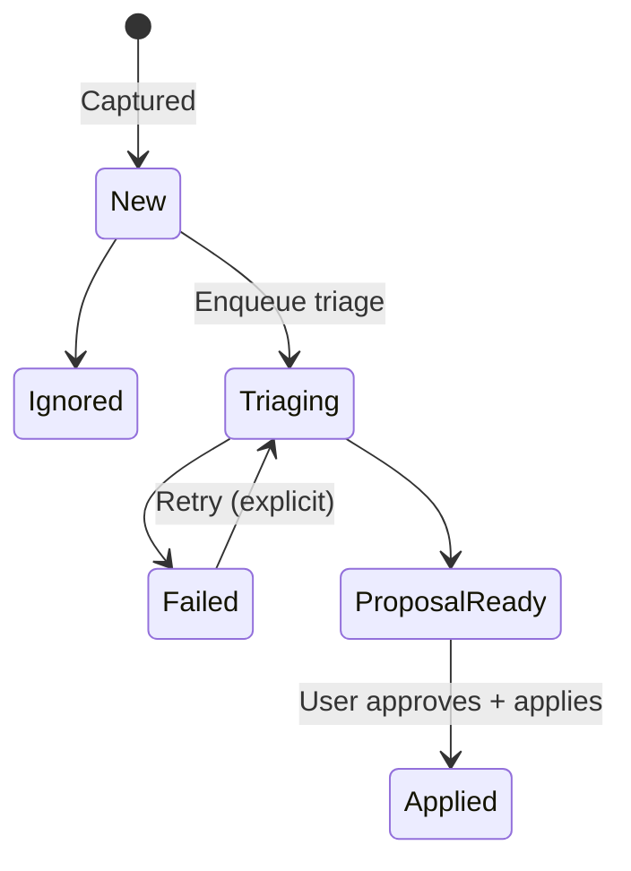

# UX Flows and Maps (Taskdeck key journeys)
Date: 2026-02-23
Status: Draft

This document focuses on flows where clarity and “premium feel” are make-or-break.

---

## Flow 1: Capture → Inbox → Triage → Proposal → Apply
User intent: “dump messy input fast; later accept clean tasks.”

### States (Capture Artifact)

### UX requirements
- Capture modal opens instantly (no network dependency).
- Inbox list never loads full text by default (excerpt-only).
- Triage progress is visible and cannot be “silent.”
- Proposal view shows summary + diff + provenance.
- After apply, the created card displays provenance (link to Inbox item).

---

## Flow 2: Board execution loop (daily usage)
User intent: “scan, pick next, act, move, repeat.”

### Micro-loop
1) open board
2) scan WIP / column counts
3) open next card
4) update status / notes
5) move card to next column
6) close card and continue

UX requirements:
- keyboard path exists for every step (not drag-only)
- drag has non-drag alternative (WCAG 2.5.7 Dragging Movements)  
  WCAG 2.2: https://www.w3.org/TR/WCAG22/
- drag handle hit targets satisfy target size guidance (WCAG 2.5.8)
- filter panel can be toggled quickly and never traps focus

---

## Flow 3: Automation safety loop (proposal-first)
User intent: “let automation help, but never surprise me.”

### Steps
1) user requests change (chat/op)
2) proposal generated (draft)
3) user reviews summary + diff
4) apply executes with explicit confirmation if destructive
5) result state visible + audit log link

Heuristic basis:
- visibility of system status builds trust  
  https://www.nngroup.com/articles/visibility-system-status/

---

## Flow 4: Permissions & Ops console
User intent: “run an op; if blocked, understand why and what to do next.”

UX requirements:
- role/capability displayed in header
- templates show required role and whether runnable
- permission error gives actionable next steps

---

## Screen inventory (map)
- Auth (login/register)
- Shell
- Boards list
- Board view
- Card modal
- Inbox
- Proposal review
- Ops console
- Activity / Audit
- Settings

---

## Deliverable: “Interaction Map” diagram
Create a single mermaid diagram showing navigation between screens and the most important modal flows.
Keep it in canonical docs once stable.

(You can later generate a clickable map in Figma, but the mermaid map keeps decisions close to code.)
