# Data Model Reference

Last Verified: 2026-08-16 (full-model recertification against `TaskdeckDbContext` and the EF model snapshot on 2026-08-12; transcript linkage rechecked 2026-08-16 -- issue `#1470`)

This document describes entities in the Taskdeck data model, their fields, constraints, and relationships. The backend uses Entity Framework Core with SQLite. Most entities inherit from a common `Entity` base class; `CardLabel` and the singleton `RegistrationBootstrap` are the exceptions.

> **Coverage claim (self-checkable):** every `DbSet` on `TaskdeckDbContext` has a `###` block below,
> and the only `###` blocks that are *not* a `DbSet` are the domain-only entities named under the
> ERD. That invariant is the claim -- deliberately not a count, because a hand-maintained count
> rots silently while the invariant stays checkable. It takes three checks, not one: a single
> `comm -23` proves only that nothing mapped is missing, and stays silent when an unexpected
> heading or a duplicate heading is added. Run all three from the repo root, using native `rg`
> per `AGENTS.md`:
>
> ```bash
> mapped=$(rg --no-filename --no-line-number -o 'DbSet<\w+' \
>   backend/src/Taskdeck.Infrastructure/Persistence/TaskdeckDbContext.cs | cut -d'<' -f2 | sort -u)
> headings=$(rg --no-filename --no-line-number -o '^### \w+' \
>   docs/architecture/DATA_MODEL.md | cut -d' ' -f2 | sort)
>
> # 1. mapped entity with no heading    -- expect NO output
> comm -23 <(printf '%s\n' "$mapped") <(printf '%s\n' "$headings" | sort -u)
> # 2. heading that is not a DbSet      -- expect EXACTLY: AbuseActor, AbuseEvent
> comm -13 <(printf '%s\n' "$mapped") <(printf '%s\n' "$headings" | sort -u)
> # 3. duplicate heading                -- expect NO output
> printf '%s\n' "$headings" | uniq -d
> ```
>
> Measured on this document 2026-08-12: 51 mapped entities, 53 headings; checks 1 and 3 empty,
> check 2 exactly `AbuseActor` and `AbuseEvent`.
>
> Column-level ground truth is `backend/src/Taskdeck.Domain/**/*.cs` (validation rules) plus
> `backend/src/Taskdeck.Infrastructure/Migrations/TaskdeckDbContextModelSnapshot.cs` (persisted
> columns, widths, indexes, delete behavior). Where the two differ -- the domain often validates
> tighter than the column allows -- both numbers are given.
>
> **EF model metadata vs. runtime validation:** `IsRequired()` and a declared width
> (`HasMaxLength`) are EF model/schema mappings. SQLite stores these mapped string properties as
> `TEXT` and does not itself enforce declared widths or JSON syntax. In the rows below, `JSON`
> describes the intended serialized representation, not a database constraint. Where application
> or domain validation is known, it is called out separately; serialization/deserialization or a
> length bound alone is not syntax validation.
>
> The glob is `Domain/**` on purpose, not `Domain/Entities/*.cs`: 50 of the 51 mapped entities live
> under `Domain/Entities/`, but `McpToolHash` is defined at
> `backend/src/Taskdeck.Domain/Agents/McpToolHash.cs`, so an `Entities/`-only sweep silently skips
> its validation rules. Re-check that exception rather than assuming it, by intersecting the `DbSet`
> names above with the basenames under `Domain/Entities/`.

> **FK vs. logical references:** Fields marked **FK** have an enforced foreign key constraint in the database (with Cascade, Restrict, or SetNull behavior). Fields marked **references** store a related entity's ID but have no database-level FK constraint -- referential integrity is maintained by application code only.

**Related docs:** [API Quickstart](../api/QUICKSTART.md) | [Boards API](../api/BOARDS.md) | [Capture API](../api/CAPTURE.md) | [Chat API](../api/CHAT.md) | [Webhooks API](../api/WEBHOOKS.md) | [Authentication](../api/AUTHENTICATION.md) | [Integrations Registry](INTEGRATIONS_REGISTRY.md)

---

## Entity Relationship Diagram

> **Diagram legend:** Solid lines represent enforced FK constraints in the database. Lines marked "(logical)" represent application-level associations with no database FK constraint. The ERD maps *relationships*, so mapped tables that stand alone -- `RegistrationBootstrap` and `RegistrationInvite` -- have no line here and appear only as blocks below.

```mermaid
erDiagram
    User ||--o{ Board : "owns (FK)"
    User ||--o{ BoardAccess : "has access (FK)"
    User ||--o{ ApiKey : "authenticates with (FK)"
    User ||--o{ ExternalLogin : "linked to (FK)"
    User ||--o| MfaCredential : "has (FK)"
    User ||--o| UserPreference : "has (FK)"
    User ||--o| NotificationPreference : "has (FK)"
    User ||--o{ Notification : "receives (FK)"
    User ||--o{ CardComment : "authors (FK)"
    User ||--o{ CardCommentMention : "is mentioned in (FK)"
    User ||--o{ LlmRequest : "submits (FK)"
    User ||--o{ AuditLog : "triggers (FK)"
    User ||--o{ IntegrationConnector : "owns (FK)"
    User ||--o{ OutboundWebhookSubscription : "manages (FK)"
    User ||--o{ SourceArtefact : "owns (FK)"
    User ||--o{ Transcript : "owns (FK)"
    User ||--o{ ChatSession : "creates (logical)"
    User ||--o{ LlmUsageRecord : "tracked for (logical)"
    User ||--o{ KnowledgeDocument : "owns (logical)"
    User ||--o{ AgentProfile : "owns (logical)"
    User ||--o{ ConnectorCredential : "owns (FK)"
    User ||--o{ DailySnapshot : "seals (logical)"
    User ||--o{ TomorrowNote : "writes (logical)"
    User ||--o{ McpToolHash : "approves (logical)"
    User ||--o{ OAuthAuthCode : "issued to (logical)"

    Board ||--o{ Column : "contains (FK)"
    Board ||--o{ Card : "contains (FK)"
    Board ||--o{ Label : "has (FK)"
    Board ||--o{ BoardAccess : "grants (FK)"
    Board ||--o{ OutboundWebhookSubscription : "has (FK)"
    Board ||--o{ AutomationProposal : "targeted by (logical)"
    Board ||--o{ ArchiveItem : "stores (logical)"
    Board ||--o{ KnowledgeDocument : "scoped to (logical)"
    Board ||--o{ LlmRequest : "scoped to (FK)"
    Board o|--o{ SourceArtefact : "optionally scopes (FK, SetNull)"
    Board o|--o{ Transcript : "optionally scopes (FK, SetNull)"

    LlmRequest ||--o{ Transcript : "created from (logical)"
    LlmRequest o|--o| Transcript : "links snapshot (FK, SetNull)"

    Column ||--o{ Card : "holds (FK)"

    Card ||--o{ CardLabel : "tagged with (FK)"
    Card ||--o{ CardComment : "has (FK)"

    Label ||--o{ CardLabel : "applied via (FK)"

    CardComment ||--o{ CardCommentMention : "mentions (FK)"
    CardComment ||--o{ CardComment : "replies (FK)"

    ChatSession ||--o{ ChatMessage : "contains (FK)"

    AutomationProposal ||--o{ AutomationProposalOperation : "defines (FK)"
    AutomationProposal ||--o{ ProposalRevision : "revised by (FK)"
    AutomationProposal ||--o{ ProposalOutcome : "decided as (FK)"
    AutomationProposal ||--o{ ProposalFeedback : "flagged by (FK)"
    AutomationProposal ||--o| ProposalProvenance : "derived via (FK)"

    ProposalProvenance ||--o{ ProvenanceField : "explains (FK)"
    ProvenanceField ||--o{ ProvenanceEvidenceLink : "cites (FK)"
    Transcript ||--o{ ProvenanceEvidenceLink : "anchors transcript evidence (FK)"

    IntegrationConnector ||--o{ ConnectorEvent : "logs (FK)"
    IntegrationConnector ||--o{ ConnectorCredential : "authenticates with (FK)"

    KnowledgeDocument ||--o{ KnowledgeChunk : "split into (FK)"

    CommandRun ||--o{ CommandRunLog : "logs (FK)"

    AgentProfile ||--o{ AgentRun : "executes (FK)"
    AgentRun ||--o{ AgentRunEvent : "emits (FK)"

    OutboundWebhookSubscription ||--o{ OutboundWebhookDelivery : "delivers (FK)"

    SourceArtefact ||--o| ArtefactBlob : "stores (FK)"
    SourceArtefact ||--o{ ArtefactExtraction : "extracts (FK)"
    SourceArtefact o|--o{ Transcript : "optionally originates (FK, SetNull)"
```



> **Domain-only entities:** eight classes derive from `Entity` but have no `DbSet`, no EF
> configuration, and no table, so they never appear in the ERD: `AbuseActor`, `AbuseEvent`,
> `EvidenceLink`, `IntentCandidate`, `IntentEnvelopeV1`, `SourceBlock`, `SourceSpan`, and
> `TaskdeckProposalBatch`. `AbuseActor` and `AbuseEvent` are written out in the
> [Audit and Abuse](#audit-and-abuse) section because an abuse-containment reader expects them;
> the other six are in-memory pipeline shapes with no persistence contract to document.
> Note that `EvidenceLink` (unmapped) is a different type from the mapped
> `ProvenanceEvidenceLink` below.

---

## Base Entity

Most entities inherit from `Entity`, which provides the fields below. `CardLabel` and `RegistrationBootstrap` use different key shapes, while EF maps `ArtefactBlob` through its `SourceArtefactId` shared key and ignores the inherited base fields.

| Field | Type | Required | Description |
|-------|------|----------|-------------|
| Id | `Guid` | Yes | Primary key, auto-generated UUID |
| CreatedAt | `DateTimeOffset` | Yes | Set to UTC now on creation |
| UpdatedAt | `DateTimeOffset` | Yes | Set to UTC now on creation and updated via `Touch()` |

---

## Core Board Entities

### User

Represents an authenticated user.

| Field | Type | Required | Constraints | Description |
|-------|------|----------|-------------|-------------|
| Id | `Guid` | Yes | PK | Inherited from Entity |
| Username | `string` | Yes | 3-50 chars | Unique display name |
| Email | `string` | Yes | Max 255 chars, must contain `@` | Stored lowercase |
| PasswordHash | `string` | Yes | Non-empty | BCrypt hash of password |
| DefaultRole | `UserRole` | Yes | Enum: Owner, Admin, Editor, Viewer | Default: Editor |
| IsActive | `bool` | Yes | | Account active flag |
| TokenInvalidatedAt | `DateTimeOffset?` | No | | JWTs issued before this timestamp are invalid |
| MfaEnabled | `bool` | Yes | | Whether TOTP MFA is active |
| CreatedAt | `DateTimeOffset` | Yes | | Inherited |
| UpdatedAt | `DateTimeOffset` | Yes | | Inherited |

### Board

A kanban-style task board.

| Field | Type | Required | Constraints | Description |
|-------|------|----------|-------------|-------------|
| Id | `Guid` | Yes | PK | |
| Name | `string` | Yes | 1-100 chars | Board display name |
| Description | `string?` | No | Max 500 chars (DB); domain allows 1000 | Optional description |
| IsArchived | `bool` | Yes | | Soft-archive flag |
| OwnerId | `Guid?` | No | FK to User | Board owner |
| CreatedAt | `DateTimeOffset` | Yes | | |
| UpdatedAt | `DateTimeOffset` | Yes | | |

**Navigation collections:** Columns, Cards, Labels, BoardAccesses

### Column

A vertical lane within a board.

| Field | Type | Required | Constraints | Description |
|-------|------|----------|-------------|-------------|
| Id | `Guid` | Yes | PK | |
| BoardId | `Guid` | Yes | FK to Board | Parent board |
| Name | `string` | Yes | 1-50 chars | Column name |
| Position | `int` | Yes | >= 0 | Display order |
| WipLimit | `int?` | No | Must be > 0 if set | Work-in-progress limit |
| CreatedAt | `DateTimeOffset` | Yes | | |
| UpdatedAt | `DateTimeOffset` | Yes | | |

**Navigation:** Board (parent), Cards (children)

### Card

A task card within a board column.

| Field | Type | Required | Constraints | Description |
|-------|------|----------|-------------|-------------|
| Id | `Guid` | Yes | PK | |
| BoardId | `Guid` | Yes | FK to Board | Parent board |
| ColumnId | `Guid` | Yes | FK to Column | Current column |
| Title | `string` | Yes | 1-200 chars | Card title |
| Description | `string` | Yes | Max 4000 chars (DB); domain enforces 2000 | Defaults to empty string |
| DueDate | `DateTimeOffset?` | No | | Optional deadline |
| IsBlocked | `bool` | Yes | | Blocked status flag |
| BlockReason | `string?` | No | Non-empty when IsBlocked; 500 is a model width only (SQLite `TEXT`, runtime input unbounded) | Reason for blocking |
| Position | `int` | Yes | >= 0 | Display order within column |
| CreatedAt | `DateTimeOffset` | Yes | | |
| UpdatedAt | `DateTimeOffset` | Yes | | |

**Navigation:** Board, Column, CardLabels

### Label

A color-coded tag for cards, scoped to a board.

| Field | Type | Required | Constraints | Description |
|-------|------|----------|-------------|-------------|
| Id | `Guid` | Yes | PK | |
| BoardId | `Guid` | Yes | FK to Board | Parent board |
| Name | `string` | Yes | 1-30 chars | Label text |
| ColorHex | `string` | Yes | Regex `^#[0-9A-Fa-f]{6}$` | Stored uppercase |
| CreatedAt | `DateTimeOffset` | Yes | | |
| UpdatedAt | `DateTimeOffset` | Yes | | |

**Navigation:** Board, CardLabels

### CardLabel (Join Table)

Many-to-many relationship between Cards and Labels. Does **not** inherit from Entity.

| Field | Type | Required | Constraints | Description |
|-------|------|----------|-------------|-------------|
| CardId | `Guid` | Yes | FK to Card, composite PK | |
| LabelId | `Guid` | Yes | FK to Label, composite PK | |

### BoardAccess

Grants a user a specific role on a board.

| Field | Type | Required | Constraints | Description |
|-------|------|----------|-------------|-------------|
| Id | `Guid` | Yes | PK | |
| BoardId | `Guid` | Yes | FK to Board | Target board |
| UserId | `Guid` | Yes | FK to User | Granted user |
| Role | `UserRole` | Yes | Enum: Owner, Admin, Editor, Viewer | Access level |
| GrantedBy | `Guid` | Yes | Non-empty | User who granted access |
| GrantedAt | `DateTimeOffset` | Yes | | When access was granted |
| CreatedAt | `DateTimeOffset` | Yes | | |
| UpdatedAt | `DateTimeOffset` | Yes | | |

**Navigation:** Board, User

---

## Comments and Mentions

### CardComment

A comment on a card, supporting threaded replies.

| Field | Type | Required | Constraints | Description |
|-------|------|----------|-------------|-------------|
| Id | `Guid` | Yes | PK | |
| CardId | `Guid` | Yes | FK to Card | Target card |
| BoardId | `Guid` | Yes | Non-empty | Board scope |
| AuthorUserId | `Guid` | Yes | FK to User | Comment author |
| ParentCommentId | `Guid?` | No | FK to CardComment | For threaded replies |
| Content | `string` | Yes | 1-4000 chars | Comment text; set to `[deleted]` on soft delete |
| IsDeleted | `bool` | Yes | | Soft-delete flag |
| DeletedAt | `DateTimeOffset?` | No | | When soft-deleted |
| EditedAt | `DateTimeOffset?` | No | | Last edit timestamp |
| CreatedAt | `DateTimeOffset` | Yes | | |
| UpdatedAt | `DateTimeOffset` | Yes | | |

**Navigation:** Card, AuthorUser, ParentComment, Replies, Mentions

### CardCommentMention

Tracks @-mentions within card comments.

| Field | Type | Required | Constraints | Description |
|-------|------|----------|-------------|-------------|
| Id | `Guid` | Yes | PK | |
| CardCommentId | `Guid` | Yes | FK to CardComment (Cascade) | Parent comment |
| MentionedUserId | `Guid` | Yes | FK to User (Cascade) | Mentioned user; deleting the user deletes this row |
| MentionedUsername | `string` | Yes | 1-50 chars | Username at time of mention |
| CreatedAt | `DateTimeOffset` | Yes | | |
| UpdatedAt | `DateTimeOffset` | Yes | | |

---

## Automation and Proposals

### AutomationProposal

A review-first automation proposal containing one or more operations.

| Field | Type | Required | Constraints | Description |
|-------|------|----------|-------------|-------------|
| Id | `Guid` | Yes | PK | |
| SourceType | `ProposalSourceType` | Yes | Enum: Queue, Chat, Manual | Origin of proposal |
| SourceReferenceId | `string?` | No | Max 100 chars | External reference |
| BoardId | `Guid?` | No | References Board (no FK) | Target board |
| RequestedByUserId | `Guid` | Yes | References User (no FK) | Initiating user |
| Status | `ProposalStatus` | Yes | Enum: PendingReview, Approved, Rejected, Applied, Failed, Expired, Dismissed | Lifecycle state |
| RiskLevel | `RiskLevel` | Yes | Enum: Low, Medium, High, Critical | Risk classification |
| Summary | `string` | Yes | 1-500 chars | Human-readable description |
| DiffPreview | `string?` | No | | Rendered diff |
| ValidationIssues | `string?` | No | | Detected issues |
| ExpiresAt | `DateTime` | Yes | | Auto-expire timestamp |
| DeferredUntil | `DateTime?` | No | Each defer is 1–1440 minutes | Pending-review snooze; defer keeps the status pending and floors expiry at least 24 hours after this timestamp |
| DecidedAt | `DateTime?` | No | | When approved/rejected |
| DecidedByUserId | `Guid?` | No | | Who approved/rejected |
| AppliedAt | `DateTime?` | No | | When applied |
| ApprovedRevisionId | `Guid?` | No | References ProposalRevision (no FK) | Exact revision pinned at approval; null means the original operations |
| FailureReason | `string?` | No | Max 1000 chars | Failure or rejection reason |
| CorrelationId | `string` | Yes | 1-100 chars | Request correlation |
| CreatedAt | `DateTimeOffset` | Yes | | |
| UpdatedAt | `DateTimeOffset` | Yes | | |

**Navigation:** Operations, Revisions, Outcomes (children)

`DeferredUntil` is cleared on approve, reject, apply, fail, expire, and dismiss. `ApprovedRevisionId` deliberately remains a scalar logical pointer rather than a database FK, avoiding a proposal/revision FK cycle while preventing a later revision from changing what Apply executes.

### AutomationProposalOperation

A single atomic operation within a proposal.

| Field | Type | Required | Constraints | Description |
|-------|------|----------|-------------|-------------|
| Id | `Guid` | Yes | PK | |
| ProposalId | `Guid` | Yes | FK to AutomationProposal | Parent proposal |
| Sequence | `int` | Yes | >= 0 | Execution order |
| ActionType | `string` | Yes | Non-empty | Operation type (e.g., "CreateCard") |
| TargetType | `string` | Yes | Non-empty | Target entity type |
| TargetId | `string?` | No | | ID of existing target |
| Parameters | `string` | Yes | EF: required `TEXT`; create path: `ProposalOperationInputValidator` requires a non-empty JSON object, max 64 KiB UTF-8, max depth 32; revision path: `ProposalRevisionService` applies `ProposalOperationStructureValidator`, which requires a non-null value no longer than 10,000 characters | Operation parameters |
| IdempotencyKey | `string` | Yes | Non-empty | Ensures at-most-once execution |
| ExpectedVersion | `string?` | No | | Optimistic concurrency token |
| CreatedAt | `DateTimeOffset` | Yes | | |
| UpdatedAt | `DateTimeOffset` | Yes | | |

**Navigation:** Proposal (parent)

**Indexes:** `IdempotencyKey` (unique), `ProposalId`, `(ProposalId, Sequence)`.

### ProposalRevision

An immutable edit of a proposal. Revisions never overwrite the original payload; they form a
chronological chain, and `AutomationProposal.ApprovedRevisionId` pins the one Apply executes.

| Field | Type | Required | Constraints | Description |
|-------|------|----------|-------------|-------------|
| Id | `Guid` | Yes | PK | |
| ProposalId | `Guid` | Yes | FK to AutomationProposal (Cascade) | Parent proposal |
| RevisionNumber | `int` | Yes | >= 1, unique per proposal | Monotonic 1-based revision counter |
| EditorUserId | `Guid` | Yes | References User (no FK) | Who made the edit |
| RevisedPayload | `string` | Yes | EF: required `TEXT`; domain requires non-empty; application: `ProposalRevisionService` parses a JSON object with a non-empty `operations` array | Full snapshot of the edited operations, not a diff |
| RevisedAt | `DateTimeOffset` | Yes | | When the revision was created (UTC) |
| Reason | `string` | Yes | 1-500 chars | Human-readable reason for the edit |
| CreatedAt | `DateTimeOffset` | Yes | | |
| UpdatedAt | `DateTimeOffset` | Yes | | |

**Navigation:** Proposal (parent)

**Indexes:** `EditorUserId`, `ProposalId`, `(ProposalId, RevisionNumber)` (unique).

### ProposalOutcome

A record of a review decision that is *intended* to store structural dimensions only -- not
proposal text, user rationale, or other business content. That content-free property is a caller
convention, not an enforced guarantee: `SourceType`, `RiskLevel`, and `ModelId` are free-form
strings the public constructor validates only for non-emptiness and length, so a caller could place
content in them. The entity carries no free-text field, and its enum and numeric dimensions hold
none by construction.

| Field | Type | Required | Constraints | Description |
|-------|------|----------|-------------|-------------|
| Id | `Guid` | Yes | PK | |
| ProposalId | `Guid` | Yes | FK to AutomationProposal (Cascade) | Decided proposal |
| DecidedByUserId | `Guid` | Yes | References User (no FK) | Deciding user |
| Decision | `OutcomeDecision` | Yes | Enum: Approved, EditedThenApproved, Rejected, Ignored | Decision taken |
| OutcomeType | `OutcomeType` | Yes | Enum: Approved, EditedThenApproved, Rejected, Ignored | Derived from `Decision`; kept in sync |
| DecidedAt | `DateTimeOffset` | Yes | | Decision timestamp |
| DecisionLatencySeconds | `double` | Yes | Finite, >= 0 | Time from surfacing to decision |
| FieldCount | `int` | Yes | >= 0 | Fields in the proposal |
| EditedFieldCount | `int` | Yes | 0 <= value <= FieldCount | Must be 0 unless the decision is EditedThenApproved, and > 0 when it is |
| SourceType | `string` | Yes | 1-50 chars | Proposal origin, as text |
| RiskLevel | `string` | Yes | 1-50 chars | Risk classification, as text |
| ModelId | `string?` | No | Max 100 chars | Generating model, when known |
| AverageFieldConfidence | `double?` | No | 0.0-1.0 | Mean provenance confidence |
| CreatedAt | `DateTimeOffset` | Yes | | |
| UpdatedAt | `DateTimeOffset` | Yes | Concurrency token | |

**Navigation:** Proposal (parent)

**Indexes:** `CreatedAt`, `DecidedByUserId`, `Decision`, `ProposalId`.

`SourceType` and `RiskLevel` are stored as strings here, not as the `ProposalSourceType` / `RiskLevel`
enums used on `AutomationProposal` -- an outcome row keeps its recorded label even if the enum changes.

### ProposalFeedback

A content-free negative signal: a reviewer flagged a proposal as a bad or unhelpful suggestion.
Orthogonal to the decision lifecycle -- recording feedback never changes `AutomationProposal.Status`.
The entity has **no free-text field**, so the no-PII invariant cannot be violated by construction.

| Field | Type | Required | Constraints | Description |
|-------|------|----------|-------------|-------------|
| Id | `Guid` | Yes | PK | |
| ProposalId | `Guid` | Yes | FK to AutomationProposal (Cascade) | Flagged proposal |
| ReportedByUserId | `Guid` | Yes | References User (no FK) | Reporting user |
| Reason | `ProposalFeedbackReason` | Yes | Enum: Unspecified, Irrelevant, Incorrect, Duplicate, TooRisky, Other | Category; a one-click report stores Unspecified |
| ReportedAt | `DateTimeOffset` | Yes | | When flagged |
| CreatedAt | `DateTimeOffset` | Yes | | |
| UpdatedAt | `DateTimeOffset` | Yes | Concurrency token | |

**Indexes:** `(ProposalId, ReportedByUserId)` (unique), `(ReportedByUserId, CreatedAt)`.

At most one row exists per (proposal, user). A repeat report never inserts a second row; instead it
is a **one-time upgrade out of `Unspecified`, and nothing more**. `ProposalFeedbackService`
rewrites `Reason` only while the stored value is still `Unspecified`
(`if (existing.Reason == ProposalFeedbackReason.Unspecified && reason != ...Unspecified)`), so once
a categorized reason is stored it is frozen -- first-specific-wins, not last. Worked sequence for
one user on one proposal:

| Report | Stored `Reason` after it | Why |
|--------|--------------------------|-----|
| 1st: one-click (no category) | `Unspecified` | Row inserted |
| 2nd: `Irrelevant` | `Irrelevant` | Upgrade fires -- stored value was `Unspecified` |
| 3rd: `TooRisky` | `Irrelevant` (unchanged) | Guard fails -- stored value is no longer `Unspecified`; silent no-op returning success |

Under *simultaneous* distinct reasons the unique `(ProposalId, ReportedByUserId)` index and the
`UpdatedAt` concurrency token make it first-committed-wins, and the loser is a benign no-op.

### ProposalProvenance

The head of a proposal's provenance chain: which model produced it, under which correlation, and at
what token cost. At most one row per proposal, and possibly none. The unique index on `ProposalId`
forbids a second row, but nothing requires a first: `AutomationProposalService` writes provenance
only when the optional `IProposalProvenanceRepository` constructor argument was supplied
(`if (_provenanceRepository is not null)`), the repository lookup returns `ProposalProvenance?`, and
the FK migration `20260425232031_AddProposalProvenanceForeignKey` added the constraint without
backfilling existing proposals. Consumers must handle absence --
`ProvenanceQueryService.GetProvenanceRowsAsync` returns an empty list, not an error.

| Field | Type | Required | Constraints | Description |
|-------|------|----------|-------------|-------------|
| Id | `Guid` | Yes | PK | |
| ProposalId | `Guid` | Yes | FK to AutomationProposal (Cascade), unique | Owning proposal |
| CorrelationId | `string` | Yes | 1-100 chars | Ties provenance to the originating pipeline run |
| ModelId | `string` | Yes | 1-100 chars | Generating model (e.g. `gpt-4o`, `mock`) |
| TotalTokens | `int` | Yes | >= 0 | Prompt + completion tokens |
| CreatedAt | `DateTimeOffset` | Yes | | |
| UpdatedAt | `DateTimeOffset` | Yes | Concurrency token | |

**Navigation:** Fields (children)

**Index:** `ProposalId` (unique).

### ProvenanceField

One proposal field with its derivation metadata: how it was produced, from where, and how confidently.

| Field | Type | Required | Constraints | Description |
|-------|------|----------|-------------|-------------|
| Id | `Guid` | Yes | PK | |
| ProposalProvenanceId | `Guid` | Yes | FK to ProposalProvenance (Cascade) | Parent chain |
| FieldName | `string` | Yes | 1-100 chars | Proposal field (e.g. `Title`, `DueDate`) |
| Kind | `ProvenanceKind` | Yes | Enum: Extractive, Inferred | Verbatim extraction vs. synthesis |
| Confidence | `double` | Yes | 0.0-1.0 | Match quality (Extractive) or model confidence (Inferred) |
| ExtractiveQuote | `string?` | No | Max 2000 chars | **Required** when Kind = Extractive; **must be null** otherwise |
| CreatedAt | `DateTimeOffset` | Yes | | |
| UpdatedAt | `DateTimeOffset` | Yes | Concurrency token | |

**Navigation:** EvidenceLinks (children)

**Index:** `ProposalProvenanceId`.

Confidence is monotonic downward once set: verification may downgrade it, never raise it.

### ProvenanceEvidenceLink

A structured pointer from a provenance field back to its source material -- a capture, a chat
message, a document chunk, or a durable Transcript.

| Field | Type | Required | Constraints | Description |
|-------|------|----------|-------------|-------------|
| Id | `Guid` | Yes | PK | |
| ProvenanceFieldId | `Guid` | Yes | FK to ProvenanceField (Cascade) | Parent field |
| SourceType | `string` | Yes | 1-100 chars | Kind of source referenced |
| SourceId | `string` | Yes | 1-500 chars | Identifier within that source |
| TranscriptId | `Guid?` | Conditional | FK to Transcript (Cascade) | Required for canonical Transcript sources; null for every other source type |
| Label | `string?` | No | Max 200 chars | Optional display label |
| SpanStart | `int?` | No | >= 0 | Optional start offset in the source |
| SpanEnd | `int?` | No | >= 0, >= SpanStart | Optional end offset |
| CreatedAt | `DateTimeOffset` | Yes | | |
| UpdatedAt | `DateTimeOffset` | Yes | Concurrency token | |

**Indexes:** `ProvenanceFieldId`, `TranscriptId`.

For transcript triage, the canonical source contract is `SourceType = "Transcript"`, a `Guid` `D`
string in `SourceId`, the same value in typed `TranscriptId`, and the fixed non-content label
`Transcript evidence`. `SpanStart` and `SpanEnd` are either both null when the verbatim quote is
ambiguous, or a paired half-open
`[start,end)` range measured in .NET UTF-16 code units over the Transcript's LF-normalized text.
Neither `Label` nor the inferred field's `ExtractiveQuote` duplicates Transcript content. Board
readers may receive this opaque metadata, but any future quote resolver must load text through the
owner-scoped Transcript repository and return an explicit unavailable state to other users.

The database check requires typed `TranscriptId` exactly for `SourceType = "Transcript"`, and its
FK cascades on Transcript deletion. A link committed before erasure is therefore deleted by the
database; a stale proposal/link save attempted after erasure fails its FK and rolls back atomically.
Other generic source types remain untyped and retain only `SourceType`/`SourceId`.

> Not to be confused with the unmapped domain class `EvidenceLink`, which has no table.

---

## Chat

### ChatSession

An LLM chat conversation.

| Field | Type | Required | Constraints | Description |
|-------|------|----------|-------------|-------------|
| Id | `Guid` | Yes | PK | |
| UserId | `Guid` | Yes | Non-empty | Owning user |
| BoardId | `Guid?` | No | | Optional board scope |
| Title | `string` | Yes | 1-200 chars | Session title |
| Status | `ChatSessionStatus` | Yes | Enum: Active, Archived | Lifecycle state |
| CreatedAt | `DateTimeOffset` | Yes | | |
| UpdatedAt | `DateTimeOffset` | Yes | | |

**Navigation:** Messages (children)

### ChatMessage

A single message in a chat session.

| Field | Type | Required | Constraints | Description |
|-------|------|----------|-------------|-------------|
| Id | `Guid` | Yes | PK | |
| SessionId | `Guid` | Yes | FK to ChatSession | Parent session |
| Role | `ChatMessageRole` | Yes | Enum: User, Assistant, System | Message author role |
| Content | `string` | Yes | Non-empty | Message body |
| MessageType | `string` | Yes | One of: text, proposal-reference, error, status, degraded, clarification | Message classification |
| ProposalId | `Guid?` | No | | Linked proposal |
| TokenUsage | `int?` | No | >= 0 | Tokens consumed |
| DegradedReason | `string?` | No | | Reason for degraded response |
| ToolCallMetadataJson | `string?` | No | Optional `TEXT`; application serializer produces the orchestrator metadata; the entity setter only trims and does not validate arbitrary JSON syntax | Tool call metadata (JSON) |
| CreatedAt | `DateTimeOffset` | Yes | | |
| UpdatedAt | `DateTimeOffset` | Yes | | |

**Navigation:** Session (parent)

---

## Notifications

### Notification

An in-app notification delivered to a user.

| Field | Type | Required | Constraints | Description |
|-------|------|----------|-------------|-------------|
| Id | `Guid` | Yes | PK | |
| UserId | `Guid` | Yes | FK to User | Recipient |
| BoardId | `Guid?` | No | | Board context |
| Type | `NotificationType` | Yes | Enum: Mention, Assignment, ProposalOutcome, BoardChange, System | Category |
| Cadence | `NotificationCadence` | Yes | Enum: Immediate, Digest | Delivery timing |
| Title | `string` | Yes | 1-160 chars | Notification title |
| Message | `string` | Yes | 1-2000 chars | Notification body |
| SourceEntityType | `string?` | No | Max 50 chars | Origin entity type |
| SourceEntityId | `Guid?` | No | | Origin entity ID |
| DeduplicationKey | `string?` | No | Max 200 chars | Prevents duplicate notifications |
| IsRead | `bool` | Yes | | Read status |
| ReadAt | `DateTimeOffset?` | No | | When marked read |
| CreatedAt | `DateTimeOffset` | Yes | | |
| UpdatedAt | `DateTimeOffset` | Yes | | |

**Navigation:** User

### NotificationPreference

Per-user notification settings (one row per user).

| Field | Type | Required | Constraints | Description |
|-------|------|----------|-------------|-------------|
| Id | `Guid` | Yes | PK | |
| UserId | `Guid` | Yes | FK to User, unique | Owning user |
| InAppChannelEnabled | `bool` | Yes | | Master toggle for in-app channel |
| MentionImmediateEnabled | `bool` | Yes | | Immediate mention notifications |
| MentionDigestEnabled | `bool` | Yes | | Digest mention notifications |
| AssignmentImmediateEnabled | `bool` | Yes | | Immediate assignment notifications |
| AssignmentDigestEnabled | `bool` | Yes | | Digest assignment notifications |
| ProposalOutcomeImmediateEnabled | `bool` | Yes | | Immediate proposal outcome notifications |
| ProposalOutcomeDigestEnabled | `bool` | Yes | | Digest proposal outcome notifications |
| CreatedAt | `DateTimeOffset` | Yes | | |
| UpdatedAt | `DateTimeOffset` | Yes | | |

---

## Authentication and Identity

### ApiKey

MCP HTTP transport authentication key.

| Field | Type | Required | Constraints | Description |
|-------|------|----------|-------------|-------------|
| Id | `Guid` | Yes | PK | |
| UserId | `Guid` | Yes | FK to User | Key owner |
| KeyHash | `string` | Yes | Non-empty, max 64 chars, unique | SHA-256 hash of full key |
| KeyPrefix_ | `string` | Yes | Non-empty, max 10 chars | First 8 chars for display (e.g., `tdsk_a1b2`); persisted as column `KeyPrefix` |
| Name | `string` | Yes | 1-100 chars | User-provided name |
| ExpiresAt | `DateTimeOffset?` | No | Must be future | Optional expiration |
| RevokedAt | `DateTimeOffset?` | No | | Set when revoked |
| LastUsedAt | `DateTimeOffset?` | No | | Last successful auth |
| CreatedAt | `DateTimeOffset` | Yes | | |
| UpdatedAt | `DateTimeOffset` | Yes | | |

**Computed:** `IsActive` = not revoked and not expired.

**Indexes:** `KeyHash` (unique), `UserId`. The raw key is `tdsk_` plus 36 base62 characters (41 total) and is never persisted.

### RegistrationBootstrap

Singleton claim used to make the first-user bypass atomic. Existing databases
with a non-system user receive the row during migration; fresh databases create
it in the same transaction as the first successful registration.

| Field | Type | Required | Constraints | Description |
|-------|------|----------|-------------|-------------|
| Id | `string` | Yes | PK, fixed `registration` | Singleton key |
| ClaimedAt | `DateTimeOffset` | Yes | | First-user claim timestamp |

### RegistrationInvite

Expiring, one-time invite for restrictive registration, including the first
owner in `Closed` or `InviteOnly`. Plaintext is never persisted.

| Field | Type | Required | Constraints | Description |
|-------|------|----------|-------------|-------------|
| Id | `Guid` | Yes | PK | |
| CodeHash | `string` | Yes | Unique, 64 chars | SHA-256 hash of the plaintext code |
| DisplayPrefix | `string` | Yes | Max 12 chars | Non-secret identification prefix |
| ExpiresAt | `DateTimeOffset` | Yes | | Expiration cutoff |
| ConsumedAt | `DateTimeOffset?` | No | | Set atomically on successful redemption |
| CreatedAt | `DateTimeOffset` | Yes | | |
| UpdatedAt | `DateTimeOffset` | Yes | | |

### ExternalLogin

Links a user to an external OAuth provider (e.g., GitHub).

| Field | Type | Required | Constraints | Description |
|-------|------|----------|-------------|-------------|
| Id | `Guid` | Yes | PK | |
| UserId | `Guid` | Yes | FK to User | Linked user |
| Provider | `string` | Yes | 1-50 chars | Provider name (e.g., "github") |
| ProviderUserId | `string` | Yes | 1-255 chars | User ID on the provider |
| ProviderDisplayName | `string?` | No | Max 255 chars, control chars stripped | Display name from provider |
| AvatarUrl | `string?` | No | HTTPS only, max 2048 chars | Profile avatar URL |
| CreatedAt | `DateTimeOffset` | Yes | | |
| UpdatedAt | `DateTimeOffset` | Yes | | |

### MfaCredential

TOTP-based multi-factor authentication credential (one per user).

**Security note:** `Secret` is currently stored plaintext at rest. Encryption is required before
MFA is used in production; the current entity and EF configuration do not define an encryption
converter.

| Field | Type | Required | Constraints | Description |
|-------|------|----------|-------------|-------------|
| Id | `Guid` | Yes | PK | |
| UserId | `Guid` | Yes | FK to User | Owning user |
| Secret | `string` | Yes | 1-512 chars | Base32-encoded TOTP secret |
| IsConfirmed | `bool` | Yes | | Whether user confirmed via valid code |
| RecoveryCodes | `string?` | No | | Comma-separated hashed recovery codes |
| CreatedAt | `DateTimeOffset` | Yes | | |
| UpdatedAt | `DateTimeOffset` | Yes | | |

### OAuthAuthCode

Short-lived authorization code for OAuth login/linking flows.

| Field | Type | Required | Constraints | Description |
|-------|------|----------|-------------|-------------|
| Id | `Guid` | Yes | PK | |
| Code | `string` | Yes | 1-512 chars | Authorization code |
| UserId | `Guid` | Yes | References User (no FK); non-empty | Authenticated user (login) or initiating user (link) |
| Token | `string` | Yes | | Legacy field, no longer stores JWTs |
| Purpose | `string` | Yes | `"login"` or `"link"` | Flow type |
| ProviderData | `string?` | No | Optional `TEXT`, max 4096 via EF; application serializes provider identity and deserializes it during link exchange; persistence does not enforce syntax | JSON provider identity for linking |
| ExpiresAt | `DateTimeOffset` | Yes | Must be future | Expiration time |
| IsConsumed | `bool` | Yes | | Whether already exchanged |
| ConsumedAt | `DateTimeOffset?` | No | | When consumed |
| CreatedAt | `DateTimeOffset` | Yes | | |
| UpdatedAt | `DateTimeOffset` | Yes | | |

---

## User Preferences

### UserPreference

Per-user workspace preferences (one per user).

| Field | Type | Required | Constraints | Description |
|-------|------|----------|-------------|-------------|
| Id | `Guid` | Yes | PK | |
| UserId | `Guid` | Yes | FK to User, unique | Owning user |
| WorkspaceMode | `WorkspaceMode` | Yes | Enum: Guided, Workbench, Agent | Current workspace mode |
| OnboardingVisibility | `WorkspaceOnboardingVisibility` | Yes | Enum: Active, Dismissed | Onboarding state |
| OnboardingDismissedAt | `DateTimeOffset?` | No | | When onboarding was dismissed |
| OnboardingCompletedAt | `DateTimeOffset?` | No | | When onboarding was completed |
| CreatedAt | `DateTimeOffset` | Yes | | |
| UpdatedAt | `DateTimeOffset` | Yes | | |

---

## Capture Artefacts and Transcripts

### SourceArtefact

Immutable metadata for a user-owned source. Binary content is stored separately so metadata reads do not materialize the blob.

| Field | Type | Required | Constraints | Description |
|-------|------|----------|-------------|-------------|
| Id | `Guid` | Yes | PK | |
| UserId | `Guid` | Yes | FK to User (Restrict) | Owning user |
| BoardId | `Guid?` | No | FK to Board (SetNull) | Optional board scope |
| Kind | `ArtefactKind` | Yes | Image, Pdf, TextFile | Bounded artefact type |
| MimeType | `string` | Yes | 1-100 chars | Media type |
| FileName | `string` | Yes | 1-255 chars | Original file name |
| ByteSize | `long` | Yes | > 0 | Content size |
| Sha256 | `string` | Yes | 64 hexadecimal chars | Lowercase content digest |
| CaptureSource | `CaptureSource` | Yes | Defined enum value | Intake source |
| OriginReference | `string?` | No | Max 1000 chars | Content-free trusted-adapter locator; never dereferenced during upload |
| CreatedFromCaptureId | `Guid?` | No | References LlmRequest (no FK) | Soft provenance link; capture retention may be shorter |
| CreatedAt | `DateTimeOffset` | Yes | | |
| UpdatedAt | `DateTimeOffset` | Yes | | |

**Indexes:** `(UserId, CreatedAt)`, `BoardId`, `(UserId, Sha256)` (not unique).

### ArtefactBlob

Cold binary payload in a shared-primary-key one-to-one table.

| Field | Type | Required | Constraints | Description |
|-------|------|----------|-------------|-------------|
| SourceArtefactId | `Guid` | Yes | PK and FK to SourceArtefact (Cascade) | Owning metadata row |
| Content | `byte[]` | Yes | Non-empty | Binary payload |

`ArtefactBlob` inherits from `Entity` in the domain, but EF ignores the inherited `Id`, `CreatedAt`, and `UpdatedAt`; `SourceArtefactId` is the persisted identity.

### ArtefactExtraction

Immutable extracted-text history. Re-extraction appends a row; consumers select the latest record.

| Field | Type | Required | Constraints | Description |
|-------|------|----------|-------------|-------------|
| Id | `Guid` | Yes | PK | |
| SourceArtefactId | `Guid` | Yes | FK to SourceArtefact (Cascade) | Source metadata |
| ExtractorName | `string` | Yes | 1-100, control-free, valid UTF-16 | Extractor identity |
| ExtractorVersion | `string` | Yes | 1-50, control-free, valid UTF-16 | Extractor version |
| WarningsJson | `string` | Yes | EF: required `TEXT`, max 4096; domain allows at most 16 warnings, each non-empty, control-free, valid UTF-16, and no longer than 128 characters, then enforces the serialized-length bound and serializes/deserializes the list | Serialized warning list |
| ExtractedText | `string` | Yes | Max 102,400 chars; LF-only, valid UTF-16 | Immutable extracted text; may be empty |
| TextLength | `int` | Yes | Derived from text | Character count |
| CreatedAt | `DateTimeOffset` | Yes | | |
| UpdatedAt | `DateTimeOffset` | Yes | | |

**Index:** `(SourceArtefactId, CreatedAt)`.

### Transcript

User-owned normalized transcript record. It is the canonical durable transcript snapshot for linked
transcript captures. The current transcript-capture path also retains input text in
`LlmRequest.Payload` as a compatibility duplicate; this linkage does not imply payload retirement.

| Field | Type | Required | Constraints | Description |
|-------|------|----------|-------------|-------------|
| Id | `Guid` | Yes | PK | |
| UserId | `Guid` | Yes | FK to User (Restrict) | Owning user |
| BoardId | `Guid?` | No | FK to Board (SetNull) | Optional board scope |
| CaptureSource | `CaptureSource` | Yes | Defined enum value | Transcript source |
| Text | `string` | Yes | 1-200,000 chars; normalized LF, valid UTF-16 | Normalized text owned by this Transcript record |
| SegmentsJson | `string` | Yes | EF: required `TEXT`, max 1,048,576; domain allows at most 5,000 segments, validates their content and serialized length, then serializes/deserializes the list | Serialized line-indexed annotations |
| CreatedFromCaptureId | `Guid?` | No | References LlmRequest (no FK) | Optional soft provenance link |
| SourceArtefactId | `Guid?` | No | FK to SourceArtefact (SetNull) | Optional originating artefact |
| CreatedAt | `DateTimeOffset` | Yes | | |
| UpdatedAt | `DateTimeOffset` | Yes | | |

`Segments` is a non-mapped JSON view. Each `TranscriptSegment` has zero-based inclusive `StartLine`/`EndLine` within the normalized text, an optional control-free valid-UTF-16 speaker name up to 128 characters, and an optional non-negative timestamp in milliseconds.

**Indexes:** `(UserId, Id)`, `BoardId`, `SourceArtefactId`.

---

## LLM and Processing

### LlmRequest

A queued request for LLM processing.

| Field | Type | Required | Constraints | Description |
|-------|------|----------|-------------|-------------|
| Id | `Guid` | Yes | PK | |
| UserId | `Guid` | Yes | FK to User | Requesting user |
| BoardId | `Guid?` | No | FK to Board | Optional board scope |
| TranscriptId | `Guid?` | No | FK to Transcript (SetNull); unique when present | Optional durable transcript snapshot linked to this request |
| RequestType | `string` | Yes | Non-empty | Request category |
| Payload | `string` | Yes | EF: required `TEXT`; domain rejects null, empty, or whitespace-only values in both construction and `UpdatePayload`; application capture contract parses/serializes the current JSON payload and retains a legacy/plaintext fallback | Request content (current capture contract is JSON) |
| Status | `RequestStatus` | Yes | Enum: Pending, Processing, Completed, Failed, Cancelled | Lifecycle state |
| ErrorMessage | `string?` | No | | Failure message |
| ProcessedAt | `DateTimeOffset?` | No | | When processing completed |
| RetryCount | `int` | Yes | | Number of retry attempts |
| CreatedAt | `DateTimeOffset` | Yes | | |
| UpdatedAt | `DateTimeOffset` | Yes | | |

**Navigation:** User, Board, Transcript

**Index:** `TranscriptId` (unique; nullable values may repeat).

### LlmUsageRecord

Per-request token usage tracking for quota and cost visibility.

| Field | Type | Required | Constraints | Description |
|-------|------|----------|-------------|-------------|
| Id | `Guid` | Yes | PK | |
| UserId | `Guid` | Yes | References User (no FK) | Requesting user |
| Surface | `LlmSurface` | Yes | Enum: Chat, CaptureTriage, Worker | Product surface |
| Provider | `string` | Yes | Non-empty; 100 is a model width only (SQLite `TEXT`, not runtime-enforced) | LLM provider name; a reservation stores the literal `reserved` until committed |
| Model | `string` | Yes | 200 is a model width only (SQLite `TEXT`, not runtime-enforced); empty string allowed | Model identifier |
| InputTokens | `int` | Yes | >= 0 | Input token count |
| OutputTokens | `int` | Yes | >= 0 | Output token count |
| Status | `LlmUsageRecordStatus` | Yes | Enum: Reserved, Committed | Lifecycle state; a directly recorded row is Committed |
| ExpiresAt | `DateTimeOffset?` | No | Set only while Reserved | Reservation TTL; null on committed rows |
| CreatedAt | `DateTimeOffset` | Yes | | |
| UpdatedAt | `DateTimeOffset` | Yes | | |

**Computed:** `TotalTokens` = InputTokens + OutputTokens.

**Indexes:** `CreatedAt`, `UserId`, `(Status, ExpiresAt)`, `(Surface, CreatedAt)`, `(UserId, CreatedAt)`.

`Status`/`ExpiresAt` back the quota-reservation flow: a `Reserved` row holds one request slot
and an estimated token count, and only counts toward quota while `ExpiresAt > now`, so a crashed
process's stale reservation is ignored and swept on the next attempt. `Commit` overwrites the
estimate with actual counts and clears `ExpiresAt`.

**Not atomic.** Reserving is a check-then-insert, and concurrent reservations can over-admit past
the quota: the race was proven not closeable in-process (it survives even a global full-span lock,
because of cold-start WAL `-shm` read-visibility), so the redesign is deferred to `#1435` and the
four guarantee tests in `backend/tests/Taskdeck.Api.Tests/LlmQuotaReservationConcurrencyTests.cs`
are `Skip`-marked pending it. Treat these columns as a best-effort budget signal, not an enforced
ceiling. What `#1427` *did* close is settlement, not admission: a client that aborts mid-stream can
no longer discard its own billed usage record.

### CommandRun

A sandboxed command execution record.

| Field | Type | Required | Constraints | Description |
|-------|------|----------|-------------|-------------|
| Id | `Guid` | Yes | PK | |
| TemplateName | `string` | Yes | Non-empty | Command template name |
| RequestedByUserId | `Guid` | Yes | Non-empty | Initiating user |
| Status | `CommandRunStatus` | Yes | Enum: Queued, Running, Completed, Failed, TimedOut, Cancelled | Lifecycle state |
| StartedAt | `DateTime?` | No | | When execution started |
| CompletedAt | `DateTime?` | No | | When execution finished |
| ExitCode | `int?` | No | | Process exit code |
| Truncated | `bool` | Yes | | Whether output was truncated |
| CorrelationId | `string` | Yes | Non-empty | Request correlation |
| ErrorMessage | `string?` | No | | Failure message |
| OutputPreview | `string?` | No | Max 1000 chars | Truncated output preview |
| CreatedAt | `DateTimeOffset` | Yes | | |
| UpdatedAt | `DateTimeOffset` | Yes | | |

**Navigation:** Logs (children)

### CommandRunLog

A log entry for a command execution.

| Field | Type | Required | Constraints | Description |
|-------|------|----------|-------------|-------------|
| Id | `Guid` | Yes | PK | |
| CommandRunId | `Guid` | Yes | FK to CommandRun | Parent run |
| Timestamp | `DateTime` | Yes | | Log entry time |
| Level | `string` | Yes | One of: Debug, Info, Warning, Error | Log level |
| Source | `string` | Yes | Non-empty | Log source |
| Message | `string` | Yes | Non-empty | Log message |
| Metadata | `string?` | No | Optional `TEXT`; no application/domain JSON syntax validation is claimed here | Additional data (JSON) |
| CreatedAt | `DateTimeOffset` | Yes | | |
| UpdatedAt | `DateTimeOffset` | Yes | | |

---

## Integrations and Webhooks

### IntegrationConnector

An external integration connector owned by a user.

| Field | Type | Required | Constraints | Description |
|-------|------|----------|-------------|-------------|
| Id | `Guid` | Yes | PK | |
| Name | `string` | Yes | 1-100 chars | Connector display name |
| ConnectorType | `ConnectorType` | Yes | Enum: BrowserClipper, MarkdownImport, WebClip, GitHubIssueIntake, WebhookInbound, Custom | Integration type |
| Direction | `ConnectorDirection` | Yes | Enum: Inbound, Context, Outbound | Data flow direction |
| Status | `ConnectorStatus` | Yes | Enum: Active, Disabled, Error | Current state |
| Configuration | `string?` | No | Optional `TEXT`, max 4000 via EF; length-only mapping, with no application/domain JSON syntax validation claimed here | Connector config (JSON) |
| UserId | `Guid` | Yes | FK to User | Owner |
| CreatedAt | `DateTimeOffset` | Yes | | |
| UpdatedAt | `DateTimeOffset` | Yes | | |

**Navigation:** ConnectorEvents (implicit via ConnectorId)

### ConnectorEvent

An audit event for an integration connector.

| Field | Type | Required | Constraints | Description |
|-------|------|----------|-------------|-------------|
| Id | `Guid` | Yes | PK | |
| ConnectorId | `Guid` | Yes | FK to IntegrationConnector | Parent connector |
| EventType | `ConnectorEventType` | Yes | Enum: Connected, Disconnected, DataReceived, Error | Event category |
| Payload | `string?` | No | Truncated to 1000 chars | Event payload |
| CreatedAt | `DateTimeOffset` | Yes | | |
| UpdatedAt | `DateTimeOffset` | Yes | | |

**Indexes:** `ConnectorId`, `(ConnectorId, CreatedAt)`.

### ConnectorCredential

Encrypted credential material for a connector instance. Plaintext secrets are never stored.

| Field | Type | Required | Constraints | Description |
|-------|------|----------|-------------|-------------|
| Id | `Guid` | Yes | PK | |
| ConnectorId | `Guid` | Yes | FK to IntegrationConnector (Cascade) | Owning connector |
| UserId | `Guid` | Yes | FK to User (Cascade) | Owning user |
| AuthMethod | `ConnectorAuthMethod` | Yes | Enum: None, ApiKey, OAuth2, PersonalAccessToken, WebhookSecret. **Stored as the enum NAME in a `TEXT` column, max length 50** -- not as an integer | Credential type |
| Label | `string` | Yes | 1-100 chars, trimmed | Non-secret display label |
| EncryptedValue | `string` | Yes | 1-8000 chars | AES-256 encrypted credential; never plaintext |
| KeyVersion | `int` | Yes | >= 1, DB default 1 | Encryption key version, for rotation |
| RotatedAt | `DateTimeOffset?` | No | | Last rotation time |
| ExpiresAt | `DateTimeOffset?` | No | | Optional expiry |
| CreatedAt | `DateTimeOffset` | Yes | | |
| UpdatedAt | `DateTimeOffset` | Yes | | |

**Computed:** `IsExpired` = `ExpiresAt` is set and not in the future.

**Indexes:** `UserId`, `(ConnectorId, UserId)` (unique) -- at most one credential per connector per user.

### OutboundWebhookSubscription

A webhook subscription for board events.

| Field | Type | Required | Constraints | Description |
|-------|------|----------|-------------|-------------|
| Id | `Guid` | Yes | PK | |
| BoardId | `Guid` | Yes | FK to Board | Scoped board |
| CreatedByUserId | `Guid` | Yes | FK to User | Subscription creator |
| EndpointUrl | `string` | Yes | 1-500 chars | Delivery URL |
| SigningSecret | `string` | Yes | 1-200 chars | HMAC signing secret |
| EventFilters | `string` | Yes | Max 400 chars serialized | Pipe-delimited event filters; `*` = all |
| IsActive | `bool` | Yes | | Active status |
| RevokedAt | `DateTimeOffset?` | No | | When revoked |
| RevokedByUserId | `Guid?` | No | | Who revoked |
| LastTriggeredAt | `DateTimeOffset?` | No | | Last delivery time |
| CreatedAt | `DateTimeOffset` | Yes | | |
| UpdatedAt | `DateTimeOffset` | Yes | | |

**Navigation:** Board, CreatedByUser, Deliveries (children)

### OutboundWebhookDelivery

A single webhook delivery attempt.

| Field | Type | Required | Constraints | Description |
|-------|------|----------|-------------|-------------|
| Id | `Guid` | Yes | PK | |
| SubscriptionId | `Guid` | Yes | FK to OutboundWebhookSubscription | Parent subscription |
| BoardId | `Guid` | Yes | Non-empty | Board context |
| EventType | `string` | Yes | 1-120 chars, lowercase | Event type delivered |
| Payload | `string` | Yes | EF: required `TEXT`; outbound webhook service serializes the envelope, but SQLite does not enforce JSON syntax | JSON payload |
| Status | `WebhookDeliveryStatus` | Yes | Enum: Pending, Processing, Delivered, DeadLetter | Delivery state |
| AttemptCount | `int` | Yes | | Number of attempts |
| NextAttemptAt | `DateTimeOffset` | Yes | | Scheduled next attempt |
| LastAttemptAt | `DateTimeOffset?` | No | | Last attempt time |
| LastResponseStatusCode | `int?` | No | | HTTP status from endpoint |
| LastErrorMessage | `string?` | No | Max 1000 chars | Last error |
| DeliveredAt | `DateTimeOffset?` | No | | Successful delivery time |
| CreatedAt | `DateTimeOffset` | Yes | | |
| UpdatedAt | `DateTimeOffset` | Yes | | |

**Navigation:** Subscription (parent)

---

## Knowledge Base

### KnowledgeDocument

A user-owned knowledge document, optionally scoped to a board.

| Field | Type | Required | Constraints | Description |
|-------|------|----------|-------------|-------------|
| Id | `Guid` | Yes | PK | |
| UserId | `Guid` | Yes | References User (no FK) | Owner |
| BoardId | `Guid?` | No | References Board (no FK) | Optional board scope |
| Title | `string` | Yes | 1-200 chars | Document title |
| Content | `string` | Yes | 1-50000 chars | Document body |
| SourceType | `KnowledgeSourceType` | Yes | Enum: Manual, Import, Clip, MeetingNote, ProjectBrief | Origin |
| SourceUrl | `string?` | No | Max 2000 chars | Source URL |
| Tags | `string?` | No | Max 2000 chars | Comma-separated tags |
| IsArchived | `bool` | Yes | | Soft-archive flag |
| CreatedAt | `DateTimeOffset` | Yes | | |
| UpdatedAt | `DateTimeOffset` | Yes | | |

**Navigation:** KnowledgeChunks (children)

### KnowledgeChunk

A chunk of a knowledge document for retrieval.

| Field | Type | Required | Constraints | Description |
|-------|------|----------|-------------|-------------|
| Id | `Guid` | Yes | PK | |
| DocumentId | `Guid` | Yes | FK to KnowledgeDocument | Parent document |
| ChunkIndex | `int` | Yes | >= 0 | Position in document |
| Content | `string` | Yes | Non-empty | Chunk text |
| Metadata | `string?` | No | Optional `TEXT`, max 4000 via EF; domain enforces length only, with no JSON syntax validation | Chunk metadata (JSON) |
| CreatedAt | `DateTimeOffset` | Yes | | |
| UpdatedAt | `DateTimeOffset` | Yes | | |

---

## Agents

### AgentProfile

A configured agent template owned by a user.

| Field | Type | Required | Constraints | Description |
|-------|------|----------|-------------|-------------|
| Id | `Guid` | Yes | PK | |
| UserId | `Guid` | Yes | References User (no FK) | Owner |
| Name | `string` | Yes | 1-200 chars | Agent name |
| Description | `string` | Yes | Max 2000 chars | Defaults to empty |
| TemplateKey | `string` | Yes | 1-100 chars | Template identifier |
| ScopeType | `AgentScopeType` | Yes | Enum: Workspace, Board | Scope level |
| ScopeBoardId | `Guid?` | No | Required when ScopeType = Board | Target board |
| PolicyJson | `string` | Yes | EF: required `TEXT`, max 8000; domain enforces length/default only, with no JSON syntax validation | Agent policy config (JSON); defaults to `{}` |
| IsEnabled | `bool` | Yes | | Active flag |
| CreatedAt | `DateTimeOffset` | Yes | | |
| UpdatedAt | `DateTimeOffset` | Yes | | |

**Navigation:** AgentRuns (children)

### AgentRun

An execution of an agent profile.

| Field | Type | Required | Constraints | Description |
|-------|------|----------|-------------|-------------|
| Id | `Guid` | Yes | PK | |
| AgentProfileId | `Guid` | Yes | FK to AgentProfile | Source profile |
| UserId | `Guid` | Yes | Non-empty | Initiating user |
| BoardId | `Guid?` | No | | Target board |
| TriggerType | `string` | Yes | 1-50 chars | Trigger origin; default `"manual"` |
| Objective | `string` | Yes | 1-2000 chars | Run objective |
| Status | `AgentRunStatus` | Yes | Enum: Queued, GatheringContext, Planning, ProposalCreated, WaitingForReview, Applying, Completed, Failed, Cancelled | Lifecycle state |
| Summary | `string?` | No | Max 4000 chars | Run summary |
| FailureReason | `string?` | No | Max 4000 chars | Failure details |
| ProposalId | `Guid?` | No | | Generated proposal |
| StepsExecuted | `int` | Yes | | Step counter |
| TokensUsed | `int` | Yes | | Token counter |
| ApproxCostUsd | `decimal?` | No | | Estimated cost |
| StartedAt | `DateTimeOffset` | Yes | | Run start time |
| CompletedAt | `DateTimeOffset?` | No | | Run completion time |
| CreatedAt | `DateTimeOffset` | Yes | | |
| UpdatedAt | `DateTimeOffset` | Yes | | |

**Navigation:** Events (children)

### AgentRunEvent

A timestamped event emitted during an agent run.

| Field | Type | Required | Constraints | Description |
|-------|------|----------|-------------|-------------|
| Id | `Guid` | Yes | PK | |
| RunId | `Guid` | Yes | FK to AgentRun | Parent run |
| SequenceNumber | `int` | Yes | >= 0 | Event order |
| EventType | `string` | Yes | 1-100 chars | Event type |
| Payload | `string` | Yes | EF: required `TEXT`, max 16000; domain rejects values longer than 16,000 characters and defaults null to `{}`; runtime callers commonly serialize event data, but neither layer validates JSON syntax | Event data (JSON); defaults to `{}` |
| Timestamp | `DateTimeOffset` | Yes | | Event time |
| CreatedAt | `DateTimeOffset` | Yes | | |
| UpdatedAt | `DateTimeOffset` | Yes | | |

**Navigation:** Run (parent)

**Index:** `(RunId, SequenceNumber)` (unique).

### McpToolHash

Per-user approval record for an MCP tool definition. Lives in `Taskdeck.Domain.Agents`, not
`Taskdeck.Domain.Entities`. When a tool's definition changes the hash changes and the stored
approval is cleared -- but only when `RecordToolDefinitionAsync` writes the new hash. No MCP
execution path yet calls that service or `IsToolApprovedAsync`, so this records the *intended*
re-approval gate rather than enforcing it before a tool runs; runtime enforcement is tracked in
#1154.

| Field | Type | Required | Constraints | Description |
|-------|------|----------|-------------|-------------|
| Id | `Guid` | Yes | PK | |
| UserId | `Guid` | Yes | References User (no FK) | Approving user |
| ToolName | `string` | Yes | 1-200 chars | MCP tool name, unique per user |
| DefinitionHash | `string` | Yes | 1-128 chars | SHA-256 of (name, description, inputSchema) |
| IsApproved | `bool` | Yes | | Whether this exact hash is approved; starts false |
| ApprovedAt | `DateTimeOffset?` | No | | Last approval time; null if never approved |
| CreatedAt | `DateTimeOffset` | Yes | | |
| UpdatedAt | `DateTimeOffset` | Yes | | |

**Index:** `(UserId, ToolName)` (unique).

Updating the hash to a new value clears `IsApproved` and `ApprovedAt`; re-writing the *same* hash is
a no-op that preserves the existing approval.

---

## Daily Planning

### DailySnapshot

One row per user per calendar day, marking whether that day has been sealed.

| Field | Type | Required | Constraints | Description |
|-------|------|----------|-------------|-------------|
| Id | `Guid` | Yes | PK | |
| UserId | `Guid` | Yes | References User (no FK) | Owning user |
| Date | `DateOnly` | Yes | Not in the future at creation | Calendar day |
| SealedAt | `DateTimeOffset?` | No | | When the day was sealed; null while open |
| CreatedAt | `DateTimeOffset` | Yes | | |
| UpdatedAt | `DateTimeOffset` | Yes | Concurrency token | |

**Computed:** `IsSealed` = `SealedAt` is set.

**Indexes:** `UserId`, `(UserId, Date)` (unique). Sealing is idempotent: sealing an already-sealed day is a no-op.

### TomorrowNote

A short free-text note, at most one per user per date.

**`Date` is the authoring day, not the display day.** The shipped flow is same-day on both sides:
Paper Today saves with `saveDate = formatLocalDossierDate(dossier.value.date)`
(`frontend/taskdeck-web/src/views/paper/PaperTodayView.vue:50`) and re-reads the *same* key on load
(`useTodayDossier.ts:374-381` fetches `todayApi.getTomorrowNote(formatLocalDossierDate(now.value))`).
A note written on day X therefore persists as `Date = X` and is read back on day X; at the local day
rollover the composable clears the field and day X+1 queries key X+1, which returns 204. Neither the
backend service nor the API applies a one-day shift.

The "tomorrow" framing is *product intent that no code path implements*: the UI copy ("A note your
tomorrow-self will see at first open") and the XML doc on `TodayController.GetTomorrowNote` ("written
the previous day and is displayed on the specified date's morning open") both still describe an
X -> X+1 handoff. Persist under the current dossier date, not tomorrow's.

| Field | Type | Required | Constraints | Description |
|-------|------|----------|-------------|-------------|
| Id | `Guid` | Yes | PK | |
| UserId | `Guid` | Yes | References User (no FK) | Owning user |
| Date | `DateOnly` | Yes | Required | Calendar day the note is filed under -- the authoring/dossier day (see above) |
| Text | `string` | Yes | Max 500 chars; empty allowed, null rejected | Note body |
| CreatedAt | `DateTimeOffset` | Yes | | |
| UpdatedAt | `DateTimeOffset` | Yes | | |

**Index:** `(UserId, Date)` (unique).

---

## Archive

### ArchiveItem

A snapshot of a soft-deleted board, column, or card for potential restoration.

| Field | Type | Required | Constraints | Description |
|-------|------|----------|-------------|-------------|
| Id | `Guid` | Yes | PK | |
| EntityType | `string` | Yes | One of: `board`, `column`, `card` | Archived entity type |
| EntityId | `Guid` | Yes | Non-empty | Original entity ID |
| BoardId | `Guid` | Yes | Non-empty | Source board |
| Name | `string` | Yes | 1-200 chars | Display name at archive time |
| ArchivedByUserId | `Guid` | Yes | Non-empty | User who archived |
| ArchivedAt | `DateTime` | Yes | | Archive timestamp |
| Reason | `string?` | No | | Archive reason |
| SnapshotJson | `string` | Yes | EF: required `TEXT`; restore application deserializes the snapshot for the selected entity type; persistence does not enforce syntax | Full entity snapshot (JSON) |
| RestoreStatus | `RestoreStatus` | Yes | Enum: Available, Restored, Expired, Conflict | Restore lifecycle |
| RestoredAt | `DateTime?` | No | | When restored |
| RestoredByUserId | `Guid?` | No | | Who restored |
| CreatedAt | `DateTimeOffset` | Yes | | |
| UpdatedAt | `DateTimeOffset` | Yes | | |

---

## Audit and Abuse

### AuditLog

Tracks changes to entities for accountability.

| Field | Type | Required | Constraints | Description |
|-------|------|----------|-------------|-------------|
| Id | `Guid` | Yes | PK | |
| EntityType | `string` | Yes | Non-empty | Target entity type |
| EntityId | `Guid` | Yes | Non-empty | Target entity ID |
| Action | `AuditAction` | Yes | Enum: Created, Updated, Deleted, Archived, Unarchived, Moved, PermissionGranted, PermissionRevoked, OwnershipTransferred, DataExported, AccountDeletionRequested, AccountAnonymized | Action performed |
| UserId | `Guid?` | No | | Acting user |
| Changes | `string?` | No | Optional `TEXT`, max 4000 via EF; no application/domain JSON syntax validation is claimed here | Change details (JSON) |
| Timestamp | `DateTimeOffset` | Yes | | When action occurred |
| CreatedAt | `DateTimeOffset` | Yes | | |
| UpdatedAt | `DateTimeOffset` | Yes | | |

**Navigation:** User (optional)

### AbuseActor (domain-only -- not yet persisted)

> **Note:** This entity exists in `Taskdeck.Domain.Entities` but has no `DbSet`, no EF configuration, and no database table. The fields below reflect the domain class definition.

Tracks the abuse state for a managed-key user. One record per user.

| Field | Type | Required | Constraints | Description |
|-------|------|----------|-------------|-------------|
| Id | `Guid` | Yes | PK | |
| UserId | `Guid` | Yes | Unique per user | Tracked user |
| CurrentState | `AbuseState` | Yes | Enum: Observe, Suspicious, Restricted, Blocked | Current state |
| ActiveContainment | `AbuseContainmentAction` | Yes | Enum: None, StricterThrottles, TemporaryLock, ProviderCallsDisabled, MandatoryManualReview | Active containment |
| SignalCount | `int` | Yes | | Signals in current window |
| EscalatedAt | `DateTimeOffset?` | No | | Last escalation time |
| LastOverrideAt | `DateTimeOffset?` | No | | Last manual override time |
| LastOverrideByUserId | `Guid?` | No | | Operator who overrode |
| CreatedAt | `DateTimeOffset` | Yes | | |
| UpdatedAt | `DateTimeOffset` | Yes | | |

**Computed:** `IsBlocked` = state >= Restricted; `RequiresStricterThrottles` = state >= Suspicious.

### AbuseEvent (domain-only -- not yet persisted)

> **Note:** This entity exists in `Taskdeck.Domain.Entities` but has no `DbSet`, no EF configuration, and no database table. The fields below reflect the domain class definition.

Immutable audit record for abuse detection events and state transitions.

| Field | Type | Required | Constraints | Description |
|-------|------|----------|-------------|-------------|
| Id | `Guid` | Yes | PK | |
| ActorUserId | `Guid` | Yes | Non-empty | Subject user |
| SignalType | `AbuseSignalType` | Yes | Enum: AnomalousVelocity, RepeatedBlockedContent, LimitHitEvasion, SuspiciousConcentration, ManualEscalation, ManualOverride | Signal classification |
| PreviousState | `AbuseState` | Yes | | State before transition |
| NewState | `AbuseState` | Yes | | State after transition |
| ContainmentAction | `AbuseContainmentAction` | Yes | | Applied containment |
| Reason | `string` | Yes | Non-empty | Human-readable reason |
| OperatorUserId | `Guid?` | No | | Operator for manual overrides |
| CreatedAt | `DateTimeOffset` | Yes | | |
| UpdatedAt | `DateTimeOffset` | Yes | | |

---

## Relationship Summary

> **FK** = enforced foreign key constraint in the database. **Logical** = application-level association, no FK constraint.

| Relationship | Type | FK/Logical | Description |
|---|---|---|---|
| User -> Board | One-to-many | FK (SetNull) | A user can own many boards (via `OwnerId`) |
| User -> BoardAccess | One-to-many | FK (Restrict) | A user can have access to many boards; access rows must be removed explicitly before user deletion |
| User -> ApiKey | One-to-many | FK (Cascade) | A user can have many API keys |
| User -> ExternalLogin | One-to-many | FK (Cascade) | A user can link many OAuth providers |
| User -> MfaCredential | One-to-zero-or-one | FK (Cascade) | A user has at most one TOTP credential |
| User -> UserPreference | One-to-zero-or-one | FK (Cascade) | One preference record per user |
| User -> NotificationPreference | One-to-zero-or-one | FK (Cascade) | One preference record per user |
| User -> Notification | One-to-many | FK (Cascade) | A user receives many notifications |
| User -> CardComment | One-to-many | FK (Restrict) | A user authors many comments |
| User -> LlmRequest | One-to-many | FK (Cascade) | A user submits many LLM requests |
| User -> AuditLog | One-to-many | FK (SetNull) | A user triggers many audit log entries |
| User -> IntegrationConnector | One-to-many | FK (Cascade) | A user owns many connectors |
| User -> OutboundWebhookSubscription | One-to-many | FK (Restrict) | A user manages many webhook subscriptions |
| User -> SourceArtefact | One-to-many | FK (Restrict) | A user owns source artefacts; explicit erasure deletes them before account anonymization |
| User -> Transcript | One-to-many | FK (Restrict) | A user owns durable transcripts |
| User -> ChatSession | One-to-many | Logical | A user owns many chat sessions |
| User -> LlmUsageRecord | One-to-many | Logical | Token usage tracked per user |
| User -> KnowledgeDocument | One-to-many | Logical | A user owns many documents |
| User -> AgentProfile | One-to-many | Logical | A user owns many agent profiles |
| Board -> BoardAccess | One-to-many | FK (Cascade) | A board can grant access to many users |
| Board -> Column | One-to-many | FK (Cascade) | A board contains many columns |
| Board -> Card | One-to-many | FK (Cascade) | A board contains many cards |
| Board -> Label | One-to-many | FK (Cascade) | A board defines many labels |
| Board -> OutboundWebhookSubscription | One-to-many | FK (Cascade) | A board has many webhook subscriptions |
| Board -> LlmRequest | One-to-many | FK (SetNull) | LLM requests optionally scoped to a board |
| Board -> AutomationProposal | One-to-many | Logical | Proposals target boards |
| Board -> ArchiveItem | One-to-many | Logical | Archived snapshots scoped to a board |
| Board -> KnowledgeDocument | One-to-many (optional) | Logical | Documents optionally scoped to a board |
| Board -> SourceArtefact | One-to-many (optional) | FK (SetNull) | Artefact metadata may survive board deletion under its user owner |
| Board -> Transcript | One-to-many (optional) | FK (SetNull) | A transcript survives board deletion |
| Column -> Card | One-to-many | FK (Restrict) | Cards must be moved or removed before their column can be deleted |
| Card <-> Label | Many-to-many | FK (Cascade) | Via `CardLabel` join table |
| Card -> CardComment | One-to-many | FK (Cascade) | A card has many comments |
| CardComment -> CardComment | Self-referencing | FK (Restrict) | Threaded replies via `ParentCommentId` |
| CardComment -> CardCommentMention | One-to-many | FK (Cascade) | A comment can mention many users |
| User -> CardCommentMention | One-to-many | FK (Cascade) | Deleting a user deletes the mention rows pointing at them via `MentionedUserId` -- unlike `User -> CardComment`, which is Restrict |
| ChatSession -> ChatMessage | One-to-many | FK (Cascade) | A session contains many messages |
| AutomationProposal -> AutomationProposalOperation | One-to-many | FK (Cascade) | A proposal has many operations |
| AutomationProposal -> ProposalRevision | One-to-many | FK (Cascade) | Edit chain; revisions are cascade-owned via `ProposalRevision.ProposalId` |
| AutomationProposal -> ProposalRevision (approved pin) | One-to-zero-or-one | Logical | `ApprovedRevisionId` points back at the single revision `AutomationExecutorService.MaterializeEffectiveProposalAsync` executes on Apply; opposite direction to the cascade FK, deliberately a plain scalar with no FK to avoid a cycle |
| AutomationProposal -> ProposalOutcome | One-to-many | FK (Cascade) | Content-free decision records |
| AutomationProposal -> ProposalFeedback | One-to-many | FK (Cascade) | At most one row per (proposal, user) |
| AutomationProposal -> ProposalProvenance | One-to-zero-or-one | FK (Cascade) | Provenance chain head, keyed by `ProposalId` |
| ProposalProvenance -> ProvenanceField | One-to-many | FK (Cascade) | Per-field derivation metadata |
| ProvenanceField -> ProvenanceEvidenceLink | One-to-many | FK (Cascade) | Source references per field |
| Transcript -> ProvenanceEvidenceLink | One-to-many | FK (Cascade) | Typed ownership for canonical Transcript evidence; prevents post-erasure orphan links |
| IntegrationConnector -> ConnectorEvent | One-to-many | FK (Cascade) | A connector logs many events |
| IntegrationConnector -> ConnectorCredential | One-to-many | FK (Cascade) | Encrypted credentials per connector |
| User -> ConnectorCredential | One-to-many | FK (Cascade) | Credentials are deleted with their owner |
| User -> DailySnapshot | One-to-many | Logical | One snapshot per user per day |
| User -> TomorrowNote | One-to-many | Logical | One note per user per date |
| User -> McpToolHash | One-to-many | Logical | Per-user MCP tool approvals |
| User -> OAuthAuthCode | One-to-many | Logical | Ownership binding: `UserId` is the authenticated user (login) or the initiating user (link); enforced in code, no FK |
| KnowledgeDocument -> KnowledgeChunk | One-to-many | FK (Cascade) | A document is split into chunks |
| OutboundWebhookSubscription -> OutboundWebhookDelivery | One-to-many | FK (Cascade) | A subscription has many deliveries |
| AgentProfile -> AgentRun | One-to-many | FK (Cascade) | A profile executes many runs |
| AgentRun -> AgentRunEvent | One-to-many | FK (Cascade) | A run emits many events |
| CommandRun -> CommandRunLog | One-to-many | FK (Cascade) | Execution logs per command run |
| LlmRequest -> SourceArtefact | One-to-many (optional) | Logical | `SourceArtefact.CreatedFromCaptureId` provenance; no FK |
| LlmRequest -> Transcript (created-from) | One-to-many (optional) | Logical | `Transcript.CreatedFromCaptureId` provenance; no FK; distinct from the snapshot link below |
| LlmRequest -> Transcript (linked snapshot) | One-to-zero-or-one (optional) | FK (SetNull) | `LlmRequest.TranscriptId`; unique when present |
| SourceArtefact -> ArtefactBlob | One-to-zero-or-one | FK (Cascade) | Binary payload keyed by `SourceArtefactId` |
| SourceArtefact -> ArtefactExtraction | One-to-many | FK (Cascade) | Append-only extraction history |
| SourceArtefact -> Transcript | One-to-many (optional) | FK (SetNull) | Transcript survives source-artefact deletion |

---

## Persistence Notes

- **Database:** SQLite via EF Core.
- **Concurrency:** `UpdatedAt` is configured as an optimistic concurrency token on exactly seven
  entities -- `AutomationProposal`, `DailySnapshot`, `ProposalFeedback`, `ProposalOutcome`,
  `ProposalProvenance`, `ProvenanceField`, and `ProvenanceEvidenceLink`. On every other entity
  that maps `UpdatedAt` it is a plain timestamp maintained by `Touch()` and enforces nothing.
  A few mapped tables have no `UpdatedAt` column at all -- `ArtefactBlob`, `CardLabel`, and
  `RegistrationBootstrap` in the current snapshot.
- **Soft deletes:** Cards use `ArchiveItem` snapshots; comments use `IsDeleted` flags. Boards use `IsArchived`.
- **JSON strings:** The JSON-described fields below are ordinary SQLite `TEXT` strings. JSON syntax
  and shape are enforced only where the row calls out an application or domain path;
  serialization/deserialization and length bounds do not turn the SQLite column into a
  JSON-enforcing schema type.
- **Enum storage:** Enums are stored as integers by default. There are exactly three exceptions --
  every `HasConversion<string>()` call in `Persistence/Configurations/`:
  `UserPreference.WorkspaceMode`, `UserPreference.OnboardingVisibility`, and
  `ConnectorCredential.AuthMethod` (the last one capped at `HasMaxLength(50)`). All three persist
  the enum *name* in a `TEXT` column, so schema tooling and raw SQL must compare against the name,
  not the ordinal. Re-derive the list with
  `rg -n 'HasConversion<string>' backend/src/Taskdeck.Infrastructure/Persistence/Configurations/`.
- **Key format:** Most primary keys are `Guid` values. `CardLabel` has a composite key, `RegistrationBootstrap` uses the fixed string key `registration`, and `ArtefactBlob` reuses `SourceArtefactId` as its primary key. API keys use a `tdsk_` prefix with a SHA-256 hash at rest.
- **Foreign keys:** Not all `UserId`/`BoardId` columns have database FK constraints. `ChatSession`,
  `LlmUsageRecord`, `AgentProfile`, `KnowledgeDocument`, `AutomationProposal`, `ArchiveItem`,
  `CommandRun`, `DailySnapshot`, `TomorrowNote`, `McpToolHash`, and `OAuthAuthCode` use logical
  references only -- referential integrity is maintained by application code. `OAuthAuthCode` is the
  security-relevant one: the authenticated GitHub *link* endpoint compares the stored `UserId`
  against the caller before consuming the code (`AuthController.cs:437`, the link-flow CSRF guard).
  The anonymous GitHub/OIDC *login* exchanges run no caller check -- they consume the single-use
  bearer code and load the user it names -- so the caller-identity binding exists only on the link
  flow, and the database enforces neither. The
  [Relationship Summary](#relationship-summary) lists every FK relationship in the model snapshot
  plus the notable logical ones; re-derive it from the `HasForeignKey` calls in
  `TaskdeckDbContextModelSnapshot.cs` rather than trusting this table after a migration.
- **Domain-only entities:** eight classes derive from `Entity` without any EF mapping -- see the
  note under the ERD for the full list. Only `AbuseActor` and `AbuseEvent` are written out below.
