# Data Model Reference

This document describes entities in the Taskdeck data model, their fields, constraints, and relationships. The backend uses Entity Framework Core with SQLite. Most entities inherit from a common `Entity` base class; `CardLabel` and the singleton `RegistrationBootstrap` are the exceptions.

> **FK vs. logical references:** Fields marked **FK** have an enforced foreign key constraint in the database (with cascade/restrict behavior). Fields marked **references** store a related entity's ID but have no database-level FK constraint -- referential integrity is maintained by application code only.

**Related docs:** [API Quickstart](../api/QUICKSTART.md) | [Boards API](../api/BOARDS.md) | [Capture API](../api/CAPTURE.md) | [Chat API](../api/CHAT.md) | [Webhooks API](../api/WEBHOOKS.md) | [Authentication](../api/AUTHENTICATION.md) | [Integrations Registry](INTEGRATIONS_REGISTRY.md)

---

## Entity Relationship Diagram

> **Diagram legend:** Solid lines represent enforced FK constraints in the database. Lines marked "(logical)" represent application-level associations with no database FK constraint.

```mermaid
erDiagram
    User ||--o{ Board : "owns (FK)"
    User ||--o{ BoardAccess : "has access (FK)"
    User ||--o{ ApiKey : "authenticates with (FK)"
    User ||--o{ ExternalLogin : "linked to (FK)"
    User ||--o| MfaCredential : "has (FK)"
    User ||--o| UserPreference : "has (FK)"
    User ||--o| NotificationPreference : "has (FK)"
    User ||--o{ Notification : "receives (FK)"
    User ||--o{ CardComment : "authors (FK)"
    User ||--o{ LlmRequest : "submits (FK)"
    User ||--o{ AuditLog : "triggers (FK)"
    User ||--o{ IntegrationConnector : "owns (FK)"
    User ||--o{ OutboundWebhookSubscription : "manages (FK)"
    User ||--o{ ChatSession : "creates (logical)"
    User ||--o{ LlmUsageRecord : "tracked for (logical)"
    User ||--o{ KnowledgeDocument : "owns (logical)"
    User ||--o{ AgentProfile : "owns (logical)"

    Board ||--o{ Column : "contains (FK)"
    Board ||--o{ Card : "contains (FK)"
    Board ||--o{ Label : "has (FK)"
    Board ||--o{ BoardAccess : "grants (FK)"
    Board ||--o{ OutboundWebhookSubscription : "has (FK)"
    Board ||--o{ AutomationProposal : "targeted by (logical)"
    Board ||--o{ ArchiveItem : "stores (logical)"
    Board ||--o{ KnowledgeDocument : "scoped to (logical)"
    Board ||--o{ LlmRequest : "scoped to (FK)"

    Column ||--o{ Card : "holds (FK)"

    Card ||--o{ CardLabel : "tagged with (FK)"
    Card ||--o{ CardComment : "has (FK)"

    Label ||--o{ CardLabel : "applied via (FK)"

    CardComment ||--o{ CardCommentMention : "mentions (FK)"
    CardComment ||--o{ CardComment : "replies (FK)"

    ChatSession ||--o{ ChatMessage : "contains (FK)"

    AutomationProposal ||--o{ AutomationProposalOperation : "defines (FK)"

    IntegrationConnector ||--o{ ConnectorEvent : "logs (FK)"

    KnowledgeDocument ||--o{ KnowledgeChunk : "split into (FK)"

    CommandRun ||--o{ CommandRunLog : "logs (FK)"

    AgentProfile ||--o{ AgentRun : "executes (FK)"
    AgentRun ||--o{ AgentRunEvent : "emits (FK)"

    OutboundWebhookSubscription ||--o{ OutboundWebhookDelivery : "delivers (FK)"
```

> **Domain-only entities:** `AbuseActor` and `AbuseEvent` exist in `Taskdeck.Domain.Entities` but are not yet mapped to the database (no `DbSet` or EF configuration). They are documented in the [Audit and Abuse](#audit-and-abuse) section for completeness but are not shown in the ERD above.

---

## Base Entity

All entities (except `CardLabel`) inherit from `Entity`, which provides:

| Field | Type | Required | Description |
|-------|------|----------|-------------|
| Id | `Guid` | Yes | Primary key, auto-generated UUID |
| CreatedAt | `DateTimeOffset` | Yes | Set to UTC now on creation |
| UpdatedAt | `DateTimeOffset` | Yes | Set to UTC now on creation and updated via `Touch()` |

---

## Core Board Entities

### User

Represents an authenticated user.

| Field | Type | Required | Constraints | Description |
|-------|------|----------|-------------|-------------|
| Id | `Guid` | Yes | PK | Inherited from Entity |
| Username | `string` | Yes | 3-50 chars | Unique display name |
| Email | `string` | Yes | Max 255 chars, must contain `@` | Stored lowercase |
| PasswordHash | `string` | Yes | Non-empty | BCrypt hash of password |
| DefaultRole | `UserRole` | Yes | Enum: Owner, Admin, Editor, Viewer | Default: Editor |
| IsActive | `bool` | Yes | | Account active flag |
| TokenInvalidatedAt | `DateTimeOffset?` | No | | JWTs issued before this timestamp are invalid |
| MfaEnabled | `bool` | Yes | | Whether TOTP MFA is active |
| CreatedAt | `DateTimeOffset` | Yes | | Inherited |
| UpdatedAt | `DateTimeOffset` | Yes | | Inherited |

### Board

A kanban-style task board.

| Field | Type | Required | Constraints | Description |
|-------|------|----------|-------------|-------------|
| Id | `Guid` | Yes | PK | |
| Name | `string` | Yes | 1-100 chars | Board display name |
| Description | `string?` | No | Max 500 chars (DB); domain allows 1000 | Optional description |
| IsArchived | `bool` | Yes | | Soft-archive flag |
| OwnerId | `Guid?` | No | FK to User | Board owner |
| CreatedAt | `DateTimeOffset` | Yes | | |
| UpdatedAt | `DateTimeOffset` | Yes | | |

**Navigation collections:** Columns, Cards, Labels, BoardAccesses

### Column

A vertical lane within a board.

| Field | Type | Required | Constraints | Description |
|-------|------|----------|-------------|-------------|
| Id | `Guid` | Yes | PK | |
| BoardId | `Guid` | Yes | FK to Board | Parent board |
| Name | `string` | Yes | 1-50 chars | Column name |
| Position | `int` | Yes | >= 0 | Display order |
| WipLimit | `int?` | No | Must be > 0 if set | Work-in-progress limit |
| CreatedAt | `DateTimeOffset` | Yes | | |
| UpdatedAt | `DateTimeOffset` | Yes | | |

**Navigation:** Board (parent), Cards (children)

### Card

A task card within a board column.

| Field | Type | Required | Constraints | Description |
|-------|------|----------|-------------|-------------|
| Id | `Guid` | Yes | PK | |
| BoardId | `Guid` | Yes | FK to Board | Parent board |
| ColumnId | `Guid` | Yes | FK to Column | Current column |
| Title | `string` | Yes | 1-200 chars | Card title |
| Description | `string` | Yes | Max 2000 chars | Defaults to empty string |
| DueDate | `DateTimeOffset?` | No | | Optional deadline |
| IsBlocked | `bool` | Yes | | Blocked status flag |
| BlockReason | `string?` | No | Non-empty when IsBlocked | Reason for blocking |
| Position | `int` | Yes | >= 0 | Display order within column |
| CreatedAt | `DateTimeOffset` | Yes | | |
| UpdatedAt | `DateTimeOffset` | Yes | | |

**Navigation:** Board, Column, CardLabels

### Label

A color-coded tag for cards, scoped to a board.

| Field | Type | Required | Constraints | Description |
|-------|------|----------|-------------|-------------|
| Id | `Guid` | Yes | PK | |
| BoardId | `Guid` | Yes | FK to Board | Parent board |
| Name | `string` | Yes | 1-30 chars | Label text |
| ColorHex | `string` | Yes | Regex `^#[0-9A-Fa-f]{6}$` | Stored uppercase |
| CreatedAt | `DateTimeOffset` | Yes | | |
| UpdatedAt | `DateTimeOffset` | Yes | | |

**Navigation:** Board, CardLabels

### CardLabel (Join Table)

Many-to-many relationship between Cards and Labels. Does **not** inherit from Entity.

| Field | Type | Required | Constraints | Description |
|-------|------|----------|-------------|-------------|
| CardId | `Guid` | Yes | FK to Card, composite PK | |
| LabelId | `Guid` | Yes | FK to Label, composite PK | |

### BoardAccess

Grants a user a specific role on a board.

| Field | Type | Required | Constraints | Description |
|-------|------|----------|-------------|-------------|
| Id | `Guid` | Yes | PK | |
| BoardId | `Guid` | Yes | FK to Board | Target board |
| UserId | `Guid` | Yes | FK to User | Granted user |
| Role | `UserRole` | Yes | Enum: Owner, Admin, Editor, Viewer | Access level |
| GrantedBy | `Guid` | Yes | Non-empty | User who granted access |
| GrantedAt | `DateTimeOffset` | Yes | | When access was granted |
| CreatedAt | `DateTimeOffset` | Yes | | |
| UpdatedAt | `DateTimeOffset` | Yes | | |

**Navigation:** Board, User

---

## Comments and Mentions

### CardComment

A comment on a card, supporting threaded replies.

| Field | Type | Required | Constraints | Description |
|-------|------|----------|-------------|-------------|
| Id | `Guid` | Yes | PK | |
| CardId | `Guid` | Yes | FK to Card | Target card |
| BoardId | `Guid` | Yes | Non-empty | Board scope |
| AuthorUserId | `Guid` | Yes | FK to User | Comment author |
| ParentCommentId | `Guid?` | No | FK to CardComment | For threaded replies |
| Content | `string` | Yes | 1-4000 chars | Comment text; set to `[deleted]` on soft delete |
| IsDeleted | `bool` | Yes | | Soft-delete flag |
| DeletedAt | `DateTimeOffset?` | No | | When soft-deleted |
| EditedAt | `DateTimeOffset?` | No | | Last edit timestamp |
| CreatedAt | `DateTimeOffset` | Yes | | |
| UpdatedAt | `DateTimeOffset` | Yes | | |

**Navigation:** Card, AuthorUser, ParentComment, Replies, Mentions

### CardCommentMention

Tracks @-mentions within card comments.

| Field | Type | Required | Constraints | Description |
|-------|------|----------|-------------|-------------|
| Id | `Guid` | Yes | PK | |
| CardCommentId | `Guid` | Yes | FK to CardComment | Parent comment |
| MentionedUserId | `Guid` | Yes | FK to User | Mentioned user |
| MentionedUsername | `string` | Yes | 1-50 chars | Username at time of mention |
| CreatedAt | `DateTimeOffset` | Yes | | |
| UpdatedAt | `DateTimeOffset` | Yes | | |

---

## Automation and Proposals

### AutomationProposal

A review-first automation proposal containing one or more operations.

| Field | Type | Required | Constraints | Description |
|-------|------|----------|-------------|-------------|
| Id | `Guid` | Yes | PK | |
| SourceType | `ProposalSourceType` | Yes | Enum: Queue, Chat, Manual | Origin of proposal |
| SourceReferenceId | `string?` | No | | External reference |
| BoardId | `Guid?` | No | References Board (no FK) | Target board |
| RequestedByUserId | `Guid` | Yes | References User (no FK) | Initiating user |
| Status | `ProposalStatus` | Yes | Enum: PendingReview, Approved, Rejected, Applied, Failed, Expired, Dismissed | Lifecycle state |
| RiskLevel | `RiskLevel` | Yes | Enum: Low, Medium, High, Critical | Risk classification |
| Summary | `string` | Yes | 1-500 chars | Human-readable description |
| DiffPreview | `string?` | No | | Rendered diff |
| ValidationIssues | `string?` | No | | Detected issues |
| ExpiresAt | `DateTime` | Yes | | Auto-expire timestamp |
| DecidedAt | `DateTime?` | No | | When approved/rejected |
| DecidedByUserId | `Guid?` | No | | Who approved/rejected |
| AppliedAt | `DateTime?` | No | | When applied |
| FailureReason | `string?` | No | | Failure or rejection reason |
| CorrelationId | `string` | Yes | Non-empty | Request correlation |
| CreatedAt | `DateTimeOffset` | Yes | | |
| UpdatedAt | `DateTimeOffset` | Yes | | |

**Navigation:** Operations (children)

### AutomationProposalOperation

A single atomic operation within a proposal.

| Field | Type | Required | Constraints | Description |
|-------|------|----------|-------------|-------------|
| Id | `Guid` | Yes | PK | |
| ProposalId | `Guid` | Yes | FK to AutomationProposal | Parent proposal |
| Sequence | `int` | Yes | >= 0 | Execution order |
| ActionType | `string` | Yes | Non-empty | Operation type (e.g., "CreateCard") |
| TargetType | `string` | Yes | Non-empty | Target entity type |
| TargetId | `string?` | No | | ID of existing target |
| Parameters | `string` | Yes | Non-empty, JSON | Operation parameters |
| IdempotencyKey | `string` | Yes | Non-empty | Ensures at-most-once execution |
| ExpectedVersion | `string?` | No | | Optimistic concurrency token |
| CreatedAt | `DateTimeOffset` | Yes | | |
| UpdatedAt | `DateTimeOffset` | Yes | | |

**Navigation:** Proposal (parent)

---

## Chat

### ChatSession

An LLM chat conversation.

| Field | Type | Required | Constraints | Description |
|-------|------|----------|-------------|-------------|
| Id | `Guid` | Yes | PK | |
| UserId | `Guid` | Yes | Non-empty | Owning user |
| BoardId | `Guid?` | No | | Optional board scope |
| Title | `string` | Yes | 1-200 chars | Session title |
| Status | `ChatSessionStatus` | Yes | Enum: Active, Archived | Lifecycle state |
| CreatedAt | `DateTimeOffset` | Yes | | |
| UpdatedAt | `DateTimeOffset` | Yes | | |

**Navigation:** Messages (children)

### ChatMessage

A single message in a chat session.

| Field | Type | Required | Constraints | Description |
|-------|------|----------|-------------|-------------|
| Id | `Guid` | Yes | PK | |
| SessionId | `Guid` | Yes | FK to ChatSession | Parent session |
| Role | `ChatMessageRole` | Yes | Enum: User, Assistant, System | Message author role |
| Content | `string` | Yes | Non-empty | Message body |
| MessageType | `string` | Yes | One of: text, proposal-reference, error, status, degraded, clarification | Message classification |
| ProposalId | `Guid?` | No | | Linked proposal |
| TokenUsage | `int?` | No | >= 0 | Tokens consumed |
| DegradedReason | `string?` | No | | Reason for degraded response |
| ToolCallMetadataJson | `string?` | No | | Tool call metadata (JSON) |
| CreatedAt | `DateTimeOffset` | Yes | | |
| UpdatedAt | `DateTimeOffset` | Yes | | |

**Navigation:** Session (parent)

---

## Notifications

### Notification

An in-app notification delivered to a user.

| Field | Type | Required | Constraints | Description |
|-------|------|----------|-------------|-------------|
| Id | `Guid` | Yes | PK | |
| UserId | `Guid` | Yes | FK to User | Recipient |
| BoardId | `Guid?` | No | | Board context |
| Type | `NotificationType` | Yes | Enum: Mention, Assignment, ProposalOutcome, BoardChange, System | Category |
| Cadence | `NotificationCadence` | Yes | Enum: Immediate, Digest | Delivery timing |
| Title | `string` | Yes | 1-160 chars | Notification title |
| Message | `string` | Yes | 1-2000 chars | Notification body |
| SourceEntityType | `string?` | No | Max 50 chars | Origin entity type |
| SourceEntityId | `Guid?` | No | | Origin entity ID |
| DeduplicationKey | `string?` | No | Max 200 chars | Prevents duplicate notifications |
| IsRead | `bool` | Yes | | Read status |
| ReadAt | `DateTimeOffset?` | No | | When marked read |
| CreatedAt | `DateTimeOffset` | Yes | | |
| UpdatedAt | `DateTimeOffset` | Yes | | |

**Navigation:** User

### NotificationPreference

Per-user notification settings (one row per user).

| Field | Type | Required | Constraints | Description |
|-------|------|----------|-------------|-------------|
| Id | `Guid` | Yes | PK | |
| UserId | `Guid` | Yes | FK to User, unique | Owning user |
| InAppChannelEnabled | `bool` | Yes | | Master toggle for in-app channel |
| MentionImmediateEnabled | `bool` | Yes | | Immediate mention notifications |
| MentionDigestEnabled | `bool` | Yes | | Digest mention notifications |
| AssignmentImmediateEnabled | `bool` | Yes | | Immediate assignment notifications |
| AssignmentDigestEnabled | `bool` | Yes | | Digest assignment notifications |
| ProposalOutcomeImmediateEnabled | `bool` | Yes | | Immediate proposal outcome notifications |
| ProposalOutcomeDigestEnabled | `bool` | Yes | | Digest proposal outcome notifications |
| CreatedAt | `DateTimeOffset` | Yes | | |
| UpdatedAt | `DateTimeOffset` | Yes | | |

---

## Authentication and Identity

### ApiKey

MCP HTTP transport authentication key.

| Field | Type | Required | Constraints | Description |
|-------|------|----------|-------------|-------------|
| Id | `Guid` | Yes | PK | |
| UserId | `Guid` | Yes | FK to User | Key owner |
| KeyHash | `string` | Yes | Non-empty | SHA-256 hash of full key |
| KeyPrefix_ | `string` | Yes | Non-empty | First 8 chars for display (e.g., `tdsk_a1b2`) |
| Name | `string` | Yes | 1-100 chars | User-provided name |
| ExpiresAt | `DateTimeOffset?` | No | Must be future | Optional expiration |
| RevokedAt | `DateTimeOffset?` | No | | Set when revoked |
| LastUsedAt | `DateTimeOffset?` | No | | Last successful auth |
| CreatedAt | `DateTimeOffset` | Yes | | |
| UpdatedAt | `DateTimeOffset` | Yes | | |

**Computed:** `IsActive` = not revoked and not expired.

### RegistrationBootstrap

Singleton claim used to make the first-user bypass atomic. Existing databases
with a non-system user receive the row during migration; fresh databases create
it in the same transaction as the first successful registration.

| Field | Type | Required | Constraints | Description |
|-------|------|----------|-------------|-------------|
| Id | `string` | Yes | PK, fixed `registration` | Singleton key |
| ClaimedAt | `DateTimeOffset` | Yes | | First-user claim timestamp |

### RegistrationInvite

Expiring, one-time invite for restrictive registration, including the first
owner in `Closed` or `InviteOnly`. Plaintext is never persisted.

| Field | Type | Required | Constraints | Description |
|-------|------|----------|-------------|-------------|
| Id | `Guid` | Yes | PK | |
| CodeHash | `string` | Yes | Unique, 64 chars | SHA-256 hash of the plaintext code |
| DisplayPrefix | `string` | Yes | Max 12 chars | Non-secret identification prefix |
| ExpiresAt | `DateTimeOffset` | Yes | | Expiration cutoff |
| ConsumedAt | `DateTimeOffset?` | No | | Set atomically on successful redemption |
| CreatedAt | `DateTimeOffset` | Yes | | |
| UpdatedAt | `DateTimeOffset` | Yes | | |

### ExternalLogin

Links a user to an external OAuth provider (e.g., GitHub).

| Field | Type | Required | Constraints | Description |
|-------|------|----------|-------------|-------------|
| Id | `Guid` | Yes | PK | |
| UserId | `Guid` | Yes | FK to User | Linked user |
| Provider | `string` | Yes | 1-50 chars | Provider name (e.g., "github") |
| ProviderUserId | `string` | Yes | 1-255 chars | User ID on the provider |
| ProviderDisplayName | `string?` | No | Max 255 chars, control chars stripped | Display name from provider |
| AvatarUrl | `string?` | No | HTTPS only, max 2048 chars | Profile avatar URL |
| CreatedAt | `DateTimeOffset` | Yes | | |
| UpdatedAt | `DateTimeOffset` | Yes | | |

### MfaCredential

TOTP-based multi-factor authentication credential (one per user).

| Field | Type | Required | Constraints | Description |
|-------|------|----------|-------------|-------------|
| Id | `Guid` | Yes | PK | |
| UserId | `Guid` | Yes | FK to User | Owning user |
| Secret | `string` | Yes | 1-512 chars | Base32-encoded TOTP secret |
| IsConfirmed | `bool` | Yes | | Whether user confirmed via valid code |
| RecoveryCodes | `string?` | No | | Comma-separated hashed recovery codes |
| CreatedAt | `DateTimeOffset` | Yes | | |
| UpdatedAt | `DateTimeOffset` | Yes | | |

### OAuthAuthCode

Short-lived authorization code for OAuth login/linking flows.

| Field | Type | Required | Constraints | Description |
|-------|------|----------|-------------|-------------|
| Id | `Guid` | Yes | PK | |
| Code | `string` | Yes | 1-512 chars | Authorization code |
| UserId | `Guid` | Yes | Non-empty | Authenticated user (login) or initiating user (link) |
| Token | `string` | Yes | | Legacy field, no longer stores JWTs |
| Purpose | `string` | Yes | `"login"` or `"link"` | Flow type |
| ProviderData | `string?` | No | | JSON provider identity for linking |
| ExpiresAt | `DateTimeOffset` | Yes | Must be future | Expiration time |
| IsConsumed | `bool` | Yes | | Whether already exchanged |
| ConsumedAt | `DateTimeOffset?` | No | | When consumed |
| CreatedAt | `DateTimeOffset` | Yes | | |
| UpdatedAt | `DateTimeOffset` | Yes | | |

---

## User Preferences

### UserPreference

Per-user workspace preferences (one per user).

| Field | Type | Required | Constraints | Description |
|-------|------|----------|-------------|-------------|
| Id | `Guid` | Yes | PK | |
| UserId | `Guid` | Yes | FK to User, unique | Owning user |
| WorkspaceMode | `WorkspaceMode` | Yes | Enum: Guided, Workbench, Agent | Current workspace mode |
| OnboardingVisibility | `WorkspaceOnboardingVisibility` | Yes | Enum: Active, Dismissed | Onboarding state |
| OnboardingDismissedAt | `DateTimeOffset?` | No | | When onboarding was dismissed |
| OnboardingCompletedAt | `DateTimeOffset?` | No | | When onboarding was completed |
| CreatedAt | `DateTimeOffset` | Yes | | |
| UpdatedAt | `DateTimeOffset` | Yes | | |

---

## LLM and Processing

### LlmRequest

A queued request for LLM processing.

| Field | Type | Required | Constraints | Description |
|-------|------|----------|-------------|-------------|
| Id | `Guid` | Yes | PK | |
| UserId | `Guid` | Yes | FK to User | Requesting user |
| BoardId | `Guid?` | No | FK to Board | Optional board scope |
| RequestType | `string` | Yes | Non-empty | Request category |
| Payload | `string` | Yes | Non-empty | Request content (JSON) |
| Status | `RequestStatus` | Yes | Enum: Pending, Processing, Completed, Failed, Cancelled | Lifecycle state |
| ErrorMessage | `string?` | No | | Failure message |
| ProcessedAt | `DateTimeOffset?` | No | | When processing completed |
| RetryCount | `int` | Yes | | Number of retry attempts |
| CreatedAt | `DateTimeOffset` | Yes | | |
| UpdatedAt | `DateTimeOffset` | Yes | | |

**Navigation:** User, Board

### LlmUsageRecord

Per-request token usage tracking for quota and cost visibility.

| Field | Type | Required | Constraints | Description |
|-------|------|----------|-------------|-------------|
| Id | `Guid` | Yes | PK | |
| UserId | `Guid` | Yes | References User (no FK) | Requesting user |
| Surface | `LlmSurface` | Yes | Enum: Chat, CaptureTriage, Worker | Product surface |
| Provider | `string` | Yes | Non-empty | LLM provider name |
| Model | `string` | Yes | | Model identifier |
| InputTokens | `int` | Yes | >= 0 | Input token count |
| OutputTokens | `int` | Yes | >= 0 | Output token count |
| CreatedAt | `DateTimeOffset` | Yes | | |
| UpdatedAt | `DateTimeOffset` | Yes | | |

**Computed:** `TotalTokens` = InputTokens + OutputTokens.

### CommandRun

A sandboxed command execution record.

| Field | Type | Required | Constraints | Description |
|-------|------|----------|-------------|-------------|
| Id | `Guid` | Yes | PK | |
| TemplateName | `string` | Yes | Non-empty | Command template name |
| RequestedByUserId | `Guid` | Yes | Non-empty | Initiating user |
| Status | `CommandRunStatus` | Yes | Enum: Queued, Running, Completed, Failed, TimedOut, Cancelled | Lifecycle state |
| StartedAt | `DateTime?` | No | | When execution started |
| CompletedAt | `DateTime?` | No | | When execution finished |
| ExitCode | `int?` | No | | Process exit code |
| Truncated | `bool` | Yes | | Whether output was truncated |
| CorrelationId | `string` | Yes | Non-empty | Request correlation |
| ErrorMessage | `string?` | No | | Failure message |
| OutputPreview | `string?` | No | Max 1000 chars | Truncated output preview |
| CreatedAt | `DateTimeOffset` | Yes | | |
| UpdatedAt | `DateTimeOffset` | Yes | | |

**Navigation:** Logs (children)

### CommandRunLog

A log entry for a command execution.

| Field | Type | Required | Constraints | Description |
|-------|------|----------|-------------|-------------|
| Id | `Guid` | Yes | PK | |
| CommandRunId | `Guid` | Yes | FK to CommandRun | Parent run |
| Timestamp | `DateTime` | Yes | | Log entry time |
| Level | `string` | Yes | One of: Debug, Info, Warning, Error | Log level |
| Source | `string` | Yes | Non-empty | Log source |
| Message | `string` | Yes | Non-empty | Log message |
| Metadata | `string?` | No | | Additional data (JSON) |
| CreatedAt | `DateTimeOffset` | Yes | | |
| UpdatedAt | `DateTimeOffset` | Yes | | |

---

## Integrations and Webhooks

### IntegrationConnector

An external integration connector owned by a user.

| Field | Type | Required | Constraints | Description |
|-------|------|----------|-------------|-------------|
| Id | `Guid` | Yes | PK | |
| Name | `string` | Yes | 1-100 chars | Connector display name |
| ConnectorType | `ConnectorType` | Yes | Enum: BrowserClipper, MarkdownImport, WebClip, GitHubIssueIntake, WebhookInbound, Custom | Integration type |
| Direction | `ConnectorDirection` | Yes | Enum: Inbound, Context, Outbound | Data flow direction |
| Status | `ConnectorStatus` | Yes | Enum: Active, Disabled, Error | Current state |
| Configuration | `string?` | No | Max 4000 chars | Connector config (JSON) |
| UserId | `Guid` | Yes | FK to User | Owner |
| CreatedAt | `DateTimeOffset` | Yes | | |
| UpdatedAt | `DateTimeOffset` | Yes | | |

**Navigation:** ConnectorEvents (implicit via ConnectorId)

### ConnectorEvent

An audit event for an integration connector.

| Field | Type | Required | Constraints | Description |
|-------|------|----------|-------------|-------------|
| Id | `Guid` | Yes | PK | |
| ConnectorId | `Guid` | Yes | FK to IntegrationConnector | Parent connector |
| EventType | `ConnectorEventType` | Yes | Enum: Connected, Disconnected, DataReceived, Error | Event category |
| Payload | `string?` | No | Truncated to 1000 chars | Event payload |
| CreatedAt | `DateTimeOffset` | Yes | | |
| UpdatedAt | `DateTimeOffset` | Yes | | |

### OutboundWebhookSubscription

A webhook subscription for board events.

| Field | Type | Required | Constraints | Description |
|-------|------|----------|-------------|-------------|
| Id | `Guid` | Yes | PK | |
| BoardId | `Guid` | Yes | FK to Board | Scoped board |
| CreatedByUserId | `Guid` | Yes | FK to User | Subscription creator |
| EndpointUrl | `string` | Yes | 1-500 chars | Delivery URL |
| SigningSecret | `string` | Yes | 1-200 chars | HMAC signing secret |
| EventFilters | `string` | Yes | Max 400 chars serialized | Pipe-delimited event filters; `*` = all |
| IsActive | `bool` | Yes | | Active status |
| RevokedAt | `DateTimeOffset?` | No | | When revoked |
| RevokedByUserId | `Guid?` | No | | Who revoked |
| LastTriggeredAt | `DateTimeOffset?` | No | | Last delivery time |
| CreatedAt | `DateTimeOffset` | Yes | | |
| UpdatedAt | `DateTimeOffset` | Yes | | |

**Navigation:** Board, CreatedByUser, Deliveries (children)

### OutboundWebhookDelivery

A single webhook delivery attempt.

| Field | Type | Required | Constraints | Description |
|-------|------|----------|-------------|-------------|
| Id | `Guid` | Yes | PK | |
| SubscriptionId | `Guid` | Yes | FK to OutboundWebhookSubscription | Parent subscription |
| BoardId | `Guid` | Yes | Non-empty | Board context |
| EventType | `string` | Yes | 1-120 chars, lowercase | Event type delivered |
| Payload | `string` | Yes | Non-empty | JSON payload |
| Status | `WebhookDeliveryStatus` | Yes | Enum: Pending, Processing, Delivered, DeadLetter | Delivery state |
| AttemptCount | `int` | Yes | | Number of attempts |
| NextAttemptAt | `DateTimeOffset` | Yes | | Scheduled next attempt |
| LastAttemptAt | `DateTimeOffset?` | No | | Last attempt time |
| LastResponseStatusCode | `int?` | No | | HTTP status from endpoint |
| LastErrorMessage | `string?` | No | Max 1000 chars | Last error |
| DeliveredAt | `DateTimeOffset?` | No | | Successful delivery time |
| CreatedAt | `DateTimeOffset` | Yes | | |
| UpdatedAt | `DateTimeOffset` | Yes | | |

**Navigation:** Subscription (parent)

---

## Knowledge Base

### KnowledgeDocument

A user-owned knowledge document, optionally scoped to a board.

| Field | Type | Required | Constraints | Description |
|-------|------|----------|-------------|-------------|
| Id | `Guid` | Yes | PK | |
| UserId | `Guid` | Yes | References User (no FK) | Owner |
| BoardId | `Guid?` | No | References Board (no FK) | Optional board scope |
| Title | `string` | Yes | 1-200 chars | Document title |
| Content | `string` | Yes | 1-50000 chars | Document body |
| SourceType | `KnowledgeSourceType` | Yes | Enum: Manual, Import, Clip, MeetingNote, ProjectBrief | Origin |
| SourceUrl | `string?` | No | Max 2000 chars | Source URL |
| Tags | `string?` | No | Max 2000 chars | Comma-separated tags |
| IsArchived | `bool` | Yes | | Soft-archive flag |
| CreatedAt | `DateTimeOffset` | Yes | | |
| UpdatedAt | `DateTimeOffset` | Yes | | |

**Navigation:** KnowledgeChunks (children)

### KnowledgeChunk

A chunk of a knowledge document for retrieval.

| Field | Type | Required | Constraints | Description |
|-------|------|----------|-------------|-------------|
| Id | `Guid` | Yes | PK | |
| DocumentId | `Guid` | Yes | FK to KnowledgeDocument | Parent document |
| ChunkIndex | `int` | Yes | >= 0 | Position in document |
| Content | `string` | Yes | Non-empty | Chunk text |
| Metadata | `string?` | No | Max 4000 chars | Chunk metadata (JSON) |
| CreatedAt | `DateTimeOffset` | Yes | | |
| UpdatedAt | `DateTimeOffset` | Yes | | |

---

## Agents

### AgentProfile

A configured agent template owned by a user.

| Field | Type | Required | Constraints | Description |
|-------|------|----------|-------------|-------------|
| Id | `Guid` | Yes | PK | |
| UserId | `Guid` | Yes | References User (no FK) | Owner |
| Name | `string` | Yes | 1-200 chars | Agent name |
| Description | `string` | Yes | Max 2000 chars | Defaults to empty |
| TemplateKey | `string` | Yes | 1-100 chars | Template identifier |
| ScopeType | `AgentScopeType` | Yes | Enum: Workspace, Board | Scope level |
| ScopeBoardId | `Guid?` | No | Required when ScopeType = Board | Target board |
| PolicyJson | `string` | Yes | Max 8000 chars | Agent policy config (JSON); defaults to `{}` |
| IsEnabled | `bool` | Yes | | Active flag |
| CreatedAt | `DateTimeOffset` | Yes | | |
| UpdatedAt | `DateTimeOffset` | Yes | | |

**Navigation:** AgentRuns (children)

### AgentRun

An execution of an agent profile.

| Field | Type | Required | Constraints | Description |
|-------|------|----------|-------------|-------------|
| Id | `Guid` | Yes | PK | |
| AgentProfileId | `Guid` | Yes | FK to AgentProfile | Source profile |
| UserId | `Guid` | Yes | Non-empty | Initiating user |
| BoardId | `Guid?` | No | | Target board |
| TriggerType | `string` | Yes | 1-50 chars | Trigger origin; default `"manual"` |
| Objective | `string` | Yes | 1-2000 chars | Run objective |
| Status | `AgentRunStatus` | Yes | Enum: Queued, GatheringContext, Planning, ProposalCreated, WaitingForReview, Applying, Completed, Failed, Cancelled | Lifecycle state |
| Summary | `string?` | No | Max 4000 chars | Run summary |
| FailureReason | `string?` | No | Max 4000 chars | Failure details |
| ProposalId | `Guid?` | No | | Generated proposal |
| StepsExecuted | `int` | Yes | | Step counter |
| TokensUsed | `int` | Yes | | Token counter |
| ApproxCostUsd | `decimal?` | No | | Estimated cost |
| StartedAt | `DateTimeOffset` | Yes | | Run start time |
| CompletedAt | `DateTimeOffset?` | No | | Run completion time |
| CreatedAt | `DateTimeOffset` | Yes | | |
| UpdatedAt | `DateTimeOffset` | Yes | | |

**Navigation:** Events (children)

### AgentRunEvent

A timestamped event emitted during an agent run.

| Field | Type | Required | Constraints | Description |
|-------|------|----------|-------------|-------------|
| Id | `Guid` | Yes | PK | |
| RunId | `Guid` | Yes | FK to AgentRun | Parent run |
| SequenceNumber | `int` | Yes | >= 0 | Event order |
| EventType | `string` | Yes | 1-100 chars | Event type |
| Payload | `string` | Yes | Max 16000 chars | Event data (JSON); defaults to `{}` |
| Timestamp | `DateTimeOffset` | Yes | | Event time |
| CreatedAt | `DateTimeOffset` | Yes | | |
| UpdatedAt | `DateTimeOffset` | Yes | | |

**Navigation:** Run (parent)

---

## Archive

### ArchiveItem

A snapshot of a soft-deleted board, column, or card for potential restoration.

| Field | Type | Required | Constraints | Description |
|-------|------|----------|-------------|-------------|
| Id | `Guid` | Yes | PK | |
| EntityType | `string` | Yes | One of: `board`, `column`, `card` | Archived entity type |
| EntityId | `Guid` | Yes | Non-empty | Original entity ID |
| BoardId | `Guid` | Yes | Non-empty | Source board |
| Name | `string` | Yes | 1-200 chars | Display name at archive time |
| ArchivedByUserId | `Guid` | Yes | Non-empty | User who archived |
| ArchivedAt | `DateTime` | Yes | | Archive timestamp |
| Reason | `string?` | No | | Archive reason |
| SnapshotJson | `string` | Yes | Non-empty | Full entity snapshot (JSON) |
| RestoreStatus | `RestoreStatus` | Yes | Enum: Available, Restored, Expired, Conflict | Restore lifecycle |
| RestoredAt | `DateTime?` | No | | When restored |
| RestoredByUserId | `Guid?` | No | | Who restored |
| CreatedAt | `DateTimeOffset` | Yes | | |
| UpdatedAt | `DateTimeOffset` | Yes | | |

---

## Audit and Abuse

### AuditLog

Tracks changes to entities for accountability.

| Field | Type | Required | Constraints | Description |
|-------|------|----------|-------------|-------------|
| Id | `Guid` | Yes | PK | |
| EntityType | `string` | Yes | Non-empty | Target entity type |
| EntityId | `Guid` | Yes | Non-empty | Target entity ID |
| Action | `AuditAction` | Yes | Enum: Created, Updated, Deleted, Archived, Unarchived, Moved, PermissionGranted, PermissionRevoked, OwnershipTransferred, DataExported, AccountDeletionRequested, AccountAnonymized | Action performed |
| UserId | `Guid?` | No | | Acting user |
| Changes | `string?` | No | | Change details (JSON) |
| Timestamp | `DateTimeOffset` | Yes | | When action occurred |
| CreatedAt | `DateTimeOffset` | Yes | | |
| UpdatedAt | `DateTimeOffset` | Yes | | |

**Navigation:** User (optional)

### AbuseActor (domain-only -- not yet persisted)

> **Note:** This entity exists in `Taskdeck.Domain.Entities` but has no `DbSet`, no EF configuration, and no database table. The fields below reflect the domain class definition.

Tracks the abuse state for a managed-key user. One record per user.

| Field | Type | Required | Constraints | Description |
|-------|------|----------|-------------|-------------|
| Id | `Guid` | Yes | PK | |
| UserId | `Guid` | Yes | Unique per user | Tracked user |
| CurrentState | `AbuseState` | Yes | Enum: Observe, Suspicious, Restricted, Blocked | Current state |
| ActiveContainment | `AbuseContainmentAction` | Yes | Enum: None, StricterThrottles, TemporaryLock, ProviderCallsDisabled, MandatoryManualReview | Active containment |
| SignalCount | `int` | Yes | | Signals in current window |
| EscalatedAt | `DateTimeOffset?` | No | | Last escalation time |
| LastOverrideAt | `DateTimeOffset?` | No | | Last manual override time |
| LastOverrideByUserId | `Guid?` | No | | Operator who overrode |
| CreatedAt | `DateTimeOffset` | Yes | | |
| UpdatedAt | `DateTimeOffset` | Yes | | |

**Computed:** `IsBlocked` = state >= Restricted; `RequiresStricterThrottles` = state >= Suspicious.

### AbuseEvent (domain-only -- not yet persisted)

> **Note:** This entity exists in `Taskdeck.Domain.Entities` but has no `DbSet`, no EF configuration, and no database table. The fields below reflect the domain class definition.

Immutable audit record for abuse detection events and state transitions.

| Field | Type | Required | Constraints | Description |
|-------|------|----------|-------------|-------------|
| Id | `Guid` | Yes | PK | |
| ActorUserId | `Guid` | Yes | Non-empty | Subject user |
| SignalType | `AbuseSignalType` | Yes | Enum: AnomalousVelocity, RepeatedBlockedContent, LimitHitEvasion, SuspiciousConcentration, ManualEscalation, ManualOverride | Signal classification |
| PreviousState | `AbuseState` | Yes | | State before transition |
| NewState | `AbuseState` | Yes | | State after transition |
| ContainmentAction | `AbuseContainmentAction` | Yes | | Applied containment |
| Reason | `string` | Yes | Non-empty | Human-readable reason |
| OperatorUserId | `Guid?` | No | | Operator for manual overrides |
| CreatedAt | `DateTimeOffset` | Yes | | |
| UpdatedAt | `DateTimeOffset` | Yes | | |

---

## Relationship Summary

> **FK** = enforced foreign key constraint in the database. **Logical** = application-level association, no FK constraint.

| Relationship | Type | FK/Logical | Description |
|---|---|---|---|
| User -> Board | One-to-many | FK (SetNull) | A user can own many boards (via `OwnerId`) |
| User -> BoardAccess | One-to-many | FK (Cascade) | A user can have access to many boards |
| User -> ApiKey | One-to-many | FK (Cascade) | A user can have many API keys |
| User -> ExternalLogin | One-to-many | FK (Cascade) | A user can link many OAuth providers |
| User -> MfaCredential | One-to-zero-or-one | FK (Cascade) | A user has at most one TOTP credential |
| User -> UserPreference | One-to-zero-or-one | FK (Cascade) | One preference record per user |
| User -> NotificationPreference | One-to-zero-or-one | FK (Cascade) | One preference record per user |
| User -> Notification | One-to-many | FK (Cascade) | A user receives many notifications |
| User -> CardComment | One-to-many | FK (Restrict) | A user authors many comments |
| User -> LlmRequest | One-to-many | FK (Cascade) | A user submits many LLM requests |
| User -> AuditLog | One-to-many | FK (SetNull) | A user triggers many audit log entries |
| User -> IntegrationConnector | One-to-many | FK (Cascade) | A user owns many connectors |
| User -> OutboundWebhookSubscription | One-to-many | FK (Restrict) | A user manages many webhook subscriptions |
| User -> ChatSession | One-to-many | Logical | A user owns many chat sessions |
| User -> LlmUsageRecord | One-to-many | Logical | Token usage tracked per user |
| User -> KnowledgeDocument | One-to-many | Logical | A user owns many documents |
| User -> AgentProfile | One-to-many | Logical | A user owns many agent profiles |
| Board -> BoardAccess | One-to-many | FK (Cascade) | A board can grant access to many users |
| Board -> Column | One-to-many | FK (Cascade) | A board contains many columns |
| Board -> Card | One-to-many | FK (Cascade) | A board contains many cards |
| Board -> Label | One-to-many | FK (Cascade) | A board defines many labels |
| Board -> OutboundWebhookSubscription | One-to-many | FK (Cascade) | A board has many webhook subscriptions |
| Board -> LlmRequest | One-to-many | FK (SetNull) | LLM requests optionally scoped to a board |
| Board -> AutomationProposal | One-to-many | Logical | Proposals target boards |
| Board -> ArchiveItem | One-to-many | Logical | Archived snapshots scoped to a board |
| Board -> KnowledgeDocument | One-to-many (optional) | Logical | Documents optionally scoped to a board |
| Column -> Card | One-to-many | FK (Cascade) | A column holds many cards |
| Card <-> Label | Many-to-many | FK (Cascade) | Via `CardLabel` join table |
| Card -> CardComment | One-to-many | FK (Cascade) | A card has many comments |
| CardComment -> CardComment | Self-referencing | FK (Restrict) | Threaded replies via `ParentCommentId` |
| CardComment -> CardCommentMention | One-to-many | FK (Cascade) | A comment can mention many users |
| ChatSession -> ChatMessage | One-to-many | FK (Cascade) | A session contains many messages |
| AutomationProposal -> AutomationProposalOperation | One-to-many | FK (Cascade) | A proposal has many operations |
| IntegrationConnector -> ConnectorEvent | One-to-many | FK (Cascade) | A connector logs many events |
| KnowledgeDocument -> KnowledgeChunk | One-to-many | FK (Cascade) | A document is split into chunks |
| OutboundWebhookSubscription -> OutboundWebhookDelivery | One-to-many | FK (Cascade) | A subscription has many deliveries |
| AgentProfile -> AgentRun | One-to-many | FK (Cascade) | A profile executes many runs |
| AgentRun -> AgentRunEvent | One-to-many | FK (Cascade) | A run emits many events |
| CommandRun -> CommandRunLog | One-to-many | FK (Cascade) | Execution logs per command run |

---

## Persistence Notes

- **Database:** SQLite via EF Core.
- **Concurrency:** `UpdatedAt` used as optimistic concurrency token on key entities.
- **Soft deletes:** Cards use `ArchiveItem` snapshots; comments use `IsDeleted` flags. Boards use `IsArchived`.
- **JSON columns:** Several entities store structured data as JSON strings (`Parameters`, `SnapshotJson`, `PolicyJson`, `Configuration`, `Payload`, `ToolCallMetadataJson`).
- **Enum storage:** Enums are stored as integers by default. Exceptions: `UserPreference.WorkspaceMode` and `UserPreference.OnboardingVisibility` are stored as strings.
- **Key format:** All primary keys are `Guid` (UUID v4). API keys use `tdsk_` prefix with SHA-256 hash at rest.
- **Foreign keys:** Not all `UserId`/`BoardId` columns have database FK constraints. Some entities (e.g., `ChatSession`, `LlmUsageRecord`, `AgentProfile`, `KnowledgeDocument`, `AutomationProposal`, `ArchiveItem`, `CommandRun`) use logical references only -- referential integrity is maintained by application code. See the [Relationship Summary](#relationship-summary) for the complete FK vs. logical breakdown.
- **Domain-only entities:** `AbuseActor` and `AbuseEvent` exist as domain classes but have no EF Core mapping, no `DbSet`, and no database table. They are included in this reference for completeness.
