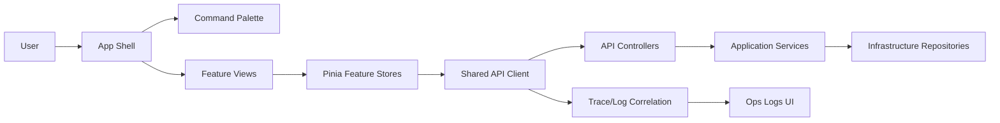

# Frontend Overhaul Architecture

Last Updated: 2026-02-12
Status: Design complete, implementation pending (documentation-first objective)

## 1. Objectives

Primary objectives:
- Deliver a complete frontend redesign (not cosmetic-only) while preserving existing board capability.
- Expose major backend capabilities in the UI, including side-track slices already implemented in API.
- Support keyboard-first workflows for creating/editing boards, columns, cards, and future checklist/project surfaces.
- Provide operational visibility (logs, queue status, action traces) to improve debugging and automated testing.
- Prepare safe automation UX where changes are reviewed before apply.

Constraints:
- Current board/column/card/label flows must remain functional throughout migration.
- Backend has transitional identity patterns (`userId` query/body on some endpoints) pending full claim-based migration.
- Implementation must be staged and test-backed.

## 2. Current State Snapshot

Current frontend routes:
- `/boards` (board list)
- `/boards/:id` (board detail)

Current frontend strengths:
- board/column/card/label CRUD
- card and column drag/drop
- filters
- keyboard shortcuts
- toasts

Current frontend gaps:
- no auth/session UI
- no permission-aware route or action gating
- no UI for users, board access, audit, queue, export/import
- no CLI exposure UI
- no logs/observability views
- no proposal/review/diff surface for automated mutations

## 3. Target Information Architecture

## 3.1 Global Shell

Top-level shell sections:
- `Boards`
- `Automations`
- `Activity`
- `Ops`
- `Settings`

Shell components:
- persistent left navigation
- top command bar with global command palette (`Ctrl/Cmd+K`)
- contextual right panel for inspector/logs/diff
- global toast and error boundary layer

## 3.2 Route Topology

Proposed primary routes:
- `/login`
- `/register`
- `/workspace/boards`
- `/workspace/boards/:boardId`
- `/workspace/automations/queue`
- `/workspace/automations/proposals`
- `/workspace/activity/board/:boardId`
- `/workspace/activity/entity/:entityType/:entityId`
- `/workspace/activity/user/:userId`
- `/workspace/ops/cli`
- `/workspace/ops/endpoints`
- `/workspace/ops/logs`
- `/workspace/settings/profile`
- `/workspace/settings/access`
- `/workspace/settings/export-import`
- `/workspace/archive`

Backward-compatible transition routes:
- keep `/boards` and `/boards/:id` until cutover
- introduce redirect policy once new routes become default

## 4. Frontend Architecture Pattern

## 4.1 Folder Structure

Target structure:

```text
frontend/taskdeck-web/src/
  app/
    shell/
    router/
    guards/
    providers/
  features/
    auth/
    boards/
    board-access/
    users/
    audit/
    llm-queue/
    automation-proposals/
    export-import/
    archive/
    ops/
  shared/
    api/
    components/
    composables/
    keyboard/
    accessibility/
    types/
    utils/
```

## 4.2 Store Strategy

Move from one broad board store to feature stores:
- `sessionStore`
- `boardsStore`
- `cardsStore`
- `labelsStore`
- `permissionsStore`
- `queueStore`
- `auditStore`
- `opsStore`

Data model guidance:
- normalized entities by `id`
- explicit `selected` references per route context
- unified async status model (`idle`, `loading`, `success`, `error`)
- typed error handling using backend `errorCode`

## 4.3 API Client Architecture

Create a shared API foundation:
- axios instance with interceptors for auth and standardized errors
- typed response and error envelopes
- capability modules per feature (auth, users, access, queue, audit, export/import)
- request correlation ID support for logs and troubleshooting

## 5. Design System Requirements (Complete Redesign)

Must define and use design tokens for:
- typography scale
- spacing scale
- semantic colors (info/success/warning/error)
- density modes (compact/default)
- focus ring and keyboard indicators
- elevation and overlay semantics

Do not retain ad hoc utility-only styling for major new surfaces.

## 6. Migration and Feature Flags

Required flags:
- `newShell`
- `newAuth`
- `newAccess`
- `newActivity`
- `newOps`
- `newAutomation`
- `newArchive`

Flag rules:
- each new surface can be enabled independently
- legacy routes remain available until acceptance criteria are met
- remove flag and legacy path only after QA sign-off

## 7. Hybrid Implementation Sequence

1. Shell foundation
- build redesigned shell and navigation
- embed legacy board view inside shell wrapper

2. Auth + permissions first
- login/register/profile/change-password
- route guards and action gating
- board access management UI

3. Boards workspace redesign
- new board list and board detail
- panel-based editing replacing modal-heavy flows
- keyboard focus graph for create/edit

4. Activity and diagnostics
- audit timeline views
- request/operation trace visibility

5. Ops and automation
- CLI runner
- endpoint explorer
- queue/proposal review flow

6. Archive and portability
- archive recovery UI
- export/import UI with validation and dry-run messaging

7. Cutover
- make new routes primary
- decommission legacy adapter

## 8. Cross-Cutting Architecture Rules

- Every mutation path must show user feedback (success/error + reason).
- Every failed action must expose enough detail for debugging (error code + endpoint + correlation id).
- Keyboard path must exist for every primary action.
- Role restrictions must be visible in UI before server rejection when possible.
- API contracts must be centralized; no direct endpoint calls from view components.

## 9. Architecture Diagram



## 10. Definition of Done for Architecture Stage

Architecture stage is complete when:
- all target routes are documented and mapped to feature modules
- store boundaries are finalized
- API client conventions are documented
- feature flags and migration strategy are approved
- keyboard/accessibility baseline is formally specified
- endpoint-entrypoint matrix is complete and current
