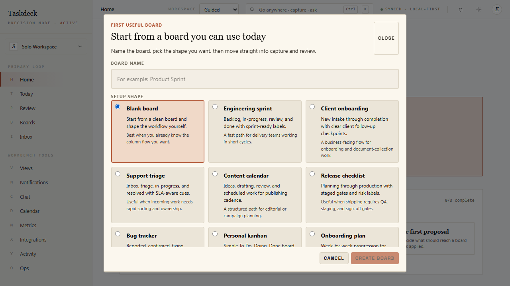
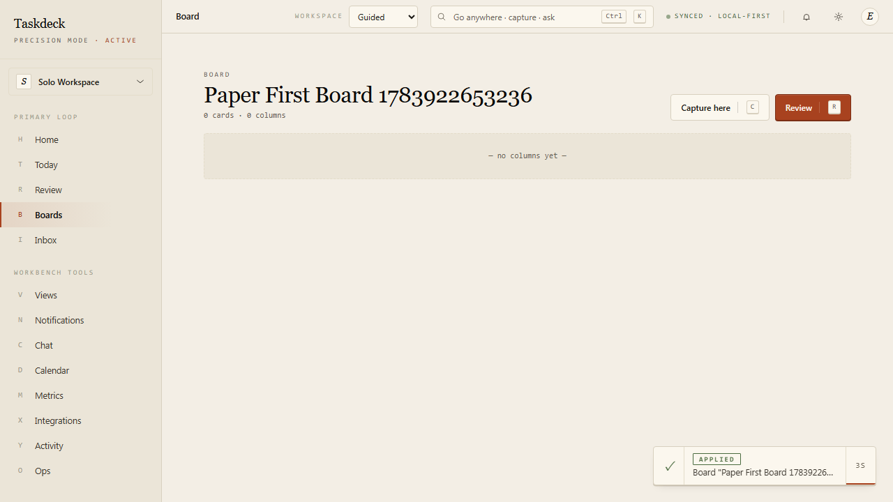

# REVIVAL-05 Paper onboarding evidence

Captured from the isolated `paper-onboarding.spec.ts` Playwright journey that starts on Paper Login, registers a fresh user through Paper Register, and continues in Paper mode on 2026-07-13.

## Guided first board



The Paper Home CTA opens the existing `WorkspaceSetupModal`; the local-only capture→review→apply activation milestones remain visible behind it.

## Created board



The same journey creates a blank board, navigates to it, then returns Home and verifies the board milestone advances to `1/4 complete` (capture → review → apply remain).

Verification command:

```powershell
$env:TASKDECK_E2E_API_BASE_URL='http://localhost:5101/api'
$env:TASKDECK_E2E_FRONTEND_PORT='5201'
$env:TASKDECK_E2E_DB='taskdeck.e2e.1301.db'
$env:TASKDECK_E2E_WORKERS='1'
npx playwright test tests/e2e/paper-onboarding.spec.ts --project=chromium --workers=1 --reporter=line
```

Result: 1 passed in 14.2 seconds.
