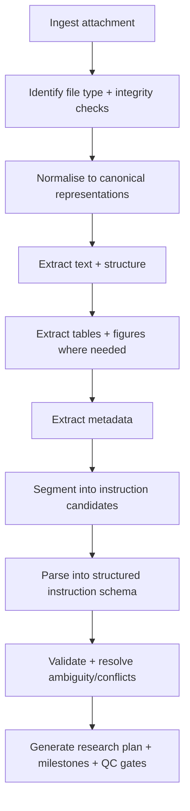
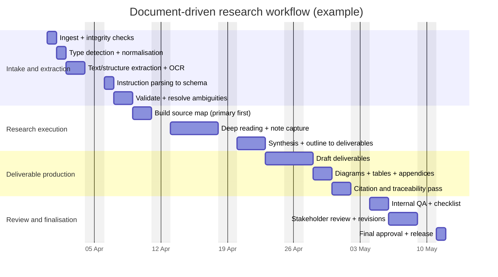

# Extracting and Following Research Instructions from an Attached Document

## Executive summary

This report outlines a robust, format-agnostic way to (a) open and parse an arbitrary “attached document” and (b) extract *structured* instructions that can be executed as a research task. The specific attached document is **unspecified**, so the approach below is designed to handle a wide range of real-world briefs, including PDFs (digital and scanned), Word, PowerPoint, plain text, and image/scan inputs. Where the document’s intent is unclear or key details are missing, the report includes concrete validation and ambiguity-handling methods.

A good instruction-extraction system is more than “get the text”: you want **traceable, structured requirements** (objectives, constraints, deliverables, deadlines, quality criteria), linked back to *where* they came from in the source (page/slide/paragraph), and scored for confidence so you can detect when a follow-up question is required. Tooling should be layered: fast “born-digital” parsing first, with OCR and document-AI escalation only when necessary (e.g., scanned PDFs, complex tables, forms). For universal multi-format extraction, Apache Tika is a strong baseline (text+metadata across many types). citeturn0search4turn0search0

As an illustration of what “instruction-rich” briefs often look like, many attached prompts are structured with explicit deliverables, constraints/non-negotiables, and reference links (even when written as free text). The attached example prompt in this chat follows that pattern (sections resembling project context, deliverables, research questions, constraints, references). fileciteturn0file0

Unspecified details you should explicitly treat as unknown until you extract them (or ask): document domain/topic; jurisdictional scope; audience; confidentiality/handling constraints; required output format(s); acceptance criteria; timeline/deadlines; citation requirements; and whether conflicting instructions have an intended precedence order.

## Steps and toolchain to open, parse, and extract structured instructions

A defensible pipeline is easiest to think of as: **ingest → detect → normalise → extract → structure → validate → plan**. The steps below are written to be implementable with either a CLI workflow or a scripted one.



### Ingest and integrity checks

1) **Capture and preserve the original bytes** (do not mutate your “source of truth”). Store:
- File name, size, hash (e.g., SHA-256) and acquisition time.
- Provenance (who supplied it, channel, version label if present).
- Any known handling constraints (e.g., “internal only”, export restrictions)—these are usually *not* in the file itself, so treat as **unspecified** unless explicitly stated.

2) **Basic safety and sanity checks** (especially for Office/PDF):
- Confirm the file opens without errors (PDFs can be malformed).
- If a PDF is encrypted or damaged, repair/decrypt into a working copy before text extraction:
  - `qpdf` can rewrite/normalise PDFs and supports transformations including encryption/decryption and linearisation. citeturn5search0turn5search12  
  - `pikepdf` (Python) builds on qpdf and is commonly used to open/repair/linearise PDFs programmatically. citeturn5search1

### File type detection (don’t trust extensions)

3) **Detect file type by content**, not extension:
- **libmagic / `file`**: identifies file types using “magic numbers” (content signatures). citeturn8search12turn8search4  
- **Apache Tika detection**: supports content-type detection and tuning. citeturn8search2  

For production, do both: use `file`/libmagic as a fast local detector and fall back to Tika’s detection when your downstream pipeline needs richer type hints.

### Normalise formats into canonical representations

4) **Choose canonical intermediate forms** so downstream parsers are simpler:
- For “document-like” content: canonical = **(a) extracted text**, **(b) structure elements**, **(c) per-page images if OCR needed**, **(d) tables as CSV/JSON when possible**, **(e) metadata**.
- For Office docs, converting to PDF can help unify extraction, but may lose some semantic structure. Prefer *native parsing* first, then convert only if needed.

**LibreOffice headless conversion** is widely used for batch conversion across formats:
- The CLI conversion syntax supports selecting output filters and parameters (including text encodings). citeturn10search20turn10search19  

### Extraction strategy by format

You typically want two classes of extractors:
- **Born-digital extractors** (fast, layout-aware when possible).
- **OCR/document-AI extractors** (for scans, photos, forms, hard tables).

#### PDF (digital or scanned)

5) **Inspect the PDF before extracting**:
- `pdfinfo` prints the PDF “Info” dictionary values (title/author/creation date, etc.) and flags like encrypted/tagged/metadata streams. citeturn4search1  
- `pdftotext` converts PDFs to plain text and can write to stdout, enabling piping. citeturn0search2  

6) **Extract text (born-digital PDFs)** using a library that fits your fidelity needs:
- `pypdf` provides `page.extract_text()` (pure Python, convenient). citeturn5search2  
- PyMuPDF is commonly used for fast extraction and supports multiple text/analysis recipes. citeturn1search8turn1search2  
- pdfplumber provides character-level detail and table extraction support; it works best on machine-generated PDFs (not scanned). citeturn1search10  

7) **Detect “scan-only” PDFs and OCR them**:
- OCRmyPDF adds an OCR text layer to PDFs, making scanned PDFs searchable/copyable, and performs useful preprocessing (rotation/deskewing, etc.). citeturn0search9turn0search23  

8) **Extract embedded images when relevant**:
- `pdfimages` extracts embedded images from PDFs into multiple image formats (PNG, TIFF, JPEG, etc.). citeturn7search13  
- `pdftoppm` renders each page to an image file, useful as an OCR input when the PDF has no text layer. citeturn7search1  

9) **Extract tables from PDFs** (choose based on table style):
- Camelot supports multiple parsing approaches (e.g., Stream vs Lattice vs Hybrid) and is designed specifically for table extraction from PDFs. citeturn1search1turn1search4  
- PyMuPDF includes table-finding recipes and APIs (e.g., `Page.find_tables()`), which can be effective without external dependencies. citeturn1search2  
- For “document AI” table extraction (particularly scans/forms): Amazon Textract can extract table structure including cells/headers/footers and table types. citeturn6search0turn6search4  

#### DOCX (Word)

10) **Parse DOCX natively first** (it’s usually higher-quality than “convert then OCR”):
- `python-docx` supports reading document text and tables, and also exposes core document properties (based on Dublin Core). citeturn3search6turn3search2turn2search2  
- For complex extraction needs (headers/footers/footnotes/endnotes), `docx2python` explicitly targets these structures. citeturn7search2turn7search6  

11) **Normalise DOCX to plain text/markdown when you want a simpler downstream parser**:
- Pandoc can convert DOCX to many formats (including Markdown), which is often convenient for instruction parsing. citeturn0search7turn0search21  
- LibreOffice conversion filters can export DOCX into text encodings such as UTF-8. citeturn10search20  

12) **Footnotes and endnotes**:
- In DOCX, footnotes can be extracted with tools that specifically parse those XML parts (e.g., docx2python). citeturn7search2  
If the deliverables depend on footnotes (common in legal/academic briefs), treat “footnote extraction coverage” as an explicit quality metric.

#### PPTX (PowerPoint)

13) **Parse PPTX natively** for slide text + speaker notes:
- `python-pptx` supports reading and analysing `.pptx` presentations and is explicitly used for corpus analysis and text extraction use cases. citeturn3search9  
- It also documents how notes slides are represented and accessed. citeturn3search1turn3search29  

14) **If the deck is highly visual** (screenshots, diagrams with embedded text), treat it partially like an “image document”:
- Render slides to images (e.g., via LibreOffice conversion to PDF then `pdftoppm`) and OCR only the slides that don’t yield text through native parsing. citeturn10search20turn7search1turn0search23  

#### TXT (plain text)

15) TXT is straightforward: read as UTF-8 if possible, fall back to a detected encoding (e.g., via chardet/uchardet). The key is to preserve line numbers/offsets so extracted instructions can be traced back precisely.

#### Images and scans (PNG/JPG/TIFF, photos, scanned pages)

16) **Open and standardise image inputs**:
- Pillow can identify and read many image formats and detects formats from file contents when opening. citeturn8search3  

17) **OCR options**
- **Local / open-source OCR**: Tesseract is a widely used open source OCR engine and can be used via CLI. citeturn1search6turn1search0  
- **PDF-first OCR**: OCRmyPDF wraps OCR for PDFs and performs preprocessing steps before generating a searchable PDF. citeturn0search9turn0search23  
- **Cloud / document AI OCR (no budget constraints)**:
  - Amazon Textract (text, layout elements, tables, forms depending on API choice). citeturn6search4turn6search0  
  - Azure Document Intelligence (layout + tables + key-value extraction, depending on model). citeturn6search8turn6search5  
  - Google Document AI (OCR + entities + tables, Form Parser and other processors). citeturn6search12turn6search2turn6search33  
  - ABBYY FineReader Engine (SDK; strong OCR + conversion outputs and field extraction). citeturn6search3turn6search27  

18) **Preprocessing for OCR accuracy** (deskew, denoise, crop):
- ImageMagick is commonly used to fix/clean scanned images in batch workflows. citeturn4search12  
- Deskewing can materially improve OCR results; OpenCV-based deskew approaches are a standard preprocessing technique for text images. citeturn4search16  

### Handling embedded tables, footnotes, and metadata

19) **Tables**
- Treat table extraction as a first-class output type, not “text that happens to look like a table”.
- Prefer: PDF-native table extractors for born-digital PDFs (Camelot/PyMuPDF), doc-AI for scanned tables and forms (Textract/Azure/Google). citeturn1search1turn1search2turn6search0turn6search5turn6search2  

20) **Footnotes**
- DOCX: use dedicated XML-aware tooling (docx2python) when footnotes/endnotes matter. citeturn7search2  
- PDF: footnotes are layout artefacts; treat them as a layout-region problem (bottom-of-page blocks, smaller font, footnote markers). If your extracted instructions cite footnotes, keep the linkage (“marker → footnote text”) as structured data.

21) **Metadata**
- PDF: `pdfinfo` provides Info-dictionary values and useful flags. citeturn4search1  
- Many formats: ExifTool is a cross-platform CLI for reading/writing metadata across many file types. citeturn2search29turn2search5  
- DOCX/PPTX: core properties are commonly accessible via python-docx since core properties are shared across Open XML formats. citeturn2search2  

image_group{"layout":"carousel","aspect_ratio":"16:9","query":["document processing pipeline OCR diagram","PDF text extraction pdftotext pdfinfo diagram","table extraction from PDF camelot diagram","document ai layout extraction diagram"],"num_per_query":1}

### Cross-platform command-line examples

These are “known-good” building blocks you can chain together; fine-tune flags per document.

**Linux (bash)**
```bash
# Inspect PDF metadata / encryption flags
pdfinfo input.pdf

# Extract text (born-digital)
pdftotext input.pdf -  > output.txt

# Render to images for OCR (one image per page)
pdftoppm -png input.pdf page

# Extract embedded images (if needed)
pdfimages -all input.pdf extracted_image

# OCR a scanned PDF into searchable PDF/A (example)
ocrmypdf --deskew --rotate-pages -l eng input.pdf ocr_output.pdf

# Repair / normalise a PDF (and potentially remove some structural issues)
qpdf input.pdf normalised.pdf
```
The above tools/behaviours are documented for `pdfinfo`, `pdftotext`, `pdftoppm`, and `pdfimages` in Poppler manpages, and OCRmyPDF’s documentation/manpage. citeturn4search1turn0search2turn7search1turn7search13turn0search23turn0search9turn5search0  

**macOS (bash; assumes tools installed, e.g., via Homebrew)**
```bash
pdfinfo input.pdf
pdftotext input.pdf - > output.txt
pdftoppm -png input.pdf page
ocrmypdf --deskew --rotate-pages -l eng input.pdf ocr_output.pdf
tesseract page-1.png page-1 -l eng
```
Tesseract’s simplest CLI invocation (`tesseract imagename outputbase`) and OCRmyPDF’s PDF OCR behaviour are documented in their official docs. citeturn1search0turn0search9  

**Windows (PowerShell)**
```powershell
# Poppler tools and Tesseract must be installed and on PATH for these to work
pdfinfo.exe input.pdf
pdftotext.exe input.pdf - | Out-File -Encoding utf8 output.txt

# OCRmyPDF (if installed via Python) - run from a shell that has ocrmypdf on PATH
ocrmypdf --deskew --rotate-pages -l eng input.pdf ocr_output.pdf

# Tesseract on an image
tesseract.exe page-1.png page-1 -l eng
```
Command semantics for pdftotext and Tesseract are documented in their manpages/docs. citeturn0search2turn1search0  

**Office conversion (cross-platform)**
```bash
# Convert Word / PowerPoint etc. using LibreOffice filters and --outdir
soffice --headless --convert-to "txt:Text (encoded):UTF8" --outdir out input.docx
soffice --headless --convert-to pdf --outdir out input.pptx
```
LibreOffice’s conversion filter syntax and examples (including TXT encoding and PDF export filters) are documented in LibreOffice “File Conversion Filter Names” help and its CLI documentation. citeturn10search20turn10search19  

### Turning extracted content into “structured instructions”

22) **Segment and classify content blocks** into candidates for instructions:
- Titles/headings, numbered lists, bullets, tables with “Required/Owner/Due” columns, and modal verbs (“must/shall/should”) are strong signals.
- Libraries like `unstructured` can “partition” documents into typed elements (Title, NarrativeText, ListItem, etc.), which can simplify the instruction identification phase. citeturn2search3turn2search7  

23) **Parse candidates into a strict schema**:
- Use an internal schema (see next section) and always store:
  - extracted text snippet
  - source location (page/slide, bounding box if available, paragraph index)
  - extraction method used (born-digital vs OCR, tool name/version)
  - confidence score and rationale

This traceability is what makes later validation and conflict resolution feasible.

## Template to capture research objectives, constraints, deliverables, timelines, and evaluation criteria

Use this as your *canonical* extraction target. The key design choice is that every field should support: **(a) value**, **(b) source reference**, **(c) confidence**, **(d) notes/assumptions**.

| Field | What it captures | What to look for in the document | Structured representation (suggested) |
|---|---|---|---|
| Document ID | Unique identifier for the attachment/version | Title page, header/footer, filename, version string | `doc_id`, `version`, `hash_sha256` |
| Research objective | The primary goal(s) of the research task | “Goal / Objective / Purpose / You will…” statements; opening brief | `objectives[]` (each: `statement`, `priority`) |
| Scope and boundaries | What is included/excluded | “In scope / Out of scope”, exclusions, carve-outs | `scope.in[]`, `scope.out[]` |
| Audience | Intended readers / stakeholders | “For…”, “Audience…”, distribution list | `audience.primary`, `audience.secondary` |
| Deliverables | Required outputs and formats | “Deliverables”, “Produce”, “Submit”, explicit artefacts | `deliverables[]` (type, format, length, required sections) |
| Quality criteria | How deliverables will be judged | “Acceptance criteria”, rubric, “must include”, citation rules | `evaluation.criteria[]` |
| Constraints | Non-negotiables, tooling limits, language, style | “Must”, “shall”, “do not”, platform constraints | `constraints[]` (hard/soft) |
| Timeline and deadlines | Dates, milestones, review meetings | Specific dates, “by EOD”, “within X days” | `timeline.milestones[]` (date, owner, gating) |
| Sources and citation policy | Allowed/required sources, citation format | “Use primary sources”, “en-GB”, “exclude blogs” | `sources.policy`, `sources.priority[]` |
| Compliance / legal | Regulatory constraints, licensing, privacy | “GDPR”, “confidential”, “no external sharing” | `compliance[]` |
| Assumptions | Stated assumptions and inferred ones | “Assume…”, “Unless specified…” | `assumptions[]` (tag: stated/inferred) |
| Open questions | Missing inputs needed to proceed | Unspecified deadlines, ambiguous terms | `open_questions[]` |
| Instruction precedence | How to resolve conflicts within the doc | “In case of conflict…”, “latest version wins” | `precedence.rules[]` |
| Change control | How updates to instructions are handled | “Revisions”, “change log” | `change_control` |
| Traceability fields | Where each extracted item came from | Page/slide, paragraph, bounding box | `source_ref` (page/slide, offsets, extractor) |
| Confidence score | How certain the extraction is | OCR quality, parse certainty, conflicts | `confidence` (0–1) + `reasons[]` |

If the document does not specify a field, record it as **unspecified** rather than guessing. The only “default” you should assume is what the user explicitly stated (e.g., language preference en‑GB).

## Validating extracted instructions and handling missing or conflicting requirements

Validation is where most instruction-following systems either become reliable or fail quietly. The goal is to detect: **extraction errors**, **interpretation errors**, **ambiguity**, and **conflicts**.

### Cross-checking and triangulation

Use at least two independent signals for critical instructions (deadlines, deliverables, bans/constraints):

- **Dual-extractor agreement**: run two different extraction approaches and compare:
  - Example: PDF text from `pdftotext` vs `pypdf`/PyMuPDF; if they disagree heavily, you may have layout/encoding issues. citeturn0search2turn5search2turn1search8  
  - Example: scanned PDF—compare OCRmyPDF output vs a cloud OCR (Textract/Azure/Google) for a subset of pages to establish accuracy on that document class. citeturn0search23turn6search4turn6search8turn6search12  

- **Round-trip checks**:
  - For OCR’d PDFs: ensure the output PDF’s text layer is non-empty and searchable (spot-check by extracting text again).
  - For Office conversions: compare native parse vs converted PDF parse for section headers and list numbering (conversion can alter numbering or omit speaker notes).

- **Location-based verification**:
  - Always store `source_ref` and render a “verification snippet” (e.g., the exact paragraph or slide note) so a human can quickly confirm.

### Ambiguity detection (find where you must ask questions)

Flag instructions as ambiguous when they contain any of the following patterns:

- **Unbound references**: “use the standard template” (template not included), “follow company policy” (policy not linked).
- **Missing quantities**: “include citations” with no minimum/format; “brief” with no length.
- **Relative deadlines** without anchor: “by next Friday” (needs timezone/calendar context), “within two weeks” (from what date?).
- **Undefined evaluation criteria**: “high quality” without rubric.
- **Tooling vagueness**: “use AI” with no provider/data-handling constraints.

Your structured output should include `open_questions[]` items automatically when these triggers fire.

### Confidence scoring (practical heuristics)

Assign a 0–1 confidence per extracted instruction, combining:

- **Extraction confidence**
  - Born-digital text from native parsers → higher
  - OCR text (especially from camera photos, skewed scans) → lower by default; adjust upward with preprocessing success and multi-engine agreement. citeturn0search23turn1search0turn4search16  

- **Structural confidence**
  - Instruction appears in a “Deliverables/Requirements/Constraints” section → higher
  - Instruction inferred from prose → lower

- **Conflict penalty**
  - Two different due dates for same deliverable → reduce confidence and emit a conflict record

Represent this as:
- `confidence`: float in [0,1]
- `confidence_reasons[]`
- `conflicts_with[]` (references to other instructions)

### Handling missing instructions

When required fields are missing, do not fill them with assumptions unless the brief explicitly authorises defaults. Instead:

- Record `unspecified` and generate a **clarifying question**.
- If you must proceed (e.g., automation): adopt a conservative default plan (short milestone cycle, early review checkpoint), clearly labelling it as **assumption** and keeping it easy to revise.

### Handling conflicting instructions

Define resolution rules (preferably extracted from the doc; otherwise apply a documented default):

Default precedence model (if unspecified):
1) Explicit “must/shall” constraints override “should/may”.
2) Later sections override earlier sections *only if* the document implies revision/updates.
3) More specific instruction overrides a general one (e.g., “use en‑GB” overrides “use English”).
4) If still unresolved: escalate as `open_question` and block execution for the conflicting items.

## Workflow to convert extracted instructions into a detailed research plan

Once you have structured instructions, you can generate a research plan that is *mechanically connected* to them. A good plan includes deliverable decomposition, milestones, resources, risk controls, and explicit QC gates tied to acceptance criteria.

### Planning workflow

1) **Create a “requirements ledger”**: a single list of all extracted objective/constraint/deliverable items, each with:
- owner (if specified; else “unassigned”)
- due date (if specified; else “unspecified”)
- acceptance criteria
- dependencies
- confidence and open questions

2) **Decompose deliverables into work packages**
- Example: “Produce analytical report with citations + diagrams” becomes:
  - research question refinement
  - source collection
  - synthesis
  - diagram creation
  - citation pass
  - QA pass

3) **Map constraints to plan-level guards**
- Example: “Use primary sources” → enforce source prioritisation.
- Example: “en‑GB” → configure spelling/locale.
- Example: “no PDFs analysed without screenshots” (if you were in a tool environment like this chat) → make it a gating check.

4) **Allocate resources**
- Tools: extraction stack, bibliography manager, diagram tooling, compute for OCR.
- People: reviewers, SMEs, editors (or “solo” if not specified).

5) **Risk register + mitigations**
Typical document-driven research risks:
- OCR errors (mitigate with preprocessing + multi-engine spot checks). citeturn0search23turn4search16  
- Table extraction failures (mitigate with alternate extractor and/or doc AI). citeturn1search1turn6search0  
- Instruction ambiguity (mitigate with early clarifying questions and a “requirements freeze” milestone).

6) **Insert QC and approval gates** (see QC section) before any “final” deliverable.

### Example Gantt-style timeline (illustrative)

Because constraints and deadlines are **unspecified**, the timeline below is a reasonable default for a “serious but not months-long” research task starting on **2026-03-31** (Europe/London). Adjust durations once the document’s real deadlines/scope are extracted.



If the document specifies a deadline earlier than this default, compress by reducing exploration time first, not validation/QC.

## Source strategy for executing the research (prioritise primary/official, en‑GB)

Because the document topic is **unspecified**, the best you can do is define a defensible *source prioritisation policy* and then tailor it once the topic/constraints are extracted.

Priority order (default):

1) **Primary/official sources**
- Official standards bodies, regulators, government guidance, official vendor documentation, original datasets, official statistics.
- For technology topics: official docs and reference manuals (e.g., tool vendor docs, RFCs, standards).

2) **Peer-reviewed / academic literature**
- Journal articles, conference papers, authoritative surveys, and reproducibility artefacts.
- Prefer sources with clear methodology and citations; use preprints where appropriate but clearly label as such.

3) **Institutional secondary sources**
- University libraries, reputable research institutes, established professional bodies.

4) **High-quality tertiary sources**
- Encyclopaedic summaries can be used for orientation, but should not carry core claims in final deliverables unless independently confirmed.

Language and locale rules (en‑GB preference):
- Prefer UK/International English documents if the topic is policy/regulatory or user-facing guidance.
- If most primary sources are US English, keep citations as-is but write your synthesis in en‑GB.
- For jurisdiction-sensitive topics, explicitly track jurisdiction per claim (UK/EU/US/other) and avoid mixing without labelling.

Recency rules:
- For fast-changing topics (APIs, policy, pricing), prefer the most recent official sources, and record “as of” dates.
- For stable concepts (maths, fundamentals), recency is less important than authority.

## Quality-control checks and deliverable approval checklist

Quality control should be tied directly to the extracted instruction schema, so you can prove you followed the document.

### Quality-control checks (systematic)

- **Instruction coverage check**: every extracted deliverable/constraint has a corresponding section or explicit “not applicable” justification.
- **Traceability check**: every non-trivial requirement in your output links back to a `source_ref` from the attachment (page/slide/paragraph ID).
- **Ambiguity log**: all open questions are either resolved (with evidence) or explicitly left open with impact noted.
- **Conflict resolution record**: if conflicting instructions existed, record which rule resolved them and why.
- **Citation integrity**
  - Every key claim is supported by a primary/academic source.
  - Citations are not “link dumping”: they correspond to the sentence they support.
- **Tables/figures accuracy**
  - If table extraction was automated, verify sampled rows/cells against the original (especially headers, totals, and negative values).
- **Locale/style compliance**
  - en‑GB spelling and terms where required.
  - Document formatting requirements (sections, word count, diagram requirements) satisfied.
- **Reproducibility**
  - Record tool versions and commands used for extraction (Tesseract/OCRmyPDF/PDF parser versions matter). citeturn0search23turn1search6  

### Approval checklist (gate before sending deliverables)

Use as a sign-off form:

- All **deliverables** present in required format(s).
- All **constraints** complied with (or explicitly waived with justification).
- All **deadlines** met (or impact documented).
- **Evaluation criteria** demonstrably satisfied (quote the criteria, then show where you met them).
- **Citations** complete and high-quality.
- **No unresolved P0 ambiguities** that could change conclusions.
- **Red-team sanity check**: if someone tried to misread the instructions, where would they fail? (Fix those points.)

## Example automation: command sequences and scripts to extract and parse instructions

Below are automation patterns you can adapt. They’re intentionally “pluggable”: swap parsers per environment and document class.

### Pattern A: “Universal” extraction with Apache Tika (text + metadata across many types)

Apache Tika is designed to detect and extract text/metadata from a large range of document formats through a single interface. citeturn0search4  
It also publishes server images that expose REST endpoints for parsing. citeturn7search3turn7search7  

**CLI-ish Docker + curl example (cross-platform)**
```bash
docker run --rm -p 9998:9998 apache/tika:latest

# Extract text
curl -T input.docx http://localhost:9998/tika > extracted.txt
```
(Exact endpoints/availability depend on your container tag and environment; the Tika server images are explicitly intended to run on port 9998.) citeturn7search3turn7search7  

### Pattern B: Deterministic local pipeline (PDF + Office + OCR fallback)

**High-level pseudocode**
```text
function extract_instructions(path):
  bytes = read_file(path)
  sha256 = hash(bytes)

  filetype = detect_type_with_libmagic(bytes)  # or `file`
  if uncertain(filetype):
    filetype = detect_with_tika(bytes)

  artefacts = {}

  if filetype is PDF:
    meta = pdfinfo(path)
    text = extract_text_pdf(path)  # pypdf or pymupdf
    if is_empty(text) or looks_like_scan(meta):
      ocr_pdf = ocrmypdf(path, lang="eng")  # en-GB still uses eng OCR model typically
      text = extract_text_pdf(ocr_pdf)
    tables = extract_tables_pdf(path)  # camelot / pymupdf / textract if needed
    artefacts = {text, tables, meta}

  else if filetype is DOCX:
    meta = read_core_properties_docx(path)
    body_text, tables, footnotes = parse_docx(path)  # python-docx + docx2python
    artefacts = {body_text, tables, footnotes, meta}

  else if filetype is PPTX:
    slides_text, speaker_notes = parse_pptx(path)  # python-pptx
    meta = read_core_properties_pptx(path)  # if available via container props
    artefacts = {slides_text, speaker_notes, meta}

  else if filetype is image:
    img = preprocess_image(path)  # optional deskew/denoise
    text = tesseract(img, lang="eng")
    meta = exiftool(path)
    artefacts = {text, meta}

  else if filetype is text:
    artefacts = {read_text(path), minimal_meta(path)}

  # Segment into candidate instruction blocks
  blocks = segment(artefacts.text, artefacts.tables, artefacts.footnotes)

  # Convert blocks -> structured requirements template
  req = parse_blocks_to_schema(blocks)

  # Validate and emit open questions/conflicts
  validated_req = validate(req, artefacts)

  return validated_req
```

Why these components are common building blocks:
- `pypdf` provides a documented `extract_text()` flow. citeturn5search2  
- OCRmyPDF adds OCR layers to PDFs and documents its rasterise → OCR → rebuild behaviour. citeturn0search23turn0search9  
- Tesseract documents the basic CLI invocation and language data expectations. citeturn1search0turn1search6  
- Camelot documents multiple PDF table extraction strategies. citeturn1search1turn1search4  
- python-docx supports tables and core properties; docx2python targets footnotes/endnotes. citeturn3search2turn2search2turn7search2  
- python-pptx documents notes slides and supports `.pptx` analysis. citeturn3search9turn3search1  
- ExifTool is explicitly designed to read metadata across many file types. citeturn2search29turn2search5  

### Pattern C: LibreOffice + Pandoc normalisation before parsing

This is useful when you want a *consistent* intermediate (Markdown or plain text) for instruction parsing.

```bash
# Convert DOCX to Markdown with pandoc
pandoc -f docx -t markdown input.docx -o input.md

# Convert Office documents to text/PDF using LibreOffice conversion filters
soffice --headless --convert-to "txt:Text (encoded):UTF8" --outdir out input.docx
soffice --headless --convert-to pdf --outdir out input.pptx
```

Pandoc’s multi-format conversion capability and LibreOffice’s conversion-filter syntax (including filter naming and parameters) are documented in their manuals/help. citeturn0search7turn10search20  

### Pattern D: Escalation to document AI for hard cases (scans/forms/tables)

When budget/time are unconstrained, you can route difficult pages to an API-based “layout + table + key-value” extractor:

- Textract table extraction (structure, headers, merged cells, etc.). citeturn6search0  
- Azure Document Intelligence “general document” / layout capabilities (tables, key-value pairs, selection marks depending on model). citeturn6search8turn6search5  
- Google Document AI processors (Form Parser, Layout Parser, etc.). citeturn6search2turn6search33turn6search12  
- ABBYY FineReader Engine SDK (conversion outputs + field extraction). citeturn6search3turn6search27  

A practical rule: **use local extraction by default**, escalate only when validation signals poor coverage/accuracy (low confidence, table parse failures, heavy OCR noise, or instruction-critical content trapped in images).