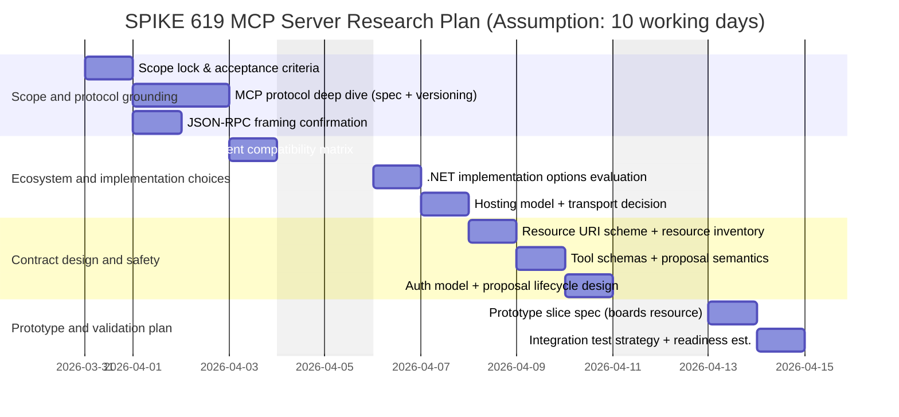
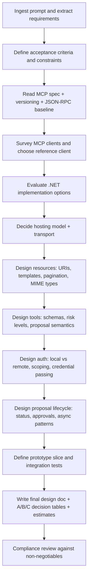

# Instruction Extraction and Execution Plan for SPIKE 619 MCP Server Research Prompt

## Executive summary

The attached document is a design-spike research prompt whose primary objective is to enable a solo developer to design and later implement an MCP server that exposes **Taskdeck** resources and actions safely to external AI agents. fileciteturn0file0

The document is explicit about five required deliverables (scope document, full resource/tool + auth inventory, a minimal working prototype target centred on a single `boards://`-style resource, an integration-test strategy, and an estimate to production readiness), and it is equally explicit about non-negotiable constraints—most importantly a “review-first” safety invariant (GP‑06) requiring write operations to create *proposals* rather than directly mutating boards, plus strict identity/auth mapping and solo-developer feasibility. fileciteturn0file0

Where the document is silent, the main gaps you will need to close are: the **timebox/deadlines** for the spike itself, the **target audience detail** (beyond “solo developer”), the **citation/style requirements**, and several concrete product decisions the research must resolve (e.g., the canonical URI scheme appears in two forms: `boards://` vs `taskdeck://…`). fileciteturn0file0

The research plan below converts the prompt into a traceable set of work packages, prioritising primary sources (notably the official MCP specification and related protocol references) and mapping each required output to milestones, methods, and a risk/issue register. citeturn0search0turn0search8turn0search1

## Extracted instructions and constraints

### Instruction register (verbatim excerpts and operational paraphrases)

The table uses short verbatim excerpts (kept intentionally brief) paired with the corresponding “what to do” paraphrase to make the prompt actionable.

| ID | Category | Verbatim (excerpt) | Paraphrased operational instruction |
|---|---|---|---|
| I‑01 | Role / intent | “You are a senior platform architect…” | Produce an architect-grade design spike: rigorous trade-offs, protocol compliance, and implementability focus. fileciteturn0file0 |
| I‑02 | Goal | “produce a comprehensive MCP server design document…” | Deliver a buildable design, not a concept note; assume a solo implementer needs clarity and decisions, not options only. fileciteturn0file0 |
| I‑03 | Audience constraint | “enables a solo developer…” | Favour simplicity, low maintenance burden, incremental delivery, and strong defaults. fileciteturn0file0 |
| I‑04 | Safety invariant | “GP‑06… Nothing mutates… without explicit user approval.” | Enforce a proposal pipeline boundary for all board mutations; default behaviour must be “create proposal, await approval.” fileciteturn0file0 |
| I‑05 | Prohibited method (implied) | “non-negotiable… calling ‘create card’ tool produces a proposal, not a card.” | Do **not** design MCP tools that directly write to boards unless an explicitly sanctioned “AllowDirect” exception is opt-in and policy-gated. fileciteturn0file0 |
| I‑06 | Existing architecture context | “Backend: .NET 8… EF Core + SQLite…” | Ensure the design fits the stated stack (ASP.NET Core hosting, DI, EF Core/SQLite realities, etc.). fileciteturn0file0 |
| I‑07 | Auth constraint | “Auth: JWT… claims-first identity.” | Every MCP request must map to authenticated identity; avoid designs requiring caller-provided user IDs. fileciteturn0file0 |
| I‑08 | Roadmap / timeline context | “MCP at v0.4.0+ … designing it now, prototyping minimally…” | Treat MCP as future strategic investment; produce a minimal prototype path now but avoid heavy early integration that threatens v0.1–v0.3 goals. fileciteturn0file0 |
| I‑09 | Deliverable | “MCP server scope document…” | Enumerate which *Resources*, *Tools*, and *Prompts* will be exposed (and what will not). fileciteturn0file0 |
| I‑10 | Deliverable | “Resource/tool inventory with auth model… schema + security design.” | Provide concrete schemas (URIs, tool inputs via JSON Schema, outputs) plus an auth/scoping story. fileciteturn0file0 |
| I‑11 | Deliverable / prototype | “One resource (`boards://`) accessible via MCP.” | Pick one thin vertical slice that works end-to-end with an MCP client (real discovery + read). fileciteturn0file0 |
| I‑12 | Deliverable | “Integration test strategy… reference MCP client.” | Specify how you will validate interoperability with at least one real client ecosystem integration. fileciteturn0file0 |
| I‑13 | Deliverable | “Timeline estimate for production readiness.” | Provide an execution estimate that accounts for hard problems (auth, lifecycle, protocol volatility). fileciteturn0file0 |
| I‑14 | Research scope | “Research [MCP] comprehensively…” | Use primary spec as source of truth; cover lifecycle, transports, primitives, and security posture. fileciteturn0file0 |
| I‑15 | Protocol specifics to resolve | “transport… stdio, HTTP+SSE, Streamable HTTP… JSON‑RPC…” | Confirm required transport(s) per target clients; ground implementation on JSON‑RPC framing rules. fileciteturn0file0turn0search1turn0search0 |
| I‑16 | Library survey | “Research… MCP server libraries… for .NET.” | Evaluate available .NET SDKs/libraries vs writing a minimal subset; compare maturity and fit. fileciteturn0file0 |
| I‑17 | Hosting decision | “Embedded… Standalone… Sidecar…” | Compare hosting models against deployment goals and SQLite constraints; make a recommendation. fileciteturn0file0 |
| I‑18 | Resource design direction | “Design the complete MCP resource… inventory…” | Specify canonical URI scheme(s), MIME types, pagination, and user scoping. fileciteturn0file0 |
| I‑19 | Tool design direction | “Write tools (MUST produce proposals)…” | Define tool surface area with risk levels; ensure write tools emit proposals and provide status tracking. fileciteturn0file0 |
| I‑20 | Prompt design direction | “Prompts… triage_inbox… board_status…” | Decide whether prompts add value vs tools alone; if included, define prompt templates clearly. fileciteturn0file0 |
| I‑21 | Auth research | “MCP doesn’t define auth… Research and recommend [auth models].” | Survey existing MCP servers for auth patterns; design a local + remote story (JWT passthrough, API key, OAuth, etc.). fileciteturn0file0 |
| I‑22 | Proposal lifecycle gap | “Most MCP tools are fire-and-forget… proposals need approval.” | Design a usable workflow for asynchronous approval and status checks without violating GP‑06. fileciteturn0file0 |
| I‑23 | Client ecosystem | “Which AI clients support MCP? … transport does each support?” | Build compatibility matrix; ensure prototype targets a real widely-used client path. fileciteturn0file0 |
| I‑24 | Operational concerns | “Token efficiency… SQLite… observability… versioning.” | Address response size, concurrency risks, logging/tracing, and handling MCP spec version changes. fileciteturn0file0turn0search8 |
| I‑25 | Non-negotiables | “Constraints and Non-Negotiables…” | Treat these as acceptance criteria; if any recommendation violates them, it is invalid. fileciteturn0file0 |
| I‑26 | Formatting requirement | “For each decision point, provide… [Option A/B/C comparison table].” | Present decisions using a consistent criteria table and an explicit recommendation line. fileciteturn0file0 |

### Explicit deliverables and embedded timelines

The document’s explicit deliverables (what must be produced by the spike) are listed verbatim as a numbered set and should be treated as the minimum output contract. fileciteturn0file0

The document provides **roadmap timing context** (MCP positioned at v0.4.0+; earlier versions focus on other product goals) but does **not** provide a date or duration for the spike itself; it also states the first prototype deliverable scope is one resource working end-to-end. fileciteturn0file0

### Preferred sources and “authoritative” references

The prompt explicitly names reference materials and treats the MCP specification and official documentation as primary. fileciteturn0file0turn0search0turn0search4

For convenience, here is the referenced source list as a portable set of URLs (verbatim).  

```text
https://modelcontextprotocol.io/specification
https://modelcontextprotocol.io/introduction
https://github.com/modelcontextprotocol
https://github.com/modelcontextprotocol/typescript-sdk
https://github.com/modelcontextprotocol/python-sdk
https://docs.anthropic.com/en/docs/build-with-claude/mcp
https://docs.anthropic.com/en/docs/claude-code/mcp
https://github.com/modelcontextprotocol/servers
https://docs.anthropic.com/en/docs/build-with-claude/tool-use
https://learn.microsoft.com/en-us/aspnet/core/fundamentals/middleware
https://learn.microsoft.com/en-us/dotnet/core/extensions/hosted-services
```

fileciteturn0file0

## Unspecified items and assumptions

This section separates (a) items the document truly does not specify, from (b) recommended assumptions you can adopt to proceed without blocking.

### Items not specified in the document

The prompt does not explicitly define: spike duration/deadlines; expected document length; citation style (e.g., IEEE/APA); whether diagrams are required (beyond the comparison tables); definition of “production readiness” (SLOs, security review depth, CI requirements); which MCP transport(s) must be supported in the prototype (it suggests likely choices per environment but does not mandate one); and the canonical URI scheme naming convention (it mentions `boards://` for prototype scope, but provides example URIs using `taskdeck://…`). fileciteturn0file0

It also does not specify governance details for the GP‑06 approval step (who approves; whether “external agent approves its own proposals” is allowed), only that write operations must not silently mutate boards and highlights the trade-off as a research question. fileciteturn0file0

### Working assumptions to enable a concrete plan

Assumption A: The spike is timeboxed to **10 working days** starting **31 March 2026** (today in Europe/London) to produce the required deliverables and a minimal end-to-end prototype slice. (Assumption to compensate for missing deadlines.) fileciteturn0file0

Assumption B: The primary written deliverable is a single Markdown design document (plus appendices) that includes the mandated A/B/C comparison tables for each decision point. (Assumption to satisfy the formatting directive.) fileciteturn0file0

Assumption C: Citations should be “inline linkable” and prioritise primary sources: MCP spec pages (including versioning), JSON‑RPC spec, and platform docs for the selected implementation stack. citeturn0search0turn0search8turn0search1

Assumption D: The prototype targets one mainstream MCP client integration path and prioritises feasibility for a solo developer (likely stdio for local IDE/agent tooling, or HTTP+SSE for remote), but transport selection is an explicit research outcome rather than a foregone conclusion. fileciteturn0file0

Assumption E: The canonical resource URI scheme will be standardised (either `taskdeck://…` everywhere or a documented alternative) as part of the resource-design milestone; the initial `boards://` reference is treated as a “prototype label” rather than a final naming decision until confirmed. fileciteturn0file0

## Research plan with milestones, methods, prioritised sources, and traceability

### Approach and methods

This plan treats the prompt as a requirements document and applies a “traceability-first” workflow: every deliverable and major decision is mapped back to an instruction ID (I‑xx) so you can verify compliance. A requirements traceability approach is widely used in systems/software engineering to ensure outputs cover stated requirements. citeturn0search3turn1search2

Primary protocol grounding should come from the official MCP specification (including versioning semantics) and the JSON‑RPC 2.0 specification, since the prompt explicitly calls out JSON‑RPC message framing and evolving protocol versions. citeturn0search0turn0search8turn0search1

### Milestones and work packages

**Milestone M1: Scope lock and acceptance criteria (Day 1)**  
Translate I‑01–I‑13 and I‑25–I‑26 into a checklist of acceptance criteria, including explicit “must not violate GP‑06” tests. Output: a one-page scope/acceptance block that sits at the top of the design doc. fileciteturn0file0

**Milestone M2: Protocol deep dive (Days 2–3)**  
Work package: read MCP spec sections for primitives (Resources/Tools/Prompts), lifecycle (init/capabilities/shutdown), transports, and versioning rules; confirm JSON‑RPC payload requirements. Output: protocol summary and a “what we implement vs defer” list. fileciteturn0file0turn0search0turn0search8turn0search1

**Milestone M3: Client compatibility matrix (Day 4)**  
Work package: survey target MCP clients/tools mentioned in the prompt and document supported transports and configuration experience, then select the reference client for integration testing and prototype validation. Output: a matrix and a justified choice. fileciteturn0file0turn2view0

**Milestone M4: .NET implementation options (Day 5)**  
Work package: inventory candidate .NET MCP libraries (or justify minimal in-house implementation); compare “use library” vs “build subset” vs “thin adapter over REST” on effort/maintenance/compliance/solo feasibility. Output: a decision table set (per required comparison format). fileciteturn0file0

**Milestone M5: Hosting model and transport selection (Day 6)**  
Work package: compare embedded vs standalone vs sidecar; select transport(s) per deployment story and chosen reference client; weigh SQLite concurrency risks and startup footprint constraints. Output: recommendation + constraints and mitigation plan. fileciteturn0file0

**Milestone M6: Resource/tool/prompt contract design (Days 7–8)**  
Work package: define canonical URI scheme, resource templates, pagination and MIME types; define tool schemas with risk levels; explicitly encode the proposal behaviour in tool descriptions; decide on prompt set and when to use prompts vs tools. Output: “inventory with schemas + auth model” deliverable content. fileciteturn0file0

**Milestone M7: AuthN/AuthZ and proposal lifecycle design (Day 9)**  
Work package: decide local vs remote auth approach; specify credential passing model for clients; define scoping rules; decide whether proposal approval is exposed via MCP tools and under what constraints. Output: an “auth strategy” section and proposal lifecycle state machine. fileciteturn0file0

**Milestone M8: Prototype slice + test strategy + production readiness estimate (Day 10)**  
Work package: implement (or specify implementing) `boards` resource end-to-end with chosen client; define integration tests; produce production readiness estimate and phased delivery plan aligned to the product roadmap. Output: prototype recommendation, test strategy, and timeline estimate. fileciteturn0file0

### Instruction-to-plan traceability map

| Instruction IDs covered | Where it is satisfied in the plan | Evidence artefact |
|---|---|---|
| I‑01–I‑03 | M1, plus decision tables throughout | Scope/acceptance block + “solo-dev feasibility” column in all comparisons fileciteturn0file0 |
| I‑04–I‑05, I‑25 | M1, M6, M7 | GP‑06 compliance checklist + tool semantics enforcing proposal creation fileciteturn0file0 |
| I‑09–I‑13 | M6, M8 | Five deliverables produced as discrete sections/appendices fileciteturn0file0 |
| I‑14–I‑16 | M2, M4 | Protocol summary + .NET library/options evaluation fileciteturn0file0 |
| I‑17–I‑18 | M5, M6 | Hosting/transport recommendation + canonical URI scheme and resource shapes fileciteturn0file0 |
| I‑19–I‑22 | M6, M7 | Tool inventory with proposal semantics + lifecycle approach for approval/status fileciteturn0file0 |
| I‑23–I‑24 | M3, M5, M8 | Compatibility matrix + operational considerations + versioning strategy fileciteturn0file0turn0search8 |
| I‑26 | All milestones producing decisions | Repeated A/B/C comparison tables per decision point fileciteturn0file0 |

### Timeline diagram (Mermaid Gantt)

The following Gantt is written in standard Mermaid syntax. citeturn0search2turn0search6



### Research-flow diagram (Mermaid flowchart)



## Deliverables matrix: required outputs, formats, and deadlines

The document enumerates five deliverables but does not attach explicit due dates; the table below preserves “deadline unspecified” while proposing target dates aligned to the 10-day spike assumption. fileciteturn0file0

| Required deliverable (per document) | Minimum required content | Recommended format | Deadline in document | Proposed target date (assumption) |
|---|---|---|---|---|
| MCP server scope document | What resources/tools/prompts are exposed; what is out of scope; boundary with REST API | Markdown section + inventory summary table | Not specified fileciteturn0file0 | 08 Apr 2026 |
| Resource/tool inventory with auth model | Canonical URIs; tool list with JSON Schemas; security model; scoping; risk levels | Markdown + structured tables; include A/B/C comparisons for key decisions | Not specified fileciteturn0file0 | 10 Apr 2026 |
| Prototype recommendation: one `boards://` resource accessible via MCP | End-to-end “happy path” (discovery → read boards) with one reference client; implementation approach described | Short prototype spec + minimal implementation notes | “first deliverable is ONE resource… working end-to-end” fileciteturn0file0 | 13 Apr 2026 |
| Integration test strategy | How to validate against reference MCP client; automated tests; edge cases (auth failures, pagination, errors) | Test plan section + suggested CI hooks | Not specified fileciteturn0file0 | 13 Apr 2026 |
| Timeline estimate for production readiness | Phased plan to v0.4.0+; list of workstreams (auth, hardening, transport, observability) | Roadmap table + narrative | Not specified fileciteturn0file0 | 13 Apr 2026 |

## Risk and issue log

This log distinguishes **risks** (uncertain future events) from **issues** (current known problems); this distinction is standard project practice. citeturn1search10

| ID | Type | Description | Likelihood | Impact | Mitigation / response |
|---|---|---|---|---|---|
| R‑01 | Risk | MCP spec evolution could break interoperability; versioning must be handled explicitly. fileciteturn0file0 | Medium | High | Pin implemented protocol version; document supported versions; add compatibility tests; follow official versioning guidance. citeturn0search8 |
| R‑02 | Risk | Limited or immature .NET MCP libraries may force partial in-house implementation, raising maintenance cost for a solo dev. fileciteturn0file0 | Medium | High | Prefer minimum viable subset; isolate protocol layer; mirror official TypeScript schema patterns where possible. citeturn0search0turn0search4 |
| R‑03 | Risk | Auth design complexity for local vs remote could delay v0.4.0+ readiness. fileciteturn0file0 | High | High | Decide early: JWT passthrough vs API keys vs OAuth; scope permissions per client; implement revocation/rotation plan. fileciteturn0file0 |
| R‑04 | Risk | Proposal lifecycle is asynchronous and may not fit a request/response tool invocation model cleanly. fileciteturn0file0 | High | Medium | Design tools to return proposal IDs + polling/status resources; consider subscriptions only if spec/client support warrants. fileciteturn0file0 |
| R‑05 | Risk | SQLite single-writer constraints could create contention in embedded/sidecar designs. fileciteturn0file0 | Medium | Medium | Prefer read-optimised resource shapes; consider separate process boundary; measure under load before committing. fileciteturn0file0 |
| I‑01 | Issue | URI scheme inconsistency (`boards://` prototype label vs `taskdeck://…` examples) needs a canonical decision. fileciteturn0file0 | — | Medium | Decide scheme naming in M6; document migration/aliases if needed. |
| I‑02 | Issue | Governance ambiguity: whether an external agent may approve its own proposals is unresolved and affects tool surface area. fileciteturn0file0 | — | High | Treat approval tools as high-risk; require explicit user action or separate “human-in-the-loop” channel; document rationale. |

## Recommended next actions and compliance checklist

### Recommended next actions

First, confirm the spike timebox and the intended consumer of the final design doc (solo developer only vs broader contributors), because these two inputs determine how deep to go on implementation detail (e.g., code skeletons, DI registrations, full JSON schemas). fileciteturn0file0

Second, decide (early) which MCP client is the reference target for end-to-end prototype validation, since the client’s supported transport(s) strongly constrain your server hosting and auth choices. fileciteturn0file0

Third, lock down the GP‑06 enforcement strategy in the MCP layer (what “write tool” means, how proposals are represented, and how/if approvals are exposed), because this is marked “non-negotiable” and shapes every tool contract. fileciteturn0file0

Fourth, standardise the canonical resource URI scheme and naming conventions (resolve `boards://` vs `taskdeck://…`) before writing large inventories or implementing the prototype slice. fileciteturn0file0

### Short compliance checklist

Use this as a final gate before declaring the spike “done”:

- The five required deliverables exist and are easy to locate in the output doc. fileciteturn0file0  
- Every board-mutating tool returns a **proposal** (or is explicitly, opt-in “AllowDirect” and policy-gated), with no silent mutations. fileciteturn0file0  
- Every MCP request maps to authenticated, claims-first identity; no caller-supplied user IDs are required. fileciteturn0file0  
- The prototype scope is honoured: **one** boards resource works end-to-end with a real MCP client. fileciteturn0file0  
- All key decision points use the mandated A/B/C comparison table format and include a recommendation. fileciteturn0file0  
- The plan explicitly references primary sources for protocol truth (MCP spec, versioning guidance, JSON‑RPC). citeturn0search0turn0search8turn0search1  
- Risks and issues affecting solo-dev feasibility (library maturity, auth complexity, async proposal lifecycle) are documented with mitigations. fileciteturn0file0